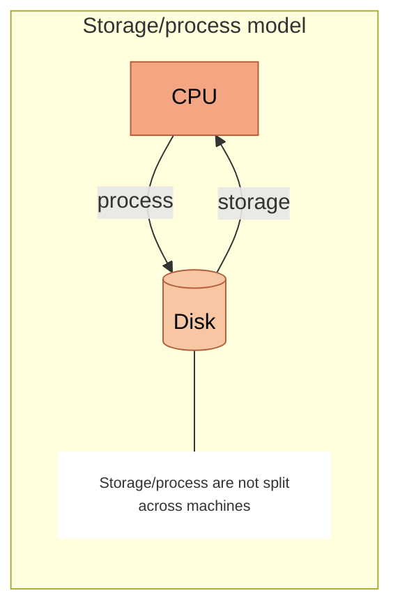
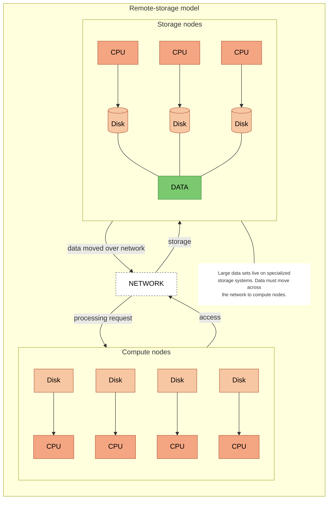
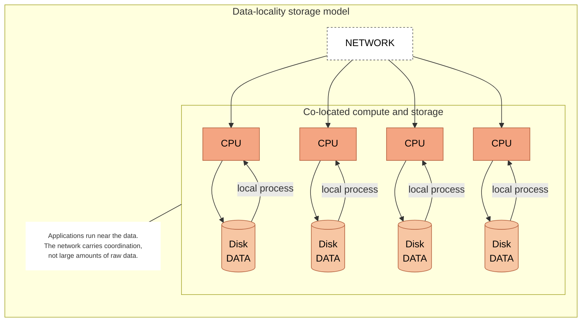
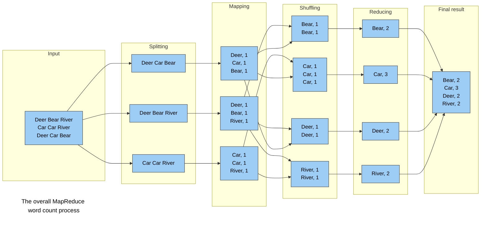
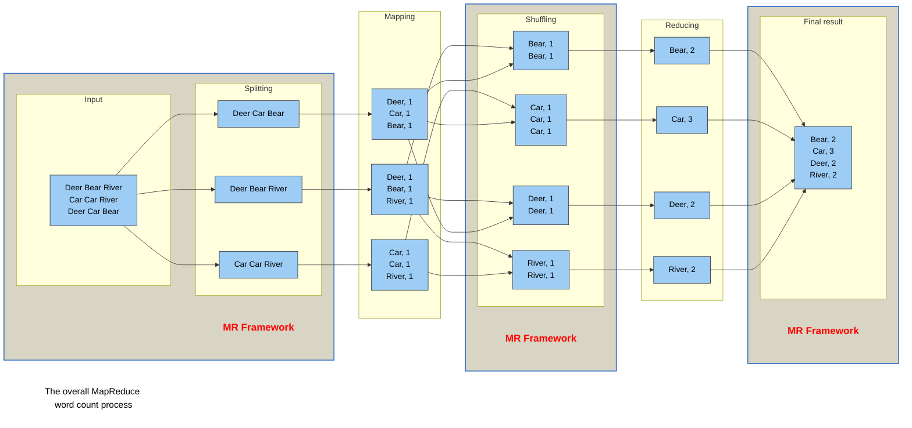

## Distributed Storage for Big Data



- Hundreds or thousands of machines to support big data.​
    - Distribute data for storage
    - Distribute data computation
    - Handle failure
- **The papers**
    - [The Google File System](https://dl.acm.org/doi/pdf/10.1145/945445.945450)
    - [MapReduce: simplified data processing on large clusters​](https://dl.acm.org/doi/pdf/10.1145/1327452.1327492)






- Storage/process model



- Remote large-scale storage: 
    - Networked file systems
    - Parallel file systems



- Remote distributed storage
    - Distributed file systems
        - Fastest I/O on local data
        - Impact of network bandwidth limit is reduced
        - How to program?







- Google File System (and its open-source counterpart, Hadoop Distributed File System) addressed the distributed storage question. 
    - Hardware failure is the norm rather than the exception
    - Streaming data access
        - Not for general purpose applications
        - For batch processing rather than interactive use
        - For high throughput of data access rather than low latency of data access
    - Large data sets (terabytes in size)
    - Simple coherency model (write once read many)
    - Moving computation is cheaper than moving data
    - Portability across heterogeneous hardware and software platform
- How do you write programs to process data stored in this manner?






- Master node (GFS) / NameNode (HDFS)
    - Stores metadata about where files are stored
    - Might be replicated
- Chunk servers (GFS) / DataNode (HDFS)
    - File is split into contiguous chunks
    - Typically each chunk is 16-64MB
    - Each chunk replicated (usually 2x or 3x) across chunk servers/datanodes
    - Try to keep replicas in different racks
- Client library for file access
    - Talks to master to find chunk servers 
    - Connects directly to chunk servers to access data




## MapReduce Programming Model



- Challenges:
    - input data is usually large 
    - the computations have to be distributed across hundreds or thousands of machines
    - finish in a reasonable amount of time. 
- Addressing these challenges causes the original simple computation to become **obscured** by
large amounts of supporting complex codes.​
- What MapReduce does:
    - is a new abstraction 
    - expresses the simple core computations 
    - hides the messy details of parallelization, fault-tolerance, data distribution and 
    load balancing in a library. 
- Why MapReduce?
    - inspired by the `_map_` and `_reduce_` primitives present in Lisp and 
    many other functional languages. 
    - Most data computations involve: 
        - applying a `_map_` operation to each logical `record` in our input in order to compute 
        a set of intermediate **key/value** pairs, and then 
        - applying a `_reduce_` operation to all the values that shared the same key to combine 
        the derived data appropriately. 





- What is `map`? A function/procedure that is applied to every individual elements of a 
collection/list/array/…​

```python
int square(x) { return x*x;}​
map square [1,2,3,4] -> [1,4,9,16]​
```

- What is `reduce`? A function/procedure that performs an operation on a list. This operation 
will *fold/reduce* this list into a single value (or a smaller subset)​

```python
reduce ([1,2,3,4]) using sum -> 10​
reduce ([1,2,3,4]) using multiply -> 24​
```




## Word Count

>the Hello, World of Big Data



- We have a large amount of text ...
    - Could be stored in a single massive file. 
    - Could be stored in multiple files. 
- We want to count the number of times each distinct word appears in the files
- Sample applications:  
    - Analyze web server logs to find popular URLs/keywords. 
    - Analyze security logs to find incidents. ​
- Standard parallel programming approach:​
    - Count number of files​ or set up seek distances within a file. 
    - Set number of processes​
    - Possibly setting up dynamic workload assignment​
    - A lot of data transfer​
    - Significant coding effort​​
- Serial implementation:
    - [LeetCode's Top K Frequent Words](https://leetcode.com/problems/top-k-frequent-words/description/)










- Input: a set of key-value pairs
- Programmer specifies two methods:
    - `Map(k, v) -> (k', v')`: 
        - Takes a key-value pair and outputs a set of key-value pairs.
            - E.g., key is the filename, value is a single line in the file
        - There is one Map call for every (k,v) pair
    - `Reduce(k2, <v'>) -> <k’, v’’>`
        - All values `v'` with same key `k'` are reduced together and processed 
        in `v'` order.
        - There is one Reduce function call per unique key `k'`.







- The MapReduce framework takes care of:
    - Partitioning the input data
    - Scheduling the program’s execution across a set of machines
    - Performing the group by key step
    - Handling machine failures
    - Managing required inter-machine communication
- The MapReduce framework lends itself nicely to the distributed storage model of GFS/HDFS.



## Algorithms using MapReduce



- MapReduce is not a solution to every problem
- GFS/HDFS is only beneficial for files that are 
    - very large
    - rarely updated
- Original purpose of Google's MapReduce Implementation
    - matrix-vector calculation
    - matrix-matrix calculation
- Relational algebra


### Matrix-Vector multiplication

- Suppose we have:
    - $n\times n$ matrix M whose element in row $i$ and column $j$ is denoted $m_{ij}$
    - Vector v of length $n$ whose $j^{th}$ element is $v_j$
- Matrix-vector product: $x_i = \sum_{j=1}^{n} m_{ij}v_j$
- First, assume n is large, but can fit into main memory of a node
    - Map
        - Each map task operates on a chunk of M and reads in the entirety of v
        - For each matrix element $m_{ij}$, return key/value pair $(i,m_{ij}v_j)$
    - Reduce
        - Sum up all values of pairs with the same key $i$
    


```python
import numpy as np

np.random.seed(0) # set static random seed to guarantee reproducibility

# Define the dimensions of the matrix and vector
N = 4

# Generate one random matrix and one random vector with the following dimensions:
# Matrix M (N x N)
# Vector V (N)
M = np.random.randint(0, 10, size=(N, N))
V = np.random.randint(0, 10, size=N)
P = np.matmul(M, V)

# Print the matrices
print(f"Matrix M:\n {M}")
print(f"Vector N:\n {V}")
print(f"Dot Product P:\n {P}")

# In this cell, we are pairing up individual elements of M and V
map_list = []

for i in range(N):
  for j in range(N):
    map_list.append((i,(M[i,j],V[j])))

print(f"Pairing up individual elements of M and V:")
for pair in map_list:
  print(pair)

# We can go ahead and multiply the paired up elements of M and V, and store the results in a list of tuples (i, M[i,j] * V[j])
map_list = []
for i in range(N):
  for j in range(N):
    map_list.append((i,M[i,j] * V[j]))

print("Multiplying the paired up elements of M and V:")
for pair in map_list:
  print(pair)

list_Q = []
for i in range(N):
  list_tmp = [value for key, value in map_list if key == i]
  list_Q.append(sum(list_tmp))

print(f"MapReduce Matrix Q:\n {np.array(list_Q)}")
print(f"Matrix P:\n {P}")
```




- Divide matrix into vertical stripes of equal width
    - Matrix M becomes $n/w$ matrices, each has the same dimension $(n/w,n)$
- Divide vector in equal stripes of the same length $w$
- Develop Map and Reduce procedures in a similar fashion.


### Matrix-matrix multiplication

- Matrix M with element $m_{ij}$ in row $i$ and column $j$
- Matrix N with element $n_{jk}$ in row $j$ and column $k$
- Matrix $P=M\times N$ has element $p_{ik} =  \sum_{j} m_{ij}n_{jk}$ in row $i$ and column $k$
- Think of a matrix as a relation with three attributes: row, column, and value
    - Matrix M: M(I, J, V) with tuples $(i, j, m_{ij})$
    - Matrix N: N(J, K, W) with tuples $(j, k, n_{jk})$
    - The product of M and N is almost a natural join of M and N, followed by grouping and aggregation:
        - $(M(I, J, V),N(J,K,W)) \xrightarrow{natural\ join} (i,j,k,m_{ij},n_{jk})$
        - What we want: $(i,j,k,m_{ij}\times n_{jk})$


- Map 1:
    - $m_{ij}\ of M \xrightarrow{map} (j, (M, i, m_{ij}))$
    - $n_{jk}\ of N \xrightarrow{map} (j, (N, k, n_{jk}))$
    - M and N are sing-bit values representing whether this comes from M or N
- Reduce 1:
    - For each key $j$, examine the list of associated values.
        - For each value that comes from M and each value that comes from N, produce $((i,k),m_{ij}n_{jk})$
- Map 2:
    - Pass through: $((i,k),m_{ij}n_{jk})$
- Reduce 2:
    - For each key $(i,k)$, produce sum of the list of values associated with this key/ 
    - Result: $((i,k),v)$ element $p_{ik}$ of resulting matrix P. 



[2-passes MapReduce Matrix Multiplication](https://colab.research.google.com/drive/1-Q26xwX2U5LSQ6YbRZAGKKoAJmAX5gAP?usp=sharing)






- Map
    - $m_{ij}$ of $M \xrightarrow{map} ((i,k), (M, j, m_{ij}))$ up to the number of columns of N (K)
        - This is a one-to-many mapping: one $m_{ij}$ map to k $m_{ij}$: $((i,0), (M, j, m_{ij}))$, $((i,1), (M, j, m_{ij}))$, $((i,2), (M, j, m_{ij}))$, $((i,3), (M, j, m_{ij}))$, ...
    - $n_{jk}$ of $N \xrightarrow{map} ((i,k), (N, j, n_{jk}))$ up to the number of rows of M (I)
        - Similar one-to-many mapping as above. 
    - M and N are sing-bit values representing whether this comes from M or N
- Reduce
    - Sort by values of $j$ for the two subsets of associated values, M and N, for each key $(i,k)$
    - Extract and multiply $m_{ij}$ and $n_{jk}$ for each value of j. 
    - Sum the final list and return with key $(i,k)$



### Relational algebra



- Apply a condition C to each tuple in the relation and produce as output only those satisfies C. 
- Does not need the full power of MapReduce
- Map: for each data element e, test if it satisfies condition C. If so, produce the key/value pair (e,e)
- Reduce: not needed. Simply pass the pair (e,e) through




- For some subset S of the attributes of the relation, produce from each tuple only the components for the attributes in S
    - Could generate duplicates
- Map:  for each $t$ in R, construct $t'$ by removing from $t$ components whose attributes are not in S.
    - Output pair $(t',t')$
- Reduce:
    - Group pairs by key. 
    - Pairs with multiple values should be flattened to a single value (remove duplicates)




- Relations R and S 
- tuple t could belong to either R or S
- Union: 
    - $t \xrightarrow{map} (t,t) \xrightarrow{shuffle} (t,t)\ or\ (t,[t,t]) \xrightarrow{reduce} (t,t)$
- Intersection
    - $t \xrightarrow{map} (t,t) \xrightarrow{shuffle} (t,t)\ or\ (t,[t,t]) \xrightarrow{reduce} (t,t)\ from (t,[t,t])\ only$
- Difference
    - Assume R - S
    - $t \xrightarrow{map} (t,R)\ or\ (t,S) \xrightarrow{shuffle} (t,R)\ or\ (t,S)\ or\ (t,[R,S]) \xrightarrow{reduce} (t,R)$



- Join R(A, B) with S(B, C)
- Map
    - $(a,b)\ of\ R \xrightarrow{map} (b, (R,a))$
    - $(b,c)\ of\ S \xrightarrow{map} (b, (S,c))$
    - R and S are sing-bit values representing whether this comes from R or S
- Reduce
    - $(b,[(R,a),(S,c)]) \xrightarrow{reduce} (somekey, (a,b,c))$




- Assume a relation whose tuple has three attributes: A for group, B for aggregating, and C: R(A,B,C)
- Map: for each tuple, produce key-value pair (a,b)
- Reduce: perform aggregation on the list-type value: $(a,[b_1,b_2,...,b_n])$

---


## Extensions to MapReduce


- MapReduce influenced a number of extensions and modifications
- Similarity
    - Built on a distributed file system
    - Manage a very large number of tasks, spawned from small number of user-written code (bring computation to data)
    - Builtin fault tolerant and error recovery



- Extend MR from a two-step workflow to any collection of functions
- An acyclic graph representing workflow among functions
- Dataflow programming
- Each function of the workflow can be executed by many tasks (data parallelism)
- Blocking property: function only deliver output after completion
- Examples
    - Spark
    - Tensorflow


## Cost Model


- Assuming an algorithm implemented by an acyclic network of tasks
    - Single MapReduce job
    - Chained MapReduce jobs
    - ...
- `Communication cost` of a task is the size of the input to the task
- `Communication cost` of the algorithm is the sum of the communication
cost of all tasks. 
- For massive data, communication cost is key performance indicator:
    - Computation cost of a single task tends to be simple and linear
    - I/O bottleneck due to network transfer
    - I/O bottleneck due to disk-to-memory transfer
- Example: MapReduce natural join



- Parallel by nature (move computation to distributed data storage)
- Should be very carefully if used in tradeoff with communication cost

