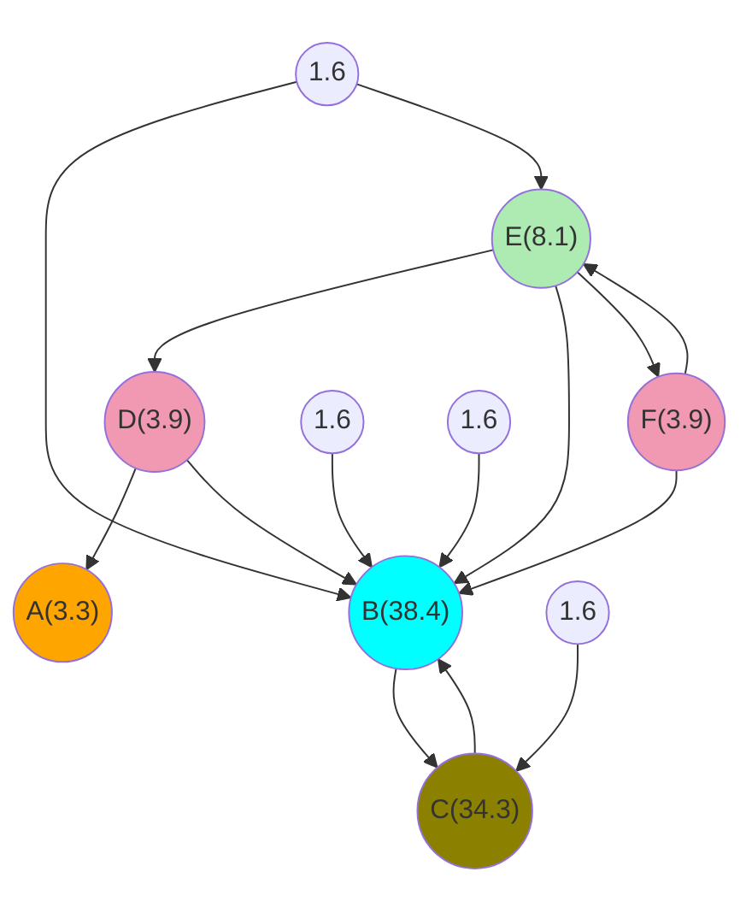
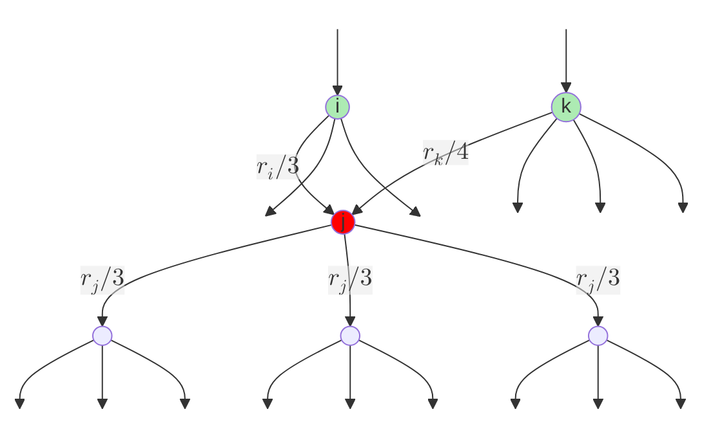
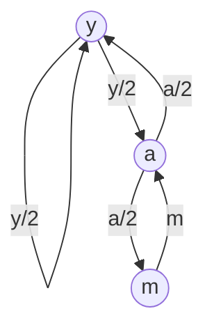
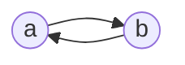
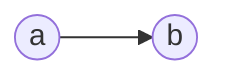
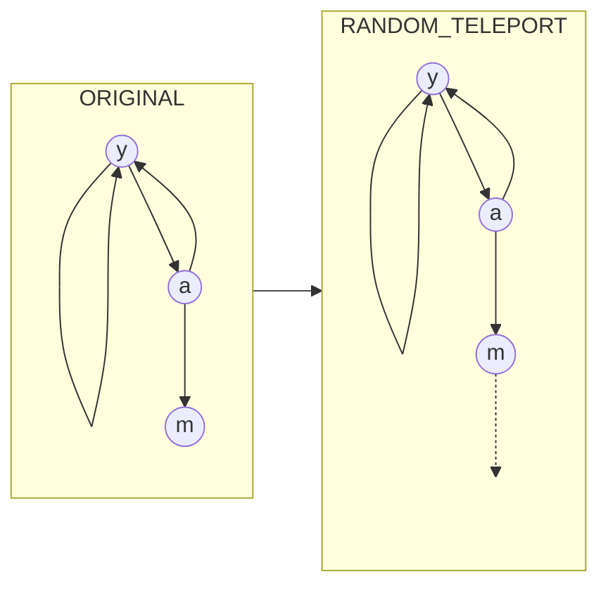
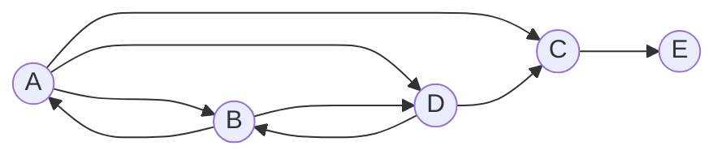

# Link Analysis

## History


- Web pages were manually curated and organized. 
- Does not scale. 

{% include figure.liquid loading="eager" path="assets/img/courses/csc467/05-pagerank/01.jpg" class="img-fluid rounded z-depth-1 mx-auto d-block" max-width="50%" zoomable=true %}

- Next, web search engines were developed: information retrieval
- Information retrieval focuses on finding documents from a trusted set. 

{% include figure.liquid loading="eager" path="assets/img/courses/csc467/05-pagerank/02.jpg" class="img-fluid rounded z-depth-1 mx-auto d-block" max-width="50%" zoomable=true %}


- Who to trust given the massive variety of information sources?
    - Trustworthy pages may point to each other. 
- What is the best answer to a keyword search (given a context)?
    - Pages using the keyword in the same contexts tend to point to each other. 
- All pages are not equally important. 
    - Web pages/sites on the Internet can be represented as a graph:
- Web pages/sites are nodes on the graph. 
- Links from one page to another represents the incoming/outgoing 
connections between nodes. 
- We can compute the importance of nodes in this graph based on 
the distribution/intensity of these links. 

---

## PageRank


- Link as votes:
    - A page (node) is more important if it has more links. 
        - Incoming or outgoing?
- Think of incoming links as votes. 
    - Are all incoming links equals?
        - Links from important pages count more. 



- Each link's vote is proportional to the **importance** of its
source page. 
- If page *j* with importance $r_j$ has **n** outgoing links, then each outgoing link has $r_j$ votes. 
- The **importance** of page *j* is the sum of the votes on its incoming links. 




$$
r_j = \frac{r_i}{3} + \frac{r_k}{4}
$$


<a id="the-flow-model"></a>

- Summary:
    - A `vote` from an important page is worth more. 
    - A page is important if it is linked to by other important pages.  

- Imagine the web in 1839!
    - Three sites: y, m, a
    - y links to a and to itself.
    - a links to y and m.
    - m links to a. 



-  $r_{y}$, $r_{a}$, and $r_{m}$ are the rank of nodes $y$, $a$, and $m$ respectively. 
    - Node $y$ has two outgoing links, so the weight of each link is going to be $r_{y}/2$.
    - Node $a$ has two outgoing links, so the weight of each link is going to be $r_{a}/2$.
    - Node $m$ has one outgoing link and the weight of this link is $r_{m}$.
- From the above link graph, we can form the following flow equations:
    - Node $y$ receives two incoming links, one from itself and one from node $a$:
        - $r_{y} = r_{y}/2 + r_{a}/2$
    - Node $a$ receives two incoming links, one from node $y$ and one from node $m$:
        - $r_{a} = r_{y}/2 + r_{m}$
    - Node $m$ receives one incoming link from node $a$:
        - $r_{m} = r_{a}/2$



- The above example demonstrates the idea of a general equation for calculating rank $r_{j}$ for page j:

$$r_j = \sum\limits_{i\rightarrow j}^{n} \frac{r_i}{d_i}$$

- $d_i$ is the number of out-degree (outgoing links) of node $i$


- From the above link graph, we seem to have three equations and three unknown. 
    - In reality, after some algebraic simplication, we actually onle have two equations. 
    - Therefore, there is no unique solution at this point. 
- We need to impose one additional constraint to force uniqueness:
    - $r_{y} + r_{a} + r_{m} = 1$
- Solving this system of equations using Gaussian elimination, we have:
    - $r_{y} = 2/5$
    - $r_{a} = 2/5$
    - $r_{m} = 1/5$
- **Does not scale to Internet-size!**


<a id="matrix-formulation"></a>
- Using the coefficients from the above flow equations, we can set up a stochastic adjacency matrix M
- Matrix M of size N: N is the number of nodes in the graph (think number of web pages on the Internet).
- Let page *i* has $d_{i}$ outgoing links. 
    - If there is an outgoing link from page *i* to another page *j*, 
        - then $M_{ij} = 1/d_{i}$
        - else $M_{ij} = 0$
    - Stochastic: sum of all values in a column of M is equal to 1. 
    - Adjacency: non-zero value indicates the availability of a link. 
- Rank vector $r$: Each element in $r$ represents the ranking value of one page. 
    - The order of pages in the rank vector should be the same as the 
    order of pages in rows and columns of **M**. 

- Combining the stochastic adjacency matrix M (coefficient matrix) and the rank vector $r$, we can formulate a general equation for calculating rank *r<sub>j</sub>* for page $j$ with regard to **all** pages:

$$r_j = \sum\limits_{i=0}^{N-1} M_{ij}r_{j}$$

- This equation can be rewritten using the matrix form:

$$r = M \cdot r$$



- Suppose page *i* has importance $r_{i}$ and has outgoing links
to three other pages, including page *j*. 

{% include figure.liquid loading="eager" path="assets/img/courses/csc467/05-pagerank/09.png" class="img-fluid rounded z-depth-1 mx-auto d-block" max-width="50%" zoomable=true %}




<a id="example-of-matrix-formulation"></a>

- Revisiting our flow equations from [Section 2.2](#the-flow-model):

$$
\begin{align}
\left
\{
\begin{aligned}
r_{y} &= r_{y}/2 + r_{a}/2\\ 
r_{a} &= r_{y}/2 + r_{m}\\ 
r_{m} &= r_{a}/2
\end{aligned}
\right.
\end{align}
$$

- We will rewrite the above equations to highlight all coefficients. 

$$
\begin{align}
\left
\{
\begin{aligned}
r_{y} &= r_{y}\times 1/2 + r_{a}\times 1/2 + r_{m}\times 0\\ 
r_{a} &= r_{y}\times 1/2 + r_{a}\times 0 \ \ \ \ + r_{m}\\ 
r_{m} &= r_{y}\times 0 \ \ \ \ + r_{a}\times 1/2 + r_{m}\times 0
\end{aligned}
\right.
\end{align}
$$

- Stochastic adjacency matrix M:

$$
\left[
\begin{array}{ccc}
1/2 & 1/2 & 0 \\
1/2 & 0 & 1 \\
0 & 1/2 & 0
\end{array}
\right]
$$

- Rank vector r:

$$
\left[
\begin{array}{c}
y \\
a \\
m
\end{array}
\right]
$$

- Dot product of rank vector and coefficient matrix:

$$
\left[
\begin{array}{c}
y \\
a \\
m
\end{array}
\right]
=
\left[
\begin{array}{ccc}
1/2 & 1/2 & 0 \\
1/2 & 0 & 1 \\
0 & 1/2 & 0
\end{array}
\right]
\left[
\begin{array}{c}
y \\
a \\
m
\end{array}
\right]
$$


- We want to find the page rank value *r*
- Power method: an iterative scheme.  
    - Support there are `N` web pages on the Internet. 
    - All web pages start out with same importance: `1/N`. 
    - Rank vector r: $r^{(0)} = [1/N, ...,1/N]^{T}$ 
    - Iterate: $r^{(t+1)} = M\cdot r$
    - Stopping condition: $r^{(t+1)} -  r^{(t)} < some\ small\ positive\ error\ threshold\ e$.



- Revisiting our flow equations from [Section 2.4](#example-of-matrix-formulation):



- Initial rank vector r at iteration 0: $r^{(0)} = [1/3,1/3,1/3]^{T}$ 

$$
\left[
\begin{array}{c}
y \\
a \\
m
\end{array}
\right]
=
\left[
\begin{array}{c}
1/3 \\
1/3 \\
1/3
\end{array}
\right]
$$





$$
\left[
\begin{array}{c}
y \\
a \\
m
\end{array}
\right]
=
\left[
\begin{array}{ccc}
1/2 & 1/2 & 0 \\
1/2 & 0 & 1 \\
0 & 1/2 & 0
\end{array}
\right]
\left[
\begin{array}{c}
1/3 \\
1/3 \\
1/3
\end{array}
\right]
=
\left[
\begin{array}{c}
1/3 \\
3/6 \\
1/6
\end{array}
\right]
$$






$$
\left[
\begin{array}{c}
y \\
a \\
m
\end{array}
\right]
=
\left[
\begin{array}{ccc}
1/2 & 1/2 & 0 \\
1/2 & 0 & 1 \\
0 & 1/2 & 0
\end{array}
\right]
\left[
\begin{array}{c}
1/3 \\
3/6 \\
1/6
\end{array}
\right]
=
\left[
\begin{array}{c}
5/12 \\
1/3 \\
3/12
\end{array}
\right]
$$






$$
\left[
\begin{array}{c}
y \\
a \\
m
\end{array}
\right]
=
\left[
\begin{array}{ccc}
1/2 & 1/2 & 0 \\
1/2 & 0 & 1 \\
0 & 1/2 & 0
\end{array}
\right]
\left[
\begin{array}{c}
5/12 \\
1/3 \\
3/12
\end{array}
\right]
=
\left[
\begin{array}{c}
9/24 \\
11/24 \\
1/6
\end{array}
\right]
$$


...




$$
\left[
\begin{array}{c}
y \\
a \\
m
\end{array}
\right]
=
\left[
\begin{array}{ccc}
1/2 & 1/2 & 0 \\
1/2 & 0 & 1 \\
0 & 1/2 & 0
\end{array}
\right]
\left[
\begin{array}{c}
... \\
... \\
...
\end{array}
\right]
=
\left[
\begin{array}{c}
6/15 \\
6/15 \\
3/15
\end{array}
\right]
$$


- The final iteration results is the same as the results from the Gaussian approach in [Section 2.2](#the-flow-model)

---

## PageRank: the Google formulation



- Recalling the equation from [section 2.3](#matrix-formulation):


$$r_j = \sum\limits_{i=0}^{N-1} M_{ij}r_{j}$$

- Does the above equation converge?
- Does it converge to what we want?. 
- Are the results reasonable? 



- The `spider trap` problem
- Build the stochastic adjacency matrix for the following graph and calculate the ranking for `a` and `b`.  






$$
\left[
\begin{array}{c}
r_a \\
r_b
\end{array}
\right]
=
\begin{array}{cccc}
1 & 0 & 1 & 0\\
0 & 1 & 0 & 1
\end{array}
$$





- The `dead end` problem
- Build the stochastic adjacency matrix for the following:
graph and calculate the ranking for `a` and `b`.  







$$
\left[
\begin{array}{c}
r_a \\
r_b
\end{array}
\right]
=
\begin{array}{cccc}
1 & 0 & 0 & 0\\
0 & 1 & 0 & 0
\end{array}
$$





- At each time step, the random surfer has two options:
    - A probably of β to follow an out-going link at random. 
    - A probably of 1 - β to jump to some random page. 
    - The value of β are between 0.8 to 0.9. 
- The surfer will teleport out of the spider trap within a few 
time steps. 
- The surfer will definitely teleport out of the dead-end. 



- This will change the coefficient matrix from 

$$
\left[
\begin{array}{ccc}
1/2 & 1/2 & 0 \\
1/2 & 0 & 0 \\
0 & 1/2 & 0
\end{array}
\right]
$$

to 

$$
\left[
\begin{array}{ccc}
1/2 & 1/2 & 0 \\
1/2 & 0 & 1 \\
\textbf{1/3} & \textbf{1/3} & \textbf{1/3}
\end{array}
\right]
$$


- Final equation for PageRank:

$$
r = \beta M \cdot r + \left[ \frac{1 - \beta}{N}\right]_{N}
$$

where $\left[ \frac{1 - \beta}{N}\right]_{N}$ is a vector with all $N$ entries have the same value $\frac{1-\beta}{N}$.

---

## Hands-on: Page Rank in Spark

- The code instructions here is meant for Spark running on local devices. 
    - If you are using Colab or Kaggle, make sure that you prepare your notebook with instructions in the Setup lecture. 



- Run the following in a cell to generate a data file

```python linenums="1"
%%file small_graph.dat
y y
y a
a y
a m
m a
```

- Load and view the data

```python linenums="1"
graph_data = sc.textFile("small_graph.dat")
graph_data.take(5)
```

- Create links

```python linenums="1"
links = graph_data.map(lambda line: (line.split(" ")[0], line.split(" ")[1]))
print(links.take(10))
links = links.groupByKey()
print(links.take(10))
links = links.mapValues(list)
print(links.take(10))
```

- Setup initial weight


```python linenums="1"
N = links.count()
ranks = links.map(lambda line: (line[0], 1/N))
ranks.take(3)
```  

- Calculate the votes

```python linenums="1"
def calculateVotes(t):
    res = []
    for item in t[1][1]:
        count = len(t[1][1])
        res.append((item, t[1][0] / count))
    return res
    ###############################
calculateVotes(('y', (0.3333333333333333, ['y', 'a'])))
``` 

- Vote distribution

```python linenums="1"
votes = ranks.join(links)
votes.take(10)
```  

```python linenums="1"
votes = votes.flatMap(calculateVotes)
print(votes.take(10))
```  

- Vote tally

```python linenums="1"
ranks = votes.reduceByKey(lambda x,y: x + y)
ranks.take(10)
```

- Iteration in Spark

```python linenums="1"
%%time
for i in range(10):
    votes = ranks.join(links).flatMap(calculateVotes)
    ranks = votes.reduceByKey(lambda x,y: x + y)
    print(ranks.take(3))
``` 

- Iterating with a stopping condition

```python linenums="1"
%%time
sum = 1
while sum > 0.01:
    old_ranks = ranks
    votes = ranks.join(links).flatMap(calculateVotes)
    ranks = votes.reduceByKey(lambda x,y: x + y)
    errors = old_ranks.join(ranks).mapValues(lambda v: abs(v[0] - v[1]))
    sum = errors.values().sum()
    print(sum)
    print(ranks.take(3))
``` 

---



- Download [the Hollins dataset](https://www.cs.wcupa.edu/LNGO/data/hollins.dat) using wget
- Hollins University web bot crawl in 2004. 
- Which page is most important (internally). 

---

## Hub and Authority


- PageRank only assume one-dimensional notion of importance
- HITS: hyperlink-induced topic search
    -  Two flavors of importance:
        - Authorities: provide information about a topic
        - Hubs: show where to find out more information about a topic
- Example: A typical department at a university maintains a Web page 
listing all the courses offered by the department, with links to a page 
for each course. 
    - If you want to know about a certain course, you need the page for that course (`authorities`). 
    - If you want to find out what courses the department is offering, you need 
    the page with the course list first (`hub`).


<a id="formalizing-hubbiness-and-authority"></a>
- For a collection of pages (enumarated)
    - Two vectors: $h$ and $a$
    - The $i^{th}$ component of $h$: the hubbiness of the $i^{th}$ page
    - The $i^{th}$ component of $a$ gives the authority of the same page.
- To compute hubbiness and authority:
    - Add the authority of successors to estimate hubbiness 
    - Add hubbiness of predecessors to estimate authority. 
- Avoid unlimited growth through scaling:
    - Scale the values of the vectors $h$ and $a$ so that the largest component is 1. 
    - Scale the values of the vectors $h$ and $a$ so that the sum of all components is 1.
- Define link matrix of the Web, $L$ and there are `n` pages on the Web
    - $L$ is an n-by-n matrix
        - $L_{ij} = 1$ if there is a link from page i to page j
        - $L_{ij} = 0$ if not. 
    - $L^T$ is the transpose of $L$
        - $L^T_{ij} = 1$ if there is a link from page j to page i
        - $L^T_{ij} = 0$ if not


<a id="example"></a>

- Given a 5-node (5 pages) link graph as follows:



- The $L$ and $L^T$ matrices are:

$$
L = 
\left[
\begin{array}{ccccc}
0 & 1 & 1 & 1 & 0 \\
1 & 0 & 0 & 1 & 0 \\
0 & 0 & 0 & 0 & 1 \\
0 & 1 & 1 & 0 & 0 \\
0 & 0 & 0 & 0 & 0
\end{array}
\right]
\ \ \ \ \ \ \ \ \ 
L^T =
\left[
\begin{array}{ccccc}
0 & 1 & 0 & 0 & 0 \\
1 & 0 & 0 & 1 & 0 \\
1 & 0 & 0 & 1 & 0 \\
1 & 1 & 0 & 0 & 0 \\
0 & 0 & 1 & 0 & 0
\end{array}
\right]
$$

- If indices $0,1,2,3,4$ represent pages $A,B,C,D,E$ accordingly:
    - There is a link from B ($i=1$) to D ($j=3$), so $L_{13}=1$ 

    $$
    \left[
    \begin{array}{ccccc}
    0 & 1 & 1 & 1 & 0 \\
    1 & 0 & 0 & \textbf{1} & 0 \\
    0 & 0 & 0 & 0 & 1 \\
    0 & 1 & 1 & 0 & 0 \\
    0 & 0 & 0 & 0 & 0
    \end{array}
    \right]
    $$

    - There is also a link from D ($j=3$) back to B($i=1$), so $L^T_{31}=1$

    $$
    \left[
    \begin{array}{ccccc}
    0 & 1 & 0 & 0 & 0 \\
    1 & 0 & 0 & 1 & 0 \\
    1 & 0 & 0 & 1 & 0 \\
    1 & \textbf{1} & 0 & 0 & 0 \\
    0 & 0 & 1 & 0 & 0
    \end{array}
    \right]
    $$  

    - and so on ...


- From [Section 5.2](#formalizing-hubbiness-and-authority), for a collection of pages (enumarated)
    - Two vectors: $h$ and $a$
    - The $i^{th}$ component of $h$: the hubbiness of the $i^{th}$ page
    - The $i^{th}$ component of $a$ gives the authority of the same page.
- The `hubbiness` of a page is proportional to the sum of the `authority` of its successor.
    - Explanation: If a hub contains pages of high value (high `authority`), then the value of that hub (`hubbiness`) will be high. 
    - Given $\lambda$ is an unknown scaling factor:

    $$h=\lambda La$$ 

- The `authority` of a page is proportional to the sum of the `hubbiness` of its predecessor.
    - Explanation: If a page is cited by multiple hubs with high value (high `hubbiness`), then that page must be of high quality (high `authority`).
    - Given $\mu$ is an unknown scaling factor:

    $$a=\mu L^{T}h$$

- Putting the two equations together:

$$
\begin{align}
h=\lambda La \\
a=\mu L^{T}h
\end{align}
$$ 

- Ommiting $\lambda$ and $\mu$ and you can see the same self-calculating structure emerges for $h$ and $a$ similar to how the rank vector $r$ was formalized in Page Rank. 
- In this case, $h$ and $a$ will alternate their roles, with one being used to calculate the other. 


- Construct $L$
- Generate $L^T$
- Generate $h$ as a vector of all 1’s.
- Compute $a = L^{T}h$ then scale so that the largest component is 1
- Compute $h = La$ then scale so that the largest component is 1
- Repeat the previous two steps until differences of successive values of $h$ and $a$ 
are small enough. 
- We demonstrate this procedure using the example from [Section 5.3](#example):



- Initialize $h$:

$$
h=
\left[
\begin{array}{c}
1 \\
1 \\
1 \\
1 \\
1 
\end{array}
\right]
$$

- Compute $a = L^{T}h$

$$
a = 
\left[
\begin{array}{ccccc}
0 & 1 & 0 & 0 & 0 \\
1 & 0 & 0 & 1 & 0 \\
1 & 0 & 0 & 1 & 0 \\
1 & 1 & 0 & 0 & 0 \\
0 & 0 & 1 & 0 & 0
\end{array}
\right]
\left[
\begin{array}{c}
1 \\
1 \\
1 \\
1 \\
1 
\end{array}
\right]
=
\left[
\begin{array}{c}
1 \\
2 \\
2 \\
2 \\
1 
\end{array}
\right]
$$

- Scale so that the largest component of $a$ is 1
    - Since max value in $a$ is 2, we divide all values in $a$ by 2.

$$
a=
\left[
\begin{array}{c}
1/2 \\
1 \\
1 \\
1 \\
1/2 
\end{array}
\right]
$$

- Compute $h = La$ 

$$
h = 
\left[
\begin{array}{ccccc}
0 & 1 & 1 & 1 & 0 \\
1 & 0 & 0 & 1 & 0 \\
0 & 0 & 0 & 0 & 1 \\
0 & 1 & 1 & 0 & 0 \\
0 & 0 & 0 & 0 & 0
\end{array}
\right]
\left[
\begin{array}{c}
1/2 \\
1 \\
1 \\
1 \\
1/2
\end{array}
\right]
=
\left[
\begin{array}{c}
3 \\
3/2 \\
1/2 \\
2 \\
0 
\end{array}
\right]
$$

- Scale so that the largest component of $h$ is 1
    - Since max value in $h$ is 3, we divide all values in $h$ by 3.

$$
h=
\left[
\begin{array}{c}
1 \\
1/2 \\
1/6 \\
2/3 \\
0 
\end{array}
\right]
$$





- This is $h$ value from previous iteration:

$$
h=
\left[
\begin{array}{c}
1 \\
1/2 \\
1/6 \\
2/3 \\
0 
\end{array}
\right]
$$

- Compute $a = L^{T}h$

$$
a = 
\left[
\begin{array}{ccccc}
0 & 1 & 0 & 0 & 0 \\
1 & 0 & 0 & 1 & 0 \\
1 & 0 & 0 & 1 & 0 \\
1 & 1 & 0 & 0 & 0 \\
0 & 0 & 1 & 0 & 0
\end{array}
\right]
\left[
\begin{array}{c}
1 \\
1/2 \\
1/6 \\
2/3 \\
0 
\end{array}
\right]
=
\left[
\begin{array}{c}
1/2 \\
5/3 \\
5/3 \\
3/2 \\
1/6 
\end{array}
\right]
$$

- Scale so that the largest component of $a$ is 1
    - Since max value in $a$ is $5/3$, we divide all values in $a$ by $5/3$.

$$
a=
\left[
\begin{array}{c}
3/10 \\
1 \\
1 \\
9/10 \\
1/10 
\end{array}
\right]
$$

- Compute $h = La$ 

$$
h = 
\left[
\begin{array}{ccccc}
0 & 1 & 1 & 1 & 0 \\
1 & 0 & 0 & 1 & 0 \\
0 & 0 & 0 & 0 & 1 \\
0 & 1 & 1 & 0 & 0 \\
0 & 0 & 0 & 0 & 0
\end{array}
\right]
\left[
\begin{array}{c}
3/10 \\
1 \\
1 \\
9/10 \\
1/10
\end{array}
\right]
=
\left[
\begin{array}{c}
29/10 \\
6/5 \\
1/10 \\
2 \\
0 
\end{array}
\right]
$$

- Scale so that the largest component of $h$ is 1
    - Since max value in $h$ is $29/10$, we divide all values in $h$ by $29/10$.

$$
a=
\left[
\begin{array}{c}
1 \\
12/29 \\
1/29 \\
20/29 \\
0 
\end{array}
\right]
$$


- Final values:

$$
\begin{align}
h = [1,0.3583,0,0.7165,0] \\
a = [0.2087,1,1,0.7913,0]
\end{align}
$$ 

---

## Hands-on: HITS


- Run the following in a cell to generate a data file. This data file represents the graph shown in [Section 5.3](#example)

```python linenums="1"
%%file small_web.dat
A B
A D
A C
B A
B D
C E
D C
D B
```
- Review the [sequential implementation of HITS](https://colab.research.google.com/drive/1pfoEjaCSY9dNeqmuSR4ur1fJIzWSbRFl?usp=sharing)


- Identify the pages with highest level of `hubbiness` in the Hollins site. 

