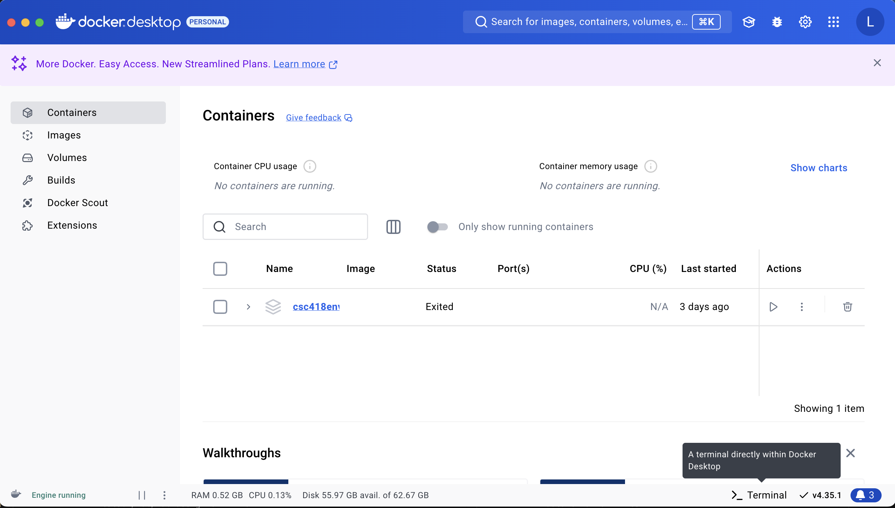
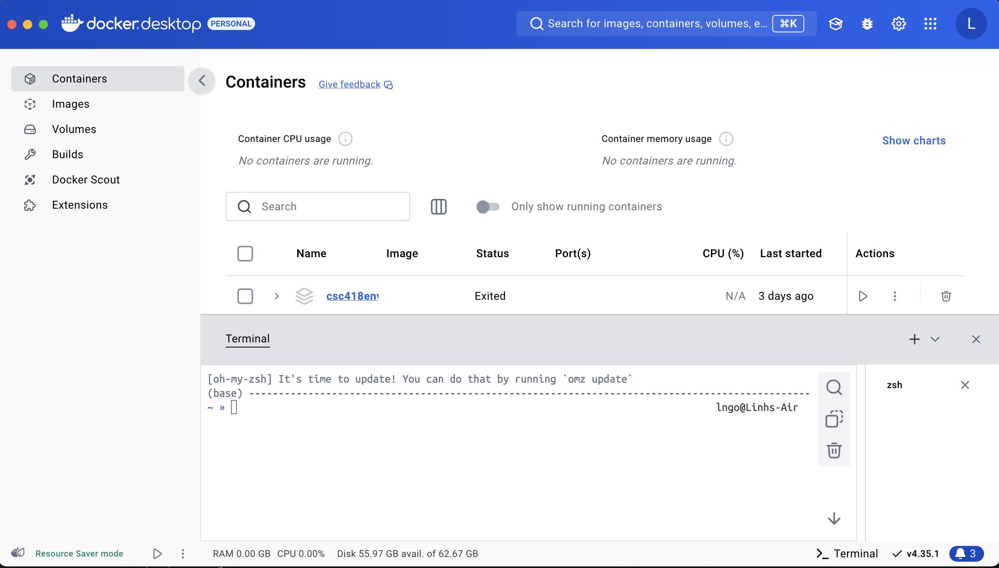

# Introduction to Docker Environments for various Classes

## 1. Quick setup reminder

Prior to using docker environments for my classes, you will need to have your 
Docker Dekstop setup. A quick guide is shown below. A more detailed workshop on 
getting yourself familiar with Docker can be found at 
[Introduction to Docker](intro-docker.md)

!!!warning "Older version of Docker Desktop"

    If you had previously installed Docker Desktop on your system, you need to 
    make sure that what you have installed is up to date. The latest Docker Desktop 
    and the accompanying Docker Engine contain many useful tools to help administrating 
    your images and containers. 

    As of Summer 2025, this material is tested on:
        - Docker Dekstop version `4.41.2 (191736)`
        - Docker Engine: `28.1.1`
        - Docker Compose: `v2.35.1-desktop.1`

    It is possible that by the time that you read this setup, the versions you have 
    will be higher. That would be a good thing!

- Links to download and install Docker Desktop
    - [Mac](https://docs.docker.com/desktop/setup/install/mac-install/)
    - [Windows](https://docs.docker.com/desktop/setup/install/windows-install/)
        - **You should run Linux containers when installing Docker Desktop for Windows**
        - It is recommended that you use WSL2 option when installing Docker Desktop on Windows
    - [Linux](https://docs.docker.com/desktop/setup/install/linux/)
    - Successful installation and startup of Docker will show the following application
        - Screenshot is taken on a Mac, but the GUI should be the same across platforms
        

!!!warning "Docker Desktop Terminal"
    - The most recent version of Docker Desktop comes with a built-in Terminal. 
    - If you are running the latest Docker Desktop version (4.35.1), this is a default feature 
    available on the lower right cornder of the GUI. 
    - For earlier versions, this could show up as a beta feature. 

    

    - The remainder of this workshop will use the Docker Desktop Terminal app for 
    consistency purpose. All the CLI docker commands can be executed on the standard 
    Linux-based terminal of Mac and Linux platforms. 

!!!tip "Docker Hub"
    - Docker Hub is one of the public repository for Docker images (think GitHub for 
    container images). 
    - You should register for Docker Hub account at [https://hub.docker.com](https://hub.docker.com) 
    and use it to log into your Docker Desktop environment (similar to how you link your 
    GitHub account to GitHub Desktop, if you use GitHub Desktop).

## 2. CSC418-587

## 3. Distributed and Parallel Programming

- This environment consists of three images:
    - `base`: contains all common software
    - `head-instructor`: is built from base and contains additional Jupyter 
    server and Code server designed to help instructors to edit lecture notes for the course. 
    - `head-student`: is built from base and contains only the Code server
- When this environment is deployed, by default, there will be 
    - One `head` container (from either `head-instructor` or `head-student` images) with running Jupyter server (if `head-instructor`) and Code server. User will interact with the environment through these servers. 
    - Two `compute` containers: `compute01` and `compute02`. They are only needed if users work on distributed MPI. 
    - All containers can be connected via passwordless SSH by the built-in user account `student`. This account also has passwordless sudo power. 
    - The internal `/home/student` is mounted from a volume directory shared across three containers 
    mount this directory, effectively creating a *shared* storage environment. 
- To setup CSC466 environment, following the [intructions in the README.md file](https://github.com/ngo-classes/csc466env/tree/main) of the [csc466env GitHub](https://github.com/class-master/csc466env/tree/main)
- If you are interested in tinkering with this environment, you are welcomed to fork the repo into your own GitHub repository before cloning. 

## 4. Big Data Engineering

- This environment consists of four images:
    - `base`: contains all common software and is built from `spark:3.5.2-java17-python3` image of Databrick. 
    - `master-instructor`: is built from base and contains Jupyter 
    server and additional Code server designed to help instructors to edit lecture notes for the course. 
    - `master-student`: is built from base and contains only the Jupyter server
    - `worker`: an almost-exact copy of `base` with additional startup script added. 
- When this environment is deployed, by default, there will be 
    - One `master` container (from either `master-instructor` or `master-student` images) with running Jupyter server and Code server (if `master-instructor`) . User will interact with the environment through these servers. 
    - Multiple worker containers. The number of `worker-` containters can be scaled at run time based on how `docker compose` is invoked. 
    - The two internal directories, `/data` and `notebooks` are mounted from the corresponding local direcries existing inside the git repo into the master container. There is no external storage sharing with the worker containers (similar to how actual Spark clusters work). 
- To setup CSC467 environment, following the [intructions in the README.md file](https://github.com/ngo-classes/csc467env/tree/main) of the [csc467env GitHub](https://github.com/class-master/csc467env/tree/main)
- If you are interested in tinkering with this environment, you are welcomed to fork the repo into your own GitHub repository before cloning. 
