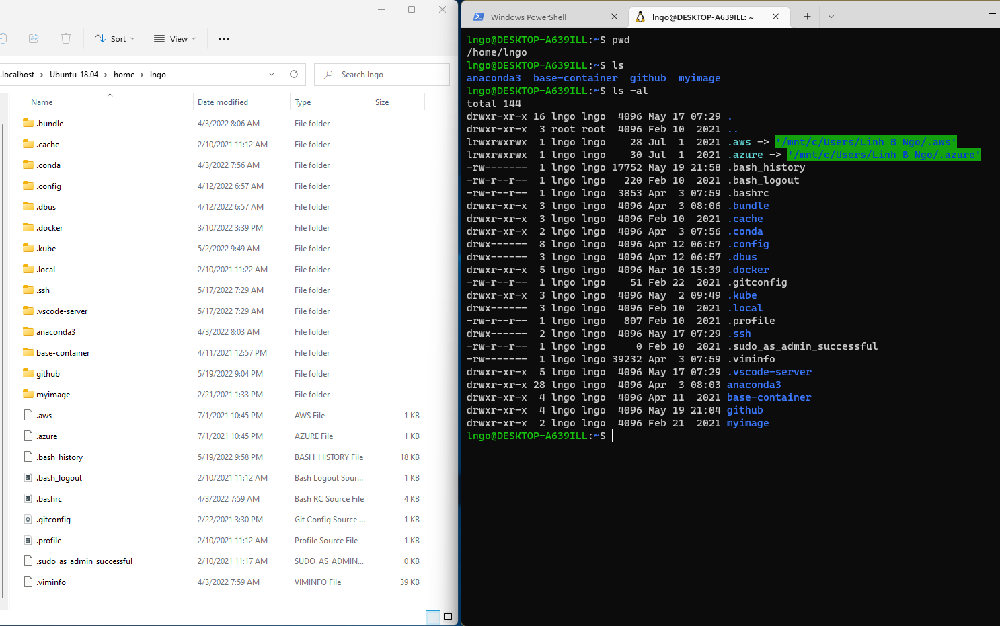
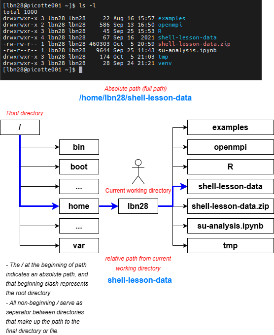
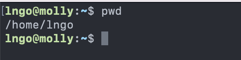
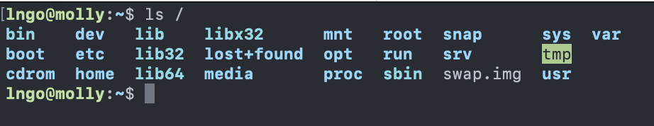
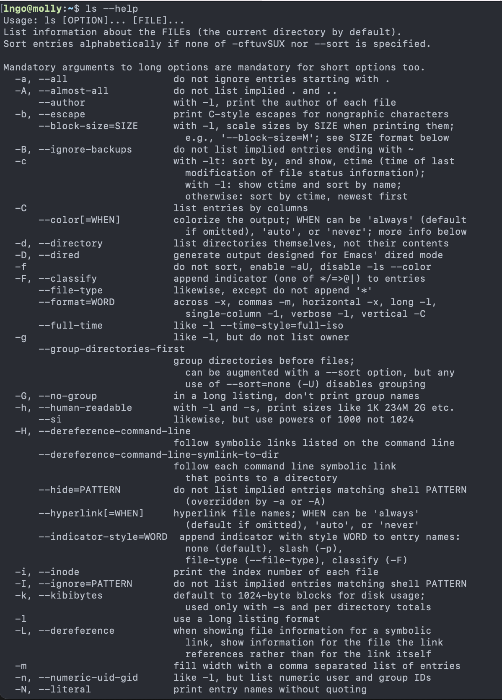
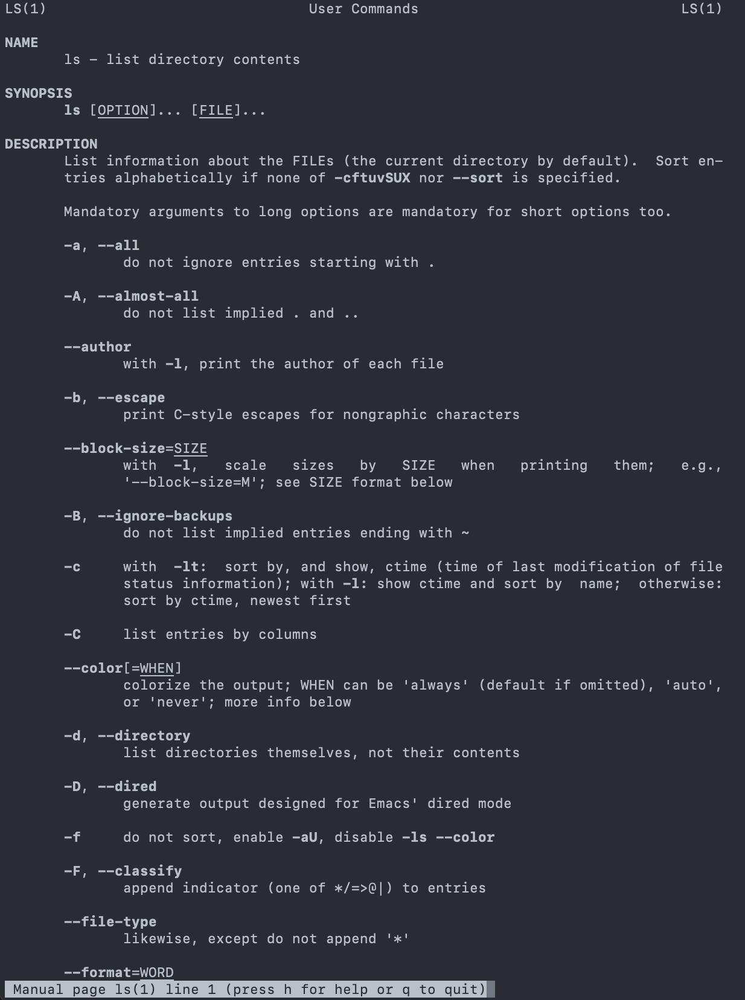
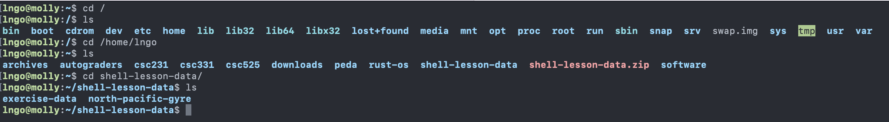
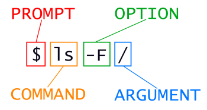
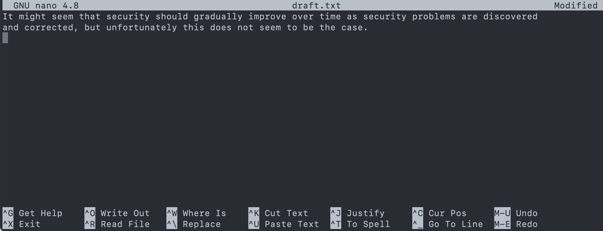
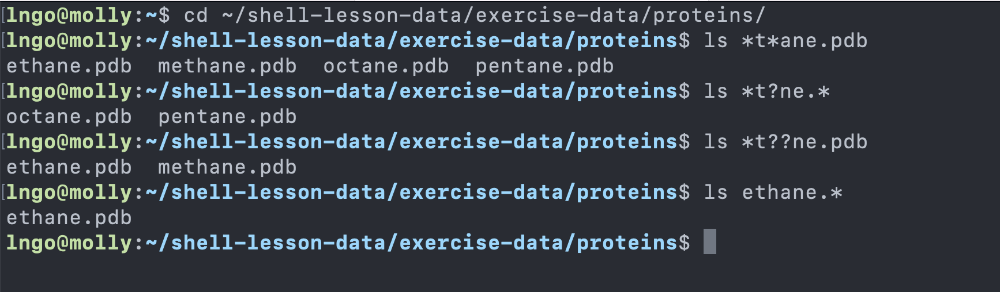

# Introduction to the Linux Shell

## 1. The Shell
???note "Overview"     
    
    - Traditional computers: Graphical User Interface (GUI)
        - include modern Linux distros
    - Remote Linux cluster of computers: Command-Line Interface (CLI)
        - Great for automation
        - Familiarity with CLI and shell scripting is essential
    - Linux CLI: The Shell
        - Is a program where users can type commands
        - Tasks that are often managed by a mouse click are now carried out
        by these commands and their respective options (flags) 
    - Shell scripting:
        - Sequence of commands can be combined into a `script` to automate
        the workflow. 
    - This is an example comparing the contents of a directory between a GUI view (left)
    and a CLI view (right). 
        - Both display contents of a home directory on a Windows Kernel Subsystem for Linux
        (Ubuntu distro)

    

???example "Hands-on: preparing shell and data"
    - SSH into a Linux environment 
    - Run the following commands to prepare the environment.

    ```bash
    wget --no-check-certificate https://www.cs.wcupa.edu/lngo/data/shell-lesson-data.zip
    unzip shell-lesson-data.zip
    ```

## 2. Files and Directories

???note "Overview"
    - **File System**: an Operating System component responsible for managing files and directories. 
    - Perspective:
        - On a GUI, you click to move from one place to another, so you are *outside* the file system 
        space looking in. 
        - On a CLI, you need to explicitly provide direction (**path**) for the command to know with which 
        file/directory it is supposed to interact. The perspective is more *inside* the file system space. 
    - Key commands:
        - `pwd`: path of working (current) directory
        - `ls`: listing
        - `cd`: change directory
    - Key definition:

    

???note "Hands-on: pwd, ls, cd"
    - `pwd` returns the absolute path to the current working directory 
    (i.e.: where you are when you are in the terminal).

    ```bash
    pwd
    ```

    

    - `ls` returns the list of current files and directories in the
    target directory. 

    ```bash
    ls /
    ```

    

    - There are many options available for different commands. 
    To view the documentation, run the followings:
      - **As a sys admin, you have to become very good at 
      reading documentation!**

    ```bash
    ls --help
    ```

    

    - Detailed manual can be viewed using the following command:
      - Use the `Space` key to move down page by page
      - How do you quit?

    ```bash
    man ls
    ```

    

    ???question "Challenge: exploring more ls flags"
        - You can also use two options at the same time. What does the command 
        `ls` do when used with the `-l` option? What about if you use both the 
        `-l` and the `-h` option?
        - Some of its output is about properties that we do not cover in this 
        lesson (such as file permissions and ownership), but the rest should be 
        useful nevertheless.

        ???success "Solution"
            - The `-l` option makes `ls` use a long listing format, showing not only 
            the file/directory names but also additional information, such as the 
            file size and the time of its last modification. 
            - If you use both the `-h` option and the `-l` option, this makes the file 
            size *human readable*, i.e. displaying something like 5.3K instead of 5369.

    ???question "Challenge: Listing in reverse chronological order"        
        - By default, ls lists the contents of a directory in alphabetical 
        order by name. The command ls `-t` lists items by time of last change 
        instead of alphabetically. The command ls `-r` lists the contents of a 
        directory in reverse order. 
        - Which file is displayed last when you combine the `-t` and `-r` options? 
        Hint: You may need to use the -l option to see the last changed dates.

        ???success "Solution"
            The most recently changed file is listed last when using `-rt`. 
            This can be very useful for finding your most recent edits or 
            checking to see if a new output file was written.

    - Run `ls` by itself will list the contents of the current directory. 

    ```bash
    ls
    ```

    - `cd` allows users to change the current directory (outcome 
    of `pwd`) to the target directory. 
        - Run `man cd` or `cd --help` to read the documentation for `cd`. 
        - The generate syntax for `cd` is `cd DESTINATION` with 
        `DESTINATION` can either be absolute or relative paths or special paths. 
    - Change to root directory and view contents of root:

    ```bash
    cd /
    ls 
    ```

    - Special paths:
        - `~`: home direcrory
        - `.`: current directory
        - `..`: a directory that is one level above the current directory

    - Change to your home directory using either the special paths or `/home/YOURUSERNAME` 
    (`YOURUSERNAME`: your username on `molly`)
    - Check the content of your home directory to confirm that you have 
    the `shell-lesson-data` directory. 
    - Change into `shell-lesson-data` directory and view the contents of this directory

    ```bash
    cd ~
    ls
    cd shell-lesson-data
    ls 
    ```

    

    ???question "Challenge: `ls` Reading comprehension"    
        - Using the filesystem diagram below.
        - If `pwd` displays `/Users/backup` and  `-r` tells `ls` to display things in 
        reverse order, what command(s) will result in the following output: 

        ```bash
        pnas_sub/ pnas_final/ original/
        ```

        

        1. `ls pwd`
        2. `ls -r -F`
        3. `ls -r -F /Users/backup`

        ???success "Solution"
            1. No: `pwd` is not the name of a directory.
            2. Yes: `ls` without directory argument lists files and directories in the current directory.
            3. Yes: uses the absolute path explicitly.

???info "General syntax of a shell command"

    

    - `ls` is the command, with an option `-F` and an argument `/`. 
    - **Option**: 
        - either start with a single dash (`-`) or two dashes (`--`), 
        - change the behavior of a command. 
        - can be referred to as either `switches` or `flags`. 
    - **Arguments** tell the command what to operate on (e.g. files and directories). 
    - Sometimes `options` and `arguments` are referred to as parameters.
        - The shell is in fact just a process/function and these `options` and `arguments`
        are being passed as parameters to the shell's function that is responsible for 
        executing the **command**. 
    - A command can be called with more than one option and more than one argument, but a 
    command doesn’t always require an argument or an option.
    - Each part is separated by spaces: if you omit the space between `ls` and `-F` the 
    shell will look for a command called `ls-F`, which doesn’t exist. 
    - Capitalization can be important. 
        - `ls -s` will display the size of files and directories alongside the names
        - `ls -S` will sort the files and directories by size

???note "Hands-on: explore data"
    - Check where you are, change back to your home directory,
    then navigate to `exercise-data`.

    ```bash
    pwd
    cd ~
    cd shell-lesson-data
    cd exercise-data/writing
    ls -F
    ```

## 3. Files and Directories: creation

???note "Creating directories: mkdir"

    - Create a directory called `thesis`, and check for its existence.
        - Also check that there is nothing inside the newly created directory. 

    ```bash
    mkdir thesis
    ls -F
    ```


    ???question "Challenge: creating multiple directories"
        - What is the role of the `-p` flag in the following 
        commands:

        ```bash
        mkdir ../project/data 
        ls -F ../project
        mkdir -p ../project/data
        mkdir -p ../project/report ../project/results
        ls -F ../project
        ```

        ???success "Solution"
        `-p` allows the creation of all directories
        on the specified path, regardless whether any directory on 
        that path exists. 

    - **Important for directory and file names in Linux!!!**
        - Do not use spaces/special characters in file and directory names. 
        - Use `-`, `_`, and `.` for annotation, but do not begin
        the names with them. 

???note "Creating files: nano (or vim)"
    - Linux terminal environment is text-only, hence its editors are 
    text only as well. 
        - `nano`
        - `vim`
        - `emacs`. 
    - Fun read: [One does not simply exist vim](https://stackoverflow.blog/2017/05/23/stack-overflow-helping-one-million-developers-exit-vim/)
    - We are using nano (lowest learning curve). 
    - Create a file named `draft.txt` inside `thesis`. 
        - Type in the contents shown in the screenshot. 

    ```bash
    pwd
    ls
    cd thesis
    nano draft.txt
    ```

    

    - To save the text, you need to press `Ctrl` + `O` keys:
        - Press and hold `Ctrl` then press `O`. 
        - You will be asked whether to keep the same file name or to edit the name. 
        Press `Enter` to confirm. 
    - To quit nano, press `Ctrl` + `X`. 
        - If you have not saved the text before, nano will ask 
        if you want to save the file first and confirm the name with `Y` or `N`. 

## 4. Files and Directories: moving, copying, and deleting

???note "Moving files and directories:  mv"

    - `mv` is short for move. It will move a file/directory from 
    one location to another. 

    ```bash
    cd ~/shell-lesson-data/exercise-data/writing
    ls thesis
    mv thesis/draft.txt thesis/quotes.txt
    ls thesis
    mv thesis/quotes.txt .
    ls thesis
    ls 
    ```

    ???question "Challenge: Moving files to a new folder"
        - After running the following commands, Jamie realizes that she 
        put the files `sucrose.dat` and `maltose.dat` into the wrong folder. The 
        files should have been placed in the `raw` folder.

        ```bash
        ls -F
        analyzed/ raw/
        ls -F analyzed
        fructose.dat glucose.dat maltose.dat sucrose.dat
        cd analyzed
        ```

        - Fill in the blanks to move these files to the `raw` folder:

        ```bash
        mv sucrose.data maltose.data ____/_____
        ```

        ???success "Solution"
            ```bash
            mv sucrose.data maltose.data ../raw
            ```

???note "Copying files and directories: cp"

    - `cp` stands for copy. It copies a file or directory to a new location, 
    possibly with a new name.  

    ```bash
    cp quotes.txt thesis/quotations.txt
    ls quotes.txt thesis/quotations.txt
    cp -r thesis thesis_backup
    ls thesis thesis_backup
    ```


    ???question "Challenge: Renaming files"
        - Suppose that you created a plain-text file in your 
        current directory to contain a list of the statistical 
        tests you will need to do to analyze your data, and named 
        it: `statstics.txt`
        - After creating and saving this file you realize you 
        misspelled the filename! You want to correct the mistake, 
        which of the following commands could you use to do so?

        1. cp statstics.txt statistics.txt
        2. mv statstics.txt statistics.txt
        3. mv statstics.txt .
        4. cp statstics.txt .

        ???success "Solution"
            1. No. While this would create a file with the correct name, 
            the incorrectly named file still exists in the directory and 
            would need to be deleted.
            2. Yes, this would work to rename the file.
            3. No, the period(.) indicates where to move the file, but 
            does not provide a new file name; identical file names cannot be created.
            4. No, the period(.) indicates where to copy the file, but does 
            not provide a new file name; identical file names cannot be created.

    ???question "Challenge: Moving and copying"
        - What is the output of the last `ls` command in the sequence shown below?

        ```bash
        pwd
        /home/rammy/data
        ls
        proteins.dat
        mkdir recombined
        mv proteins.dat recombined/
        cp recombined/proteins.dat ../proteins-saved.dat
        ls
        ```

        1. proteins-saved.dat recombined
        2. recombined
        3. proteins.dat recombined
        4. proteins-saved.dat

        ???success "Solution"
            1. No, `proteins-saved.dat` is located at `/home/rammy/`
            2. Yes
            3. `proteins.dat` is located at `/home/rammy/data/recombined`
            4. No, `proteins-saved.dat` is located at `/home/rammy/`

???note "Removing files and directories: rm"
    - Returning to the `shell-lesson-data/exercise-data/writing` directory, 
    let’s tidy up this directory by removing the quotes.txt file we created. 
    - The command we’ll use for this is `rm` (short for ‘remove’): 

    ```bash
    cd ~/shell-lesson-data/exercise-data/writing
    ls 
    rm quotes.txt
    ls quotes.txt
    rm thesis
    rm -r thesis
    ```

## 5. Wildcards

???note "Wildcards"
    - `*` is a wildcard, which matches zero or more characters. 
        - Inside `shell-lesson-data/exercise-data/proteins` directory: 
          - `*.pdb` matches `ethane.pdb`, `propane.pdb`, and every file that ends with ‘.pdb’. 
          - `p*.pdb` only matches `pentane.pdb` and `propane.pdb`, because the ‘p’ at the front 
          only matches filenames that begin with the letter ‘p’.
    - `?` is also a wildcard, but it matches exactly one character. So 
        - `?ethane.pdb` would match `methane.pdb`
        - `*ethane.pdb` matches both `ethane.pdb`, and `methane.pdb`.
    - Wildcards can be used in combination with each other
        - `???ane.pdb` matches three characters followed by `ane.pdb`.
        - `cubane.pdb`, `ethane.pdb`, `octane.pdb`.
    - When the shell sees a wildcard, it expands the wildcard to create a list of 
    matching filenames before running the command that was asked for. It is the shell, 
    not the other programs, that deals with expanding wildcards.
    - Change into `shell-lesson-data/exercise-data/proteins` and try the following 
    commands

    ```bash
    ls *t*ane.pdb
    ls *t?ne.*
    ls *t??ne.pdb
    ls ethane.*
    ```

    

    ???question "Challenge: more on wildcards"
        Sam has a directory containing calibration data, datasets, and descriptions of
        the datasets:

        ```bash
        .
        ├── 2015-10-23-calibration.txt
        ├── 2015-10-23-dataset1.txt
        ├── 2015-10-23-dataset2.txt
        ├── 2015-10-23-dataset_overview.txt
        ├── 2015-10-26-calibration.txt
        ├── 2015-10-26-dataset1.txt
        ├── 2015-10-26-dataset2.txt
        ├── 2015-10-26-dataset_overview.txt
        ├── 2015-11-23-calibration.txt
        ├── 2015-11-23-dataset1.txt
        ├── 2015-11-23-dataset2.txt
        ├── 2015-11-23-dataset_overview.txt
        ├── backup
        │   ├── calibration
        │   └── datasets
        └── send_to_bob
            ├── all_datasets_created_on_a_23rd
            └── all_november_files
        ```


        Before heading off to another field trip, Sam wants to back up her data and
        send datasets created the 23rd of any month to Bob. Sam uses the following commands
        to get the job done:

        ```bash
        cp *dataset* backup/datasets
        cp ____calibration____ backup/calibration
        cp 2015-____-____ send_to_bob/all_november_files/
        cp ____ send_to_bob/all_datasets_created_on_a_23rd/
        ```


        Help Sam by filling in the blanks.

        The resulting directory structure should look like this

        ```bash
        .
        ├── 2015-10-23-calibration.txt
        ├── 2015-10-23-dataset1.txt
        ├── 2015-10-23-dataset2.txt
        ├── 2015-10-23-dataset_overview.txt
        ├── 2015-10-26-calibration.txt
        ├── 2015-10-26-dataset1.txt
        ├── 2015-10-26-dataset2.txt
        ├── 2015-10-26-dataset_overview.txt
        ├── 2015-11-23-calibration.txt
        ├── 2015-11-23-dataset1.txt
        ├── 2015-11-23-dataset2.txt
        ├── 2015-11-23-dataset_overview.txt
        ├── backup
        │   ├── calibration
        │   │   ├── 2015-10-23-calibration.txt
        │   │   ├── 2015-10-26-calibration.txt
        │   │   └── 2015-11-23-calibration.txt
        │   └── datasets
        │       ├── 2015-10-23-dataset1.txt
        │       ├── 2015-10-23-dataset2.txt
        │       ├── 2015-10-23-dataset_overview.txt
        │       ├── 2015-10-26-dataset1.txt
        │       ├── 2015-10-26-dataset2.txt
        │       ├── 2015-10-26-dataset_overview.txt
        │       ├── 2015-11-23-dataset1.txt
        │       ├── 2015-11-23-dataset2.txt
        │       └── 2015-11-23-dataset_overview.txt
        └── send_to_bob
            ├── all_datasets_created_on_a_23rd
            │   ├── 2015-10-23-dataset1.txt
            │   ├── 2015-10-23-dataset2.txt
            │   ├── 2015-10-23-dataset_overview.txt
            │   ├── 2015-11-23-dataset1.txt
            │   ├── 2015-11-23-dataset2.txt
            │   └── 2015-11-23-dataset_overview.txt
            └── all_november_files
                ├── 2015-11-23-calibration.txt
                ├── 2015-11-23-dataset1.txt
                ├── 2015-11-23-dataset2.txt
                └── 2015-11-23-dataset_overview.txt
        ```


        ???success "Solution"
            ```bash
            cp *calibration.txt backup/calibration
            cp 2015-11-* send_to_bob/all_november_files/
            cp *-23-dataset* send_to_bob/all_datasets_created_on_a_23rd/
            ```


