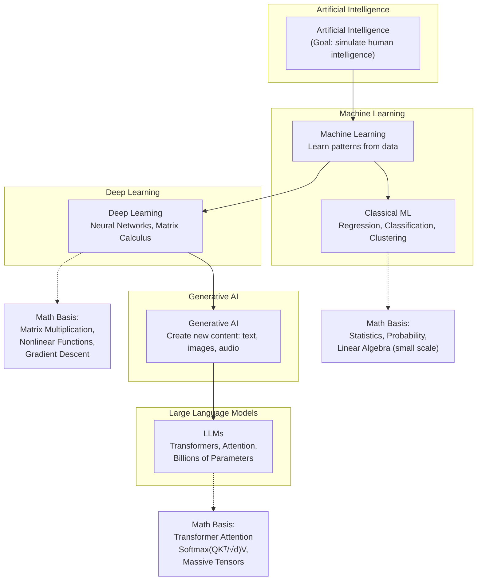
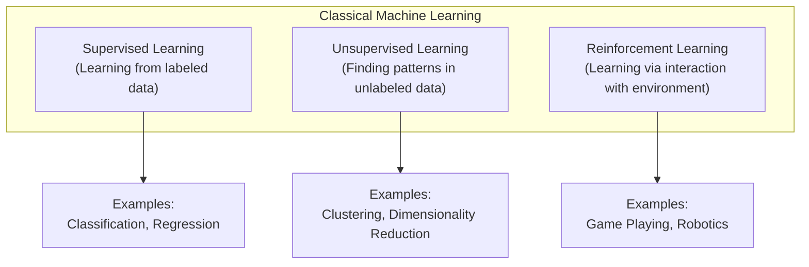

# Introduction to Machine Learning using Python


Python has become the de facto language for machine learning due to its simplicity, readability, and extensive ecosystem of libraries. Its flexibility allows for rapid prototyping and development, while its powerful libraries like NumPy, Pandas, and Scikit-learn provide efficient tools for data manipulation and model building.

---

## 1. Review




For a broad introduction to Python, check out the [Python Programming Guide](https://www.python.org/about/gettingstarted/). Here are some key features of Python that are particularly useful for machine learning:



A concise way to create lists in Python.

```python
# Code snippets demonstrating key Python concepts
# List comprehension example
squares = [x**2 for x in range(10)]
squares
```




Anonymous functions that can be defined in a single line.

```python
# Lambda function example
multiply = lambda x, y: x * y
multiply(5, 10)
```




Using `try`, `except`, and `finally` blocks to handle exceptions.

```python
# Error handling example
try:
    result = 10 / 0
except ZeroDivisionError:
    print("Cannot divide by zero")

print("This line still runs")
```




Functions that return an iterator, allowing for lazy evaluation (meaning they don't store all values in memory at once).

```python
# Generators example
def fibonacci(n):
    a, b = 0, 1
    for _ in range(n):
        yield a
        a, b = b, a + b

fib = fibonacci(int(1e18)) # Large number to demonstrate generator memory efficiency, the first 1e18 (i.e. 1 quintillion) Fibonacci numbers
```






NumPy is a powerful library for numerical computing in Python. It provides support for large, multi-dimensional arrays and matrices, along with a collection of mathematical functions to operate on these arrays. NumPy is the foundation for many other libraries in the Python data science ecosystem, such as Pandas, Scikit-learn, PyTorch, and TensorFlow. The reason NumPy is so fast is that it is implemented in C, which is a much faster language than Python.


```python
# Basic NumPy operations and array manipulations
import numpy as np

# Create an array
arr = np.array([1, 2, 3, 4, 5])

# Array operations
print("Array operations:")
print("Array:")
print(arr)
print("Array x 2:")
print(arr * 2)
print("Array summed:")
print(np.sum(arr))

# Broadcasting example
matrix = np.array([[1, 2, 3, 4 , 5], [6, 7, 8, 9, 10]])
print("\nBroadcasting example:")
print("Matrix:")
print(matrix)
print("Array:")
print(arr)
print("Matrix + Array:")
print(matrix + arr)
```





Pandas is a powerful data manipulation library for Python. It is built on top of NumPy and provides data structures and functions for efficiently manipulating large datasets. Pandas is widely used in data science and machine learning for data cleaning, exploration, and preparation.

Pandas isn't the best choice for truly massive datasets, since it loads the entire dataset into memory. But even libraries that are better suited for massive datasets, like Dask, tend to conform to the Pandas API, so learning Pandas is a good foundation for working with other libraries.

Pandas is great for organizing and exploring data. Let's take a quick look at how to use Pandas dataframes to organize data. We'll use the California Housing dataset, which is a dataset containing information about housing prices. The dataset contains 20,640 samples and 9 features. The goal is to predict the house value, given a set of features about the property and its district.

We are going to create a dataframe called `df` containing all feature data. 


```python
# Importing necessary libraries
import pandas as pd
import matplotlib.pyplot as plt
import numpy as np
from sklearn.datasets import fetch_california_housing

# Load the California housing dataset
california = fetch_california_housing()
print(type(california))
print(california.keys())
for key in california.keys():
    print(type(california[key]))
```

- [Sklearn's Bunch](https://scikit-learn.org/stable/modules/generated/sklearn.utils.Bunch.html)

To create a dataframe, we should first create a single DataFrame using `features` data, then add the `target` data. 

```python
df = pd.DataFrame(california['data'], columns = california['feature_names'])
print(df.head())
df[california['target_names'][0]] = california['target']
print(df.head())
```

Pandas includes some methods for quickly summarizing the data in a dataframe.


```python
# Basic data exploration
print("DataFrame Info:")
df.info()
```


```python
print("Basic Statistics:")
print(df.describe())
```

Pandas also makes it easy to filter data.


```python
# Filtering data
print("Houses with more than 4 rooms on average:")
print(df[df['AveRooms'] > 4].head())
```


```python
print("\nHouses with more than 4 rooms on average and a price above the median:")
print(df[(df['AveRooms'] > 4) & (df['MedHouseVal'] > df['MedHouseVal'].median())].head())
```

We can also sort the data easily, and add new columns.


```python
# Sorting data
print("\nTop 5 most expensive areas:")
print(df.sort_values('MedHouseVal', ascending=False).head())
```


```python
# Adding a new column
df['PriceCategory'] = pd.cut(df['MedHouseVal'], bins=[0, 1.25, 2.5, 3.75, np.inf], labels=['Low', 'Medium', 'High', 'Very High'])
print("\nDataFrame with new PriceCategory column:")
print(df.head())
```

A particularly useful feature of Pandas is the ability to group data by a particular column and then apply a function to each group. This is similar to the SQL `GROUP BY` clause, or to Excel's pivot tables.


```python
# Group by operations
print("\nAverage house age by price category:")
print(df.groupby('PriceCategory', observed=False)['HouseAge'].mean())
```

**Challenge:** Find the mean age of houses in the upper quartile (i.e. 75th percentile, or 0.75 quantile) of prices. I.e., among the 25% of houses that are the most expensive, what is their average age? For this, you might find it helpful to know that just as there is a `median` method (shown above) for Pandas Series, there is also a `quantile` method, in which you can specify whatever quantile you would like it to return.


```python
# Try out your code here. Submit your final answer below.
df[df['MedHouseVal'] > df['MedHouseVal'].quantile(0.75)]['HouseAge'].mean()
```


Pandas also includes some plotting functionality, which is built on top of the Matplotlib library. Very useful for quickly visualizing data.


```python
# Basic data visualization
plt.figure(figsize=(4, 3))
df.plot(x='MedInc', y='MedHouseVal', kind='scatter', alpha=0.5)
plt.title('Median Income vs House Median Price')
plt.xlabel('Median Income')
plt.ylabel('House Median Price')
plt.show()
```


```python
# Correlation heatmap (excluding categorical column)
plt.figure(figsize=(4, 3))
correlation_matrix = df.drop('PriceCategory', axis=1).corr()
plt.imshow(correlation_matrix, cmap='coolwarm', aspect='auto')
plt.colorbar()
plt.xticks(range(len(correlation_matrix.columns)), correlation_matrix.columns, rotation=90)
plt.yticks(range(len(correlation_matrix.columns)), correlation_matrix.columns)
plt.title('Correlation Heatmap of California Housing Features')
plt.tight_layout()
plt.show()
```


```python
# Handling categorical data
print("\nCount of houses in each price category:")
print(df['PriceCategory'].value_counts())
```


```python
# Visualizing categorical data
plt.figure(figsize=(6, 4))
df['PriceCategory'].value_counts().plot(kind='bar')
plt.title('Distribution of House Prices by Category')
plt.xlabel('Price Category')
plt.ylabel('Number of Houses')
plt.show()
```


---

## 2. Introduction to ML Concepts

Time to dive into some of the core concepts of machine learning! We'll start with a high-level overview of different types of machine learning, then move on to some common machine learning algorithms.















**Supervised learning:** learning a function which approximates the relationship between an input and output from a set of labeled training examples.

E.g.:



Our *target* (or dependent variable, or output) is the variable we would like to predict/estimate.

Our *features* (or regressors, or independent variables, or inputs, or covariates) are the variables we can use to make our prediction/estimate.

In this case, 

$Home \approx f(Sq. ft., \#bed, \#bath,\ldots)$





Supervised learning can be divided into regression and classification. 
In the case of **regression**, we estimate a *quantity*.



In the case of **classification**, we predict a *label* (i.e. a category).







Linear regression assumes that $f$ is just a weighted sum of the variables in the covariate matrix $X$:

$$f(X)=\beta_0 + \beta_1x_1 + \beta_2x_2 + \ldots + \beta_px_p + \epsilon$$

Which we can express as just $f(X)=X\mathbf{\beta}$ (and so $Y=X\mathbf{\beta}+\epsilon$).
Turns out the best estimate of $\beta$ is just $(X^TX)^{-1}X^TY$. This is called the Ordinary Least Squares (OLS) estimate. However, that expression sometimes cannot be calculated, and is not computationally efficient to use with large data.

In order to apply OLS regression, our problem should obey certain assumptions.

1. The linear model is correct.
2. The error term ε has mean 0.
3. The regressors (the $x$ terms) are linearly independent.
4. The errors are homoscedastic and uncorrelated.
5. The errors are normally distributed.


```python
# Simple linear regression example
import numpy as np
import matplotlib.pyplot as plt
from sklearn.linear_model import LinearRegression
from sklearn.model_selection import train_test_split

# Generate some random data - in a real problem, we would not know the true relationship described here.
X = np.random.uniform(-4, 4, (100, 1))
y = X**2 + np.random.normal(0, 3, X.shape)
X_train, X_test, y_train, y_test = train_test_split(X, y, test_size=0.2)

# Train a linear regression model
model = LinearRegression()
model.fit(X_train, y_train)
print(f"R-squared score: {model.score(X_test, y_test)}")
```


```python
# Plotting the data and the regression line
plt.figure(figsize=(4, 3))
plt.scatter(X, y, alpha=0.5)
plt.plot(X, model.predict(X), color='red')
plt.title('Simple Linear Regression Example')
plt.xlabel('X')
plt.ylabel('y')
plt.show()
```

Notice a couple of things. One, our fit is abysmal.
Two, there *does* nonetheless seem (visually) to be an interesting relationship between the variables. Maybe $y$ is related not directly to $x$, but to some function of $x$.

In this case, we can get ideas from visualizing the data, but in most cases, a deep understanding of the data will be necessary to make a good model. E.g., suppose in this case we know that $X$ is wind speed, and $y$ is power generated by a wind turbine. An engineer might tell us that in practice $y$ is typically related to the *square* of $X$, rather than $X$ itself. 


```python
# Fit a linear model where y is regressed on X^2
X_squared_train = X_train**2
X_squared_test = X_test**2

model_squared = LinearRegression()
model_squared.fit(X_squared_train, y_train)

print(f"R-squared score (X^2 model): {model_squared.score(X_squared_test, y_test)}")

# Create subplots
fig, axes = plt.subplots(1, 2, figsize=(6, 3))

# Plotting the data and the regression curve
axes[0].scatter(X, y, alpha=0.5)
X_curve = np.linspace(X.min(), X.max(), 100).reshape(-1, 1)
y_pred = model_squared.predict(X_curve**2)
axes[0].plot(X_curve, y_pred, color='red')
axes[0].set_title('Linear Regression with X^2')
axes[0].set_xlabel('X')
axes[0].set_ylabel('y')

# Plotting y_train vs X_squared_train
axes[1].scatter(X_squared_train, y_train, alpha=0.5)
axes[1].plot(X_squared_train, model_squared.predict(X_squared_train), color='red')
axes[1].set_title('y_train vs X_squared_train')
axes[1].set_xlabel('X_squared_train')
axes[1].set_ylabel('y_train')

plt.tight_layout()
plt.show()
```

"Linear" regression is surprisingly flexible!





Despite its name, logistic regression is a powerful algorithm for *classification*. In a binary classification problem, our target can be thought of as being either 1 or 0. It is possible (but not advisable!) to use a regression algorithm, like linear regression, in such a case.

Suppose that I have data where the target is a binary indicator for whether a student passed a certain class. The data is the student's score on a that class's first exam. 

```python
import numpy as np
import matplotlib.pyplot as plt
from sklearn.linear_model import LinearRegression

# Generate continuous covariate
n_samples = 100
covariate = np.random.uniform(0, 10, n_samples)

# Generate binary data correlated with covariate
probabilities = 1 / (1 + np.exp(-(covariate - 5)))
binary_data = np.random.binomial(1, probabilities)

# Fit linear regression
model = LinearRegression()
model.fit(covariate.reshape(-1, 1), binary_data)

# Create plot
plt.figure(figsize=(4, 3))
plt.scatter(covariate, binary_data, color='blue', alpha=0.6)

# Plot linear regression line
x_plot = np.linspace(0, 10, 100)
y_plot = model.predict(x_plot.reshape(-1, 1))
plt.plot(x_plot, y_plot, color='red', lw=2)

plt.xlabel('Score on first exam')
plt.ylabel('Pass (1) or fail (0)')
plt.title('Binary Data vs Continuous Covariate\nwith Linear Regression Fit')
plt.grid(True, alpha=0.3)
plt.show()

print(f"Linear Regression Coefficient: {model.coef_[0]:.4f}")
print(f"Linear Regression Intercept: {model.intercept_:.4f}")
```

The idea of logistic regression is that instead of directly modeling the target, we instead model the *probability* that the target is 1 or 0. This is a specific type of *generalized linear model*, in which the target is transformed by a *link function*. In this case, the link function is the *logit* function, which is the inverse of the *logistic* function. The logistic function is defined as: $$\mathrm{logit}(p)=\log\left(\frac{p}{1-p}\right)$$


```python
from sklearn.linear_model import LogisticRegression

# Fit logistic regression
logistic_model = LogisticRegression()
logistic_model.fit(covariate.reshape(-1, 1), binary_data)

# Create plot
plt.figure(figsize=(4, 3))
plt.scatter(covariate, binary_data, color='blue', alpha=0.6, label='Data')

# Plot linear regression line
x_plot = np.linspace(0, 10, 100)
y_linear = model.predict(x_plot.reshape(-1, 1))
plt.plot(x_plot, y_linear, color='red', lw=2, label='Lin. Reg.')

# Plot logistic regression curve
y_logistic = logistic_model.predict_proba(x_plot.reshape(-1, 1))[:, 1]
plt.plot(x_plot, y_logistic, color='green', lw=2, label='Log. Reg.')

plt.xlabel('Score on first exam')
plt.ylabel('Pass (1) or fail (0)')
plt.title('Binary Data vs Continuous Covariate:\nLinear and Logistic Regression')
plt.legend(loc='center left')
plt.grid(True, alpha=0.3)
plt.ylim(-0.1, 1.1)  # Set y-axis limits for better visualization
plt.show()

print("Linear Regression:")
print(f"Coefficient: {model.coef_[0]:.4f}")
print(f"Intercept: {model.intercept_:.4f}")
print("\nLogistic Regression:")
print(f"Coefficient: {logistic_model.coef_[0][0]:.4f}")
print(f"Intercept: {logistic_model.intercept_[0]:.4f}")
```





A totally different approach to modeling data is to use a decision tree. A decision tree is a tree-like model of the dataset. It is a simple model that is easy to interpret and understand. It is also a non-parametric model, which means that it makes no assumptions about the shape of the data - sometimes a big advantage!


```python
# First, let's make some data.
import pandas as pd
from sklearn.tree import DecisionTreeClassifier, plot_tree

# Create a sample dataset
np.random.seed(42)
n_samples = 1000

data = pd.DataFrame({
    'income': np.random.randint(20000, 200000, n_samples),
    'credit_score': np.random.randint(300, 850, n_samples),
    'debt_to_income': np.random.uniform(0, 0.6, n_samples),
    'employment_length': np.random.randint(0, 30, n_samples),
    'loan_amount': np.random.randint(5000, 100000, n_samples)
})

# Create a rule-based target variable
data['loan_approved'] = (
    (data['credit_score'] > 700) & 
    (data['debt_to_income'] < 0.4) & 
    (data['income'] > 50000)
).astype(int)

# Prepare features and target
X = data[['income', 'credit_score', 'debt_to_income', 'employment_length', 'loan_amount']]
y = data['loan_approved']
```


```python
# Create and train the Decision Tree
dt = DecisionTreeClassifier(max_depth=5, random_state=42)
dt.fit(X, y)

# Visualize the decision tree
plt.figure(figsize=(6, 6))
plot_tree(dt, filled=True, feature_names=X.columns.to_list(), class_names=['Denied', 'Approved'], rounded=True, impurity=False, proportion=True, precision=2)
plt.title("Loan Approval Decision Tree")
plt.show()

print("Decision Tree created and visualized based on the loan approval data.")
```





The decision tree is highly interpretable, which is sometimes a big advantage. But, it is a weak machine learning algorithm; not nearly as powerful as some others. One way to make it more powerful is to use a *random forest*. A random forest is an ensemble of decision trees, which means that it is a collection of decision trees that are trained separately and then combined to make a prediction. Essentially, a random forest is a collection of decision trees that are trained separately and then combined (by averaging or voting) to make a prediction. They can be used for both classification and regression tasks.

You lose the interpretability of a single decision tree, but you gain a lot of predictive power. And random forests are very easy to use and very flexible, don't require much tuning, are very hard to overfit, and don't make many assumptions about the data. A good general-purpose algorithm.


```python
import pandas as pd
import numpy as np
import matplotlib.pyplot as plt
from sklearn.ensemble import RandomForestClassifier
from sklearn.tree import plot_tree

# Create and train the Random Forest
rf = RandomForestClassifier(n_estimators=10, max_depth=2, random_state=42)
rf.fit(X, y)
```


Random Forests makes it easy to see which features are most important in making a prediction. This is because the algorithm can keep track of how much each feature contributes to the trees in the forest.


```python
# Visualize feature importances
feature_importance = pd.DataFrame({'feature': X.columns, 'importance': rf.feature_importances_})
feature_importance = feature_importance.sort_values('importance', ascending=False)

plt.figure(figsize=(4, 3))
plt.bar(feature_importance['feature'], feature_importance['importance'])
plt.title("Feature Importance in Random Forest")
plt.xlabel("Features")
plt.ylabel("Importance")
plt.xticks(rotation=45)
plt.tight_layout()
plt.show()
```


```python
# Plot two trees side by side
fig, axes = plt.subplots(1, 2, figsize=(15, 8))

# First tree
plot_tree(rf.estimators_[0], 
        filled=True, 
        feature_names=X.columns.to_list(), 
        class_names=['Denied', 'Approved'], 
        rounded=True,
        impurity=False,
        proportion=False,
        node_ids=False,
        precision=0,
        ax=axes[0])
axes[0].set_title("Tree 1 from Random Forest")

# Second tree
plot_tree(rf.estimators_[1], 
        filled=True, 
        feature_names=X.columns.to_list(), 
        class_names=['Denied', 'Approved'], 
        rounded=True,
        impurity=False,
        proportion=False,
        node_ids=False,
        precision=0,
        ax=axes[1])
axes[1].set_title("Tree 2 from Random Forest")

plt.tight_layout()
plt.show()

```





Support Vector Machines (SVMs) are a powerful supervised learning algorithm used for classification or regression tasks. They are based on the idea of finding the hyperplane that best divides a dataset into two classes. The hyperplane is the line that best separates the two classes. The SVM algorithm finds the hyperplane that maximizes the margin between the two classes.


In cases where the data cannot be linearly separated, SVMs can use a *kernel trick* to transform the data into a higher-dimensional space where it can be separated. This is a very powerful technique that allows SVMs to work well on a wide variety of datasets.


```python
# First, let's prepare some data.

from sklearn import datasets, svm
from sklearn.model_selection import train_test_split
from sklearn.preprocessing import StandardScaler
from sklearn.metrics import accuracy_score, classification_report

# Load the iris dataset
iris = datasets.load_iris()
X = iris.data[:, [2, 3]]  # We'll use petal length and width
y = iris.target

# Split the data into training and testing sets
X_train, X_test, y_train, y_test = train_test_split(X, y, test_size=0.3, random_state=42)

# Standardize the features
scaler = StandardScaler()
X_train_scaled = scaler.fit_transform(X_train)
X_test_scaled = scaler.transform(X_test)
```


```python
# Now, let's train a Support Vector Machine (SVM) classifier.

# Train SVM classifier
svm_classifier = svm.SVC(kernel='rbf', random_state=42)
svm_classifier.fit(X_train_scaled, y_train)
```


```python
# Now, let's make predictions and evaluate the model.

# Make predictions
y_pred = svm_classifier.predict(X_test_scaled)

# Print the accuracy and classification report
print("Accuracy:", accuracy_score(y_test, y_pred))
print("\nClassification Report:")
print(classification_report(y_test, y_pred, target_names=iris.target_names))

# Visualize the decision boundaries
def plot_decision_regions(X, y, classifier, test_idx=None, resolution=0.02):
    markers = ('s', 'x', 'o', '^', 'v')
    colors = ('red', 'blue', 'lightgreen', 'gray', 'cyan')
    cmap = plt.cm.RdYlBu

    x1_min, x1_max = X[:, 0].min() - 1, X[:, 0].max() + 1
    x2_min, x2_max = X[:, 1].min() - 1, X[:, 1].max() + 1
    xx1, xx2 = np.meshgrid(np.arange(x1_min, x1_max, resolution),
                        np.arange(x2_min, x2_max, resolution))
    Z = classifier.predict(np.array([xx1.ravel(), xx2.ravel()]).T)
    Z = Z.reshape(xx1.shape)

    plt.contourf(xx1, xx2, Z, alpha=0.4, cmap=cmap)
    plt.xlim(xx1.min(), xx1.max())
    plt.ylim(xx2.min(), xx2.max())

    for idx, cl in enumerate(np.unique(y)):
        plt.scatter(x=X[y == cl, 0], y=X[y == cl, 1],
                    alpha=0.8, color=cmap(idx / len(np.unique(y))),
                    marker=markers[idx], label=iris.target_names[cl])

    if test_idx:
        X_test, y_test = X[test_idx, :], y[test_idx]
        plt.scatter(X_test[:, 0], X_test[:, 1], c='none', alpha=1.0, linewidth=1, marker='o', 
                    s=55, edgecolors='black', label='test set')

# Visualize the results
X_combined = np.vstack((X_train_scaled, X_test_scaled))
y_combined = np.hstack((y_train, y_test))
plot_decision_regions(X_combined, y_combined, classifier=svm_classifier, test_idx=range(len(y_train), len(y_combined)))

plt.xlabel('Petal length (standardized)')
plt.ylabel('Petal width (standardized)')
plt.legend(loc='upper left')
plt.title('SVM Decision Regions - Iris Dataset')
plt.tight_layout()
plt.show()
```

    Accuracy: 1.0

    Classification Report:
                precision    recall  f1-score   support

        setosa       1.00      1.00      1.00        19
    versicolor       1.00      1.00      1.00        13
    virginica       1.00      1.00      1.00        13

        accuracy                           1.00        45
    macro avg       1.00      1.00      1.00        45
    weighted avg       1.00      1.00      1.00        45






K-Nearest Neighbors (KNN) is a simple, easy-to-understand algorithm that can be used for both classification and regression tasks. It is a non-parametric algorithm, which means that it makes no assumptions about the shape of the data. The basic idea behind KNN is that similar data points are close to each other in the feature space. To make a prediction, KNN looks at the K-nearest neighbors of a data point and takes a majority vote (for classification) or an average (for regression) to make a prediction.


```python
from sklearn import neighbors

# Train KNN classifier on the iris data
k = 5  # number of neighbors
knn_classifier = neighbors.KNeighborsClassifier(n_neighbors=k)
knn_classifier.fit(X_train_scaled, y_train)
```

```python
# Make predictions
y_pred = knn_classifier.predict(X_test_scaled)

# Print the accuracy and classification report
print(f"KNN (k={k}) Accuracy:", accuracy_score(y_test, y_pred))
print("\nClassification Report:")
print(classification_report(y_test, y_pred, target_names=iris.target_names))

# Visualize the decision boundaries
def plot_decision_regions(X, y, classifier, test_idx=None, resolution=0.02):
    markers = ('s', 'x', 'o', '^', 'v')
    colors = ('red', 'blue', 'lightgreen', 'gray', 'cyan')
    cmap = plt.cm.RdYlBu

    x1_min, x1_max = X[:, 0].min() - 1, X[:, 0].max() + 1
    x2_min, x2_max = X[:, 1].min() - 1, X[:, 1].max() + 1
    xx1, xx2 = np.meshgrid(np.arange(x1_min, x1_max, resolution),
                        np.arange(x2_min, x2_max, resolution))
    Z = classifier.predict(np.array([xx1.ravel(), xx2.ravel()]).T)
    Z = Z.reshape(xx1.shape)

    plt.contourf(xx1, xx2, Z, alpha=0.4, cmap=cmap)
    plt.xlim(xx1.min(), xx1.max())
    plt.ylim(xx2.min(), xx2.max())

    for idx, cl in enumerate(np.unique(y)):
        plt.scatter(x=X[y == cl, 0], y=X[y == cl, 1],
                    alpha=0.8, color=cmap(idx / len(np.unique(y))),
                    marker=markers[idx], label=iris.target_names[cl])

    if test_idx:
        X_test, y_test = X[test_idx, :], y[test_idx]
        plt.scatter(X_test[:, 0], X_test[:, 1], c='none', alpha=1.0, linewidth=1, marker='o', 
                    s=55, edgecolors='black', label='test set')

# Visualize the results
X_combined = np.vstack((X_train_scaled, X_test_scaled))
y_combined = np.hstack((y_train, y_test))
plot_decision_regions(X_combined, y_combined, classifier=knn_classifier, test_idx=range(len(y_train), len(y_combined)))

plt.xlabel('Petal length (standardized)')
plt.ylabel('Petal width (standardized)')
plt.legend(loc='upper left')
plt.title(f'KNN (k={k}) Decision Regions - Iris Dataset')
plt.tight_layout()
plt.show()
```


---

## 3. Supervised Learning Model Evaluation Metrics

How do we evaluate the performance of a machine learning model? There are many different metrics that can be used, depending on the type of problem and the goals of the model. The choice of metric will almost always depend heavily on the type of problem you are trying to solve.

But how do we apply these metrics? We can split our data into a training set and a test set. We train our model on the training set and then evaluate its performance on the test set. If we're tuning hyperparameters, we might use a validation set as well.



Even better than a single train/test split is to use *cross-validation*. In cross-validation, the data is split into K folds, and the model is trained and evaluated K times, each time using a different fold as the test set. This gives us a more robust estimate of the model's performance.






In a regression problem, we are trying to predict a continuous value. Some common metrics for evaluating regression models include:
* Mean Squared Error (MSE) - the average of the squared differences between the predicted and actual values
* Root Mean Squared Error (RMSE) - the square root of the MSE. More interpretable than MSE due to being in the same units as the target variable
* Mean Absolute Error (MAE) - the average of the absolute differences between the predicted and actual values
* R-squared (R2) - a measure of how much of the variation in the target is captured by your model





Mean Squared Error (MSE) is a metric used to measure the average squared difference between actual values and predicted values. It is commonly used in regression tasks to quantify the accuracy of a predictive model. Mathematically, MSE is defined as:

$$ \text{MSE} = \frac{1}{n} \sum_{i=1}^{n} (y_i - \hat{y}_i)^2 $$

where $ n $ is the number of data points, $ y_i $ represents the actual value of the $ i $-th data point, and $ \hat{y}_i $ is the predicted value of the $ i $-th data point.

For example, suppose a model predicts housing prices for four houses as $ \hat{y} = [250k, 300k, 200k, 400k] $, while the actual prices are $ y = [260k, 310k, 190k, 390k] $. The MSE would be calculated as:

$$ \text{MSE} = \frac{1}{4} \left( (260k - 250k)^2 + (310k - 300k)^2 + (190k - 200k)^2 + (390k - 400k)^2 \right) $$

This results in:

$$ \text{MSE} = \frac{1}{4} \left( 10k^2 + 10k^2 + (-10)^2 + (-10)^2 \right) = 100M $$

Thus, the MSE for this prediction is 100M, meaning that, on average, the squared error between predicted and actual housing prices is 100M. Notice this is *not* on the scale of dollars, it is on the scale of dollars *squared*.


```python
from sklearn.datasets import fetch_california_housing
from sklearn.model_selection import train_test_split
from sklearn.linear_model import LinearRegression
from sklearn.metrics import mean_squared_error, mean_absolute_error, r2_score
import numpy as np

# Load the California Housing dataset
housing = fetch_california_housing()
X, y = housing.data, housing.target

# Split the data into training and testing sets
X_train, X_test, y_train, y_test = train_test_split(X, y, test_size=0.2, random_state=42)

# Fit a linear regression model
model = LinearRegression()
model.fit(X_train, y_train)

# Make predictions on the test set
y_pred = model.predict(X_test)

# Calculate metrics
mse = mean_squared_error(y_test, y_pred)
rmse = np.sqrt(mse)
mae = mean_absolute_error(y_test, y_pred)
r2 = r2_score(y_test, y_pred)

# Display metrics
print("Regression Metrics for California Housing Dataset:")
print(f"Mean Squared Error (MSE): {mse:.4f}")
print(f"Root Mean Squared Error (RMSE): {rmse:.4f}")
print(f"Mean Absolute Error (MAE): {mae:.4f}")
print(f"R-squared (R2): {r2:.4f}")

# Display feature names and their coefficients
feature_names = housing.feature_names
coefficients = model.coef_

print("\nFeature Coefficients:")
for name, coef in zip(feature_names, coefficients):
    print(f"{name}: {coef:.4f}")
```





In a classification problem, we are trying to predict a label. Some common metrics for evaluating classification models include:
* Accuracy - the proportion of correctly classified instances
* Precision - the proportion of true positive predictions among all positive *predictions*
* Recall - the proportion of true positive predictions among all actual positive *instances*
* F1 Score - the harmonic mean of precision and recall $\left(F_1 = 2 \times \frac{\text{precision} \times \text{recall}}{\text{precision} + \text{recall}}\right)$
* ROC AUC - the area under the Receiver Operating Characteristic curve


Note that all of the above *except* for ROC AUC depend on your choice of threshold for classification. ROC AUC is a metric that is threshold-independent, and is often used when you want to compare models across different thresholds. 

Let's look at this in action, after fitting a logistic regression model on the UCI Ionosphere dataset. In this dataset, we are trying to predict whether a radar return is "good" or "bad" based on features such as the signal's amplitude and frequency.


```python
from sklearn.datasets import fetch_openml
from sklearn.model_selection import train_test_split
from sklearn.linear_model import LogisticRegression
from sklearn.metrics import accuracy_score, precision_score, recall_score, f1_score, roc_auc_score, roc_curve
from sklearn.preprocessing import StandardScaler
import matplotlib.pyplot as plt
import numpy as np

# Load the Ionosphere dataset
ionosphere = fetch_openml(name="ionosphere", version=1, as_frame=True)
X, y = ionosphere.data, ionosphere.target
y = (y == 'g').astype(int)  # Convert to binary (good=1, bad=0)

# Split the data into training and testing sets
X_train, X_test, y_train, y_test = train_test_split(X, y, test_size=0.3, random_state=42)

# Scale the features
scaler = StandardScaler()
X_train_scaled = scaler.fit_transform(X_train)
X_test_scaled = scaler.transform(X_test)

# Fit a logistic regression model with reduced performance
model = LogisticRegression(random_state=42, C=0.01, max_iter=1000) 
model.fit(X_train_scaled, y_train)

# Make predictions on the test set
y_pred = model.predict(X_test_scaled)
y_pred_proba = model.predict_proba(X_test_scaled)[:, 1]

# Calculate metrics
accuracy = accuracy_score(y_test, y_pred)
precision = precision_score(y_test, y_pred)
recall = recall_score(y_test, y_pred)
f1 = f1_score(y_test, y_pred)
roc_auc = roc_auc_score(y_test, y_pred_proba)

# Display metrics
print("Classification Metrics for Ionosphere Dataset:")
print(f"Accuracy: {accuracy:.4f}")
print(f"Precision: {precision:.4f}")
print(f"Recall: {recall:.4f}")
print(f"F1 Score: {f1:.4f}")
print(f"ROC AUC: {roc_auc:.4f}")

# Calculate ROC curve
fpr, tpr, thresholds = roc_curve(y_test, y_pred_proba)

# Plot ROC curve
plt.figure(figsize=(4, 3))
plt.plot(fpr, tpr, color='blue', label=f'ROC Curve (AUC = {roc_auc:.2f})')
plt.plot([0, 1], [0, 1], color='red', linestyle='--', label='Random Classifier')
plt.xlim([0.0, 1.0])
plt.ylim([0.0, 1.05])
plt.xlabel('False Positive Rate')
plt.ylabel('True Positive Rate')
plt.title('Receiver Operating Characteristic (ROC) Curve')
plt.legend(loc="lower right")
plt.grid(True)
plt.show()
```


The ROC curve shows the true positive rate (i.e., the proportion of actual positive cases correctly identified) against the false positive rate (i.e., the proportion of actual negative cases incorrectly classified as positive) at various classification thresholds. The ROC AUC is just the area under the curve -- the higher, the better.





A confusion matrix is a table that is often used to describe the performance of a classification model. It shows the number of true positives, false positives, true negatives, and false negatives. From the confusion matrix, we can calculate many different metrics, including accuracy, precision, recall, and F1 score.


```python
# Display the confusion matrix as a plot
from sklearn.metrics import confusion_matrix
import seaborn as sns

# Calculate the confusion matrix
conf_matrix = confusion_matrix(y_test, y_pred)

# Plot the confusion matrix
plt.figure(figsize=(2, 2))
sns.heatmap(conf_matrix, annot=True, fmt='d', cmap='Blues', cbar=False, 
            xticklabels=['Bad', 'Good'], yticklabels=['Bad', 'Good'])
plt.xlabel('Predicted Label')
plt.ylabel('True Label')
plt.title('Confusion Matrix')
plt.show()

```

