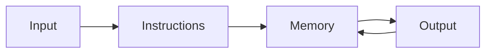

## Origin of modern computing architectures

- `computer` = `the one who computes`



<iframe width="560" height="315" src="https://www.youtube.com/embed/MQzpLLhN0fY" title="YouTube video player" frameborder="0" allow="accelerometer; autoplay; clipboard-write; encrypted-media; gyroscope; picture-in-picture" allowfullscreen></iframe>





<iframe width="560" height="315" src="https://www.youtube.com/embed/XSkGY6LchJs" title="YouTube video player" frameborder="0" allow="accelerometer; autoplay; clipboard-write; encrypted-media; gyroscope; picture-in-picture" allowfullscreen></iframe>





<iframe width="560" height="315" src="https://www.youtube.com/embed/9HXjLW7v-II" title="YouTube video player" frameborder="0" allow="accelerometer; autoplay; clipboard-write; encrypted-media; gyroscope; picture-in-picture" allowfullscreen></iframe>





<iframe width="560" height="315" src="https://www.youtube.com/embed/k4oGI_dNaPc" title="YouTube video player" frameborder="0" allow="accelerometer; autoplay; clipboard-write; encrypted-media; gyroscope; picture-in-picture" allowfullscreen></iframe>





- Everyday speech: "the computer thinks", "Excel calculated that", "my phone knows"
- More accurate: a computer **follows instructions** on **data**
- Those instructions were written by people (or by other programs written by people)
- Excel is one such program: *you* write many of the instructions as formulas





- **Input**: keyboard, file, sensor, a cell you typed into
- **Instructions**: a program, a formula, a Python script, a Copilot prompt that becomes code
- **Memory**: short-term (RAM / unsaved workbook) and long-term (disk / OneDrive / `.xlsx` file)
- **Output**: screen, chart, printed report, another file





... and not Words or Adobe Acrobat or other applications?

- This course is called `Programming and Data Science`.
  - What is Charles Babbage's Analytical Machine used for?
  - What is Hollerith Census Machine used for?
  - What is ENIAC used for?
- Mathematical calculations provide the fundamental drive for automatic computation. 
  - Modern computers: still computations, only much bigger and much faster.
- Excel is the perfect application:
  - Driven by business motivation
  - Easy access for the general population



## Introduction to Excel



- **Workbook**: the `.xlsx` file (the container)
- **Worksheet**: one grid inside the workbook (`Sheet1`, `Data`, `Notes`)
- **Cell**: intersection of a column letter and a row number (`B2`)
- **Range**: a rectangle of cells (`B2:D10`)
- **Formula bar**: shows the stored instruction or value
- **Ribbon**: Home / Insert / Data / Formulas — where most lab steps live
- **Name Box**: left of the formula bar; jump to a cell or name a range





{% include figure.liquid path="assets/img/courses/csc112/intro/computers.png" max-width="50%" zoomable=true %}

- **Chip/CPU/Processor**: executes an application's instructions, one after another
- **Memory/RAM**: contains instructions and data of an application *when* that application is running. Goes way when the computer is shutdown or the application is closed. 
- **Storage/SSD/HDD**: persistent storage of an application and its data. 





{% include figure.liquid path="assets/img/courses/csc112/intro/workflow.png" max-width="50%" zoomable=true %}

- A `.xlsx` workbook is a file: a packaged collection of worksheets, charts, and metadata
  - It's all 0s and 1s!
- Immediate edits are stored in memory
  - Closing Excel without saving is throwing these edits
  - Need autosave or explicit Save/Save As to write to storage (persistence)

{% include figure.liquid path="assets/img/courses/csc112/intro/workflow.png" max-width="50%" zoomable=true %}

- Edits make to online access are saved as a slower rate. 





- Computers store everything as bits (`0` and `1`)
- A **byte** is 8 bits; enough for a small integer or one character in older encodings
- You will not count bits in this course
- You *will* care that the machine must be told whether a pile of bits is a number, text, or a date





- Rename sheets (`Data`, `Notes`, `Checks`) instead of leaving `Sheet1`
- Freeze the header row when the list grows (`View → Freeze Panes`)
- Save to OneDrive so AutoSave is persistence
- One idea per sheet when you can: raw data stays raw



## Types of information



- `100` the number and `"100"` the text are not the same
- You can add numbers; you cannot (sensibly) add two ZIP codes stored as text
- Dates are not "how they look": they are values that can be sorted and subtracted
- True/false (Boolean) values drive `IF` decisions later in the semester





| What you mean | Typical Excel storage | Danger if you get it wrong |
| --- | --- | --- |
| Quantity, money, score | Number | Text that looks like a number will not `SUM` |
| Name, ID, ZIP, phone | Text | Leading zeros vanish if stored as Number (`08052` → `8052`) |
| When something happened | Date/time (a serial number) | Sorting "September" as text puts it after "August" incorrectly |
| Yes / no, pass / fail | Boolean or `TRUE`/`FALSE` | `"TRUE"` as text is not the same as `TRUE` |
| A rule, not a value | Formula | Copy-paste as values and the rule is gone |



## What Excel is really storing



- The cell *display* the *final interpreted value*
- The formula bar is closer to what is stored in memory
- Example: cell shows `50%`; formula bar may show `0.5`
- Example: cell shows `9/1/2026`; Excel may be storing `45901` (a date serial)





- `General`, `Number`, `Currency`, `Percentage`, `Date`, `Text` change how a value looks
- Changing the format does **not** change the underlying value (usually)
- Exception: if you type into a cell already formatted as Text, Excel may store digits as text
- Green triangles and `ISTEXT` / `ISNUMBER` are early debugging tools





- `=B2+C2` means: *when asked, fetch B2 and C2, add, put the result here*
- Recalculation is the computer running that instruction again
- If B2 is text `"10"`, the instruction may fail or silently do the wrong thing
- This is SLO4 and SLO5 in miniature: right types, then check correctness



## Try this in Excel



1. Create a new workbook and save it to OneDrive as `week01-memory.xlsx`
2. In `A1:A4` enter labels: `Quantity`, `ZIP`, `Date`, `Share`
3. In `B1` enter `12` (Number)
4. In `B2` enter `08052` and format the cell as **Text** *before* or immediately after typing; confirm the leading zero stays
5. In `B3` enter today's date; change the format between Short Date and Number; watch the serial
6. In `B4` enter `0.25` and format as Percentage
7. In `C1` enter `=B1*B4` and explain in an adjacent cell what instruction you wrote





- Close the file, reopen it: RAM was discarded; the file restored the cells
- Turn AutoSave off temporarily (if you can), type a value, force-quit Excel: that value was only in RAM
- *(Do this on a throwaway copy.)*





- Close the file, reopen it: RAM was discarded and the file restored the cells
- Turn AutoSave off temporarily (if you can), type a value, force-quit Excel: that value was only in RAM
  - *(Do this on a throwaway copy.)*


