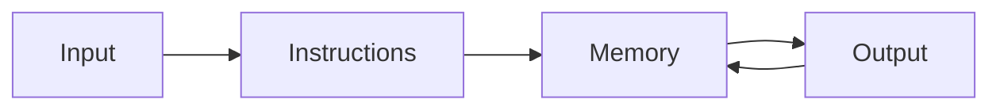

## This week

Week 1 · Excel Ch. 1 · Excel Project 1. Next: data literacy (lecture 2).

## Objectives



- Explain, in plain language, what a computer does with input, instructions, memory, and output
- Distinguish a *value* from a *display format* (the same idea in RAM and in an Excel cell)
- Recognize common data types you will meet all semester: numbers, text, dates, and true/false
- Create a simple Excel workbook, save it to OneDrive, and inspect what is actually stored in a cell



## Computers do not think



- Everyday speech: "the computer thinks", "Excel calculated that", "my phone knows"
- More accurate: a computer **follows instructions** on **data**
- Those instructions were written by people (or by other programs written by people)
- Excel is one such program: *you* write many of the instructions as formulas





- **Input**: keyboard, file, sensor, a cell you typed into
- **Instructions**: a program, a formula, a Python script, a Copilot prompt that becomes code
- **Memory**: short-term (RAM / unsaved workbook) and long-term (disk / OneDrive / `.xlsx` file)
- **Output**: screen, chart, printed report, another file





- A formula is a tiny program living in a cell
- A cell is a named memory location (`B2`, `Grade`, `Total`)
- If you do not know what is *stored* versus what is *shown*, later charts and pivots will lie politely



## Instructions, memory, and files



- **CPU**: executes instructions, one after another (very fast, not magic)
- **RAM**: working memory; disappears when the machine (or the unsaved file) goes away
- **Storage**: SSD, USB drive, OneDrive; survives after you close Excel
- **Operating system**: the program that shares the machine among Excel, the browser, and everything else





- A `.xlsx` workbook is a file: a packaged collection of worksheets, charts, and metadata
- Closing Excel without saving is throwing away RAM, not the last version on disk
- AutoSave (OneDrive / SharePoint) is persistence happening in the background
- Same idea in Word (`.docx`) and PowerPoint (`.pptx`): the file is the long-term copy





- Computers store everything as bits (`0` and `1`)
- A **byte** is 8 bits; enough for a small integer or one character in older encodings
- You will not count bits in this course
- You *will* care that the machine must be told whether a pile of bits is a number, text, or a date



## Workbook anatomy



- **Workbook**: the `.xlsx` file (the container)
- **Worksheet**: one grid inside the workbook (`Sheet1`, `Data`, `Notes`)
- **Cell**: intersection of a column letter and a row number (`B2`)
- **Range**: a rectangle of cells (`B2:D10`)
- **Formula bar**: shows the stored instruction or value
- **Ribbon**: Home / Insert / Data / Formulas — where most lab steps live
- **Name Box**: left of the formula bar; jump to a cell or name a range





- Rename sheets (`Data`, `Notes`, `Checks`) instead of leaving `Sheet1`
- Freeze the header row when the list grows (`View → Freeze Panes`)
- Save to OneDrive so AutoSave is persistence, not a hope
- One idea per sheet when you can: raw data stays raw



## Types of information



- `100` the number and `"100"` the text are not the same
- You can add numbers; you cannot (sensibly) add two ZIP codes stored as text
- Dates are not "how they look": they are values that can be sorted and subtracted
- True/false (Boolean) values drive `IF` decisions later in the semester





| What you mean | Typical Excel storage | Danger if you get it wrong |
| --- | --- | --- |
| Quantity, money, score | Number | Text that looks like a number will not `SUM` |
| Name, ID, ZIP, phone | Text | Leading zeros vanish if stored as Number (`08052` → `8052`) |
| When something happened | Date/time (a serial number) | Sorting "September" as text puts it after "August" incorrectly |
| Yes / no, pass / fail | Boolean or `TRUE`/`FALSE` | `"TRUE"` as text is not the same as `TRUE` |
| A rule, not a value | Formula | Copy-paste as values and the rule is gone |





- Word: a heading is not just big bold text; it is a *style* the document model understands
- PowerPoint: a chart pasted as a picture cannot be updated when the Excel data changes
- Theme of the course: **structure first, decoration second**



## What Excel is really storing



- The cell *display* is a costume
- The formula bar is closer to memory
- Example: cell shows `50%`; formula bar may show `0.5`
- Example: cell shows `9/1/2026`; Excel may be storing `45901` (a date serial)





- `General`, `Number`, `Currency`, `Percentage`, `Date`, `Text` change how a value looks
- Changing the format does **not** change the underlying value (usually)
- Exception: if you type into a cell already formatted as Text, Excel may store digits as text
- Green triangles and `ISTEXT` / `ISNUMBER` are early debugging tools





- `=B2+C2` means: *when asked, fetch B2 and C2, add, put the result here*
- Recalculation is the computer running that instruction again
- If B2 is text `"10"`, the instruction may fail or silently do the wrong thing
- This is SLO4 and SLO5 in miniature: right types, then check correctness



## Try this in Excel



1. Create a new workbook and save it to OneDrive as `week01-memory.xlsx`
2. In `A1:A4` enter labels: `Quantity`, `ZIP`, `Date`, `Share`
3. In `B1` enter `12` (Number)
4. In `B2` enter `08052` and format the cell as **Text** *before* or immediately after typing; confirm the leading zero stays
5. In `B3` enter today's date; change the format between Short Date and Number; watch the serial
6. In `B4` enter `0.25` and format as Percentage
7. In `C1` enter `=B1*B4` and explain in a Word comment or adjacent cell what instruction you wrote





- Close the file, reopen it: RAM was discarded; the file restored the cells
- Turn AutoSave off temporarily (if you can), type a value, force-quit Excel: that value was only in RAM
- *(Do this on a throwaway copy.)*





- Designate one note-taker
- Where have you seen a computer "get the type wrong" in real life (grades, money, IDs, dates)?
- If Copilot writes `=B2+C2` for you, what would you inspect before trusting the total?



## Takeaways



- Computers follow instructions; Excel formulas *are* instructions
- Storage has types; display formats can hide those types
- A workbook file is persistence; an unsaved grid is not
- Next lecture: before writing formulas, decide what a *row* and a *column* mean





- Screenshot walkthrough of Format Cells vs formula bar
- Binary/place-value optional appendix for curious students
- Short Word activity: styles vs manual formatting, same "type vs appearance" idea


