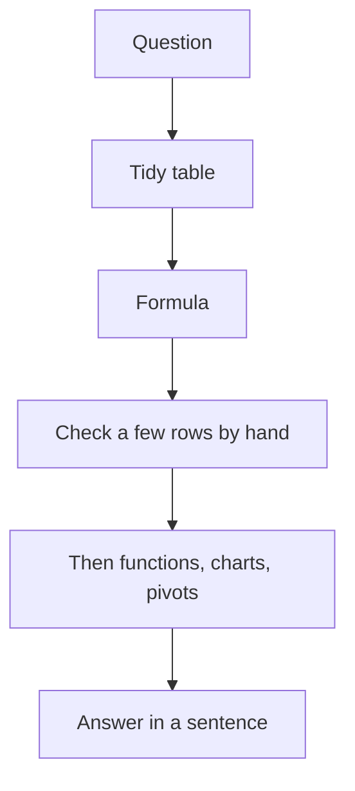

## This week

Week 3 · Excel Ch. 2 (formulas and references) · Excel Project 3. Next: functions and `IF` (lecture 4).

## Objectives



- Treat a formula as an algorithm you can explain in words (SLO2)
- Choose relative vs absolute references on purpose
- Build a weighted total that depends on a parameter cell
- Check one row by hand before filling the column (SLO5)



## Analysis is a sequence of questions



- Features are tools inside this loop, not a scavenger hunt
- If you cannot say the question, you are decorating, not analyzing
- This week is the `F` and `C` steps: write a rule, then prove it on one row





- Question: "What is each student's weighted total if quiz / project / exam weights live in a parameter row?"
- Table from lecture 2: one student per row; scores as numbers (`0`–`1` or `0`–`100`, pick one and stick to it)
- Formula: weighted sum with **absolute** references to the weight cells
- Check: pick one student; compute on paper; then fill down



## A formula is an algorithm



- Words: "Take this row's quiz, multiply by the quiz weight in `$F$1`, add project × `$G$1`, add exam × `$H$1`"
- Excel: `=B2*$F$1+C2*$G$1+D2*$H$1`
- The `=` says: this cell stores an *instruction*, not a typed number
- Recalculation is the computer running that instruction again when inputs change





- A typed `0.74` is a photograph of one moment
- A formula is a rule that stays true when the exam score changes
- If you type a new number in each row, you are not using the computer
- Same idea as lecture 1: the cell holds a program





- Excel follows math rules: parentheses, exponents, multiply/divide, add/subtract
- `=A2+B2/C2` is not the same as `=(A2+B2)/C2`
- When in doubt, use parentheses so the algorithm matches your sentence
- Percent costumes: `50%` stored as `0.5` — multiplying by `50` is a different instruction





- Name `$F$1` as `W_Quiz` (Formulas → Define Name, or the Name Box)
- Formula becomes `=B2*W_Quiz+C2*W_Project+D2*W_Exam`
- Same idea as a variable name in Python (lecture 10)



## Relative, absolute, and mixed references



When I copy this formula **down** or **across**, what should move, and what is a parameter?





| Reference | Moves when copied? | Typical use |
| --- | --- | --- |
| `B2` | Row and column both move | "This row's hours" |
| `$B$2` | Neither moves | Tax rate, weights, points possible |
| `$B2` | Row moves, column stays | Copy across months, keep the ID column |
| `B$2` | Column moves, row stays | Copy down, keep a header rate |





- Drag the fill handle (or double-click it) only *after* the first row is correct
- Watch two destination cells: did `$F$1` stay put? Did `B2` become `B3`?
- If every copied total equals the first total, you probably forgot `$` on the weights
- If the second row looks at the wrong column, you mixed up mixed references



## When formulas go wrong



| Code | Often means | First check |
| --- | --- | --- |
| `#DIV/0!` | Divided by zero or a blank treated as zero | Denominator cell |
| `#VALUE!` | Math on text | Type of the inputs (`ISTEXT`) |
| `#REF!` | Formula points at a deleted cell | Undo; restore the range |
| `#NAME?` | Typo in a name or function | Spelling; named range still exists |
| Circular | A cell depends on itself | Trace precedents |





- Click the result cell → look at the formula bar, not the costume
- Formulas → Trace Precedents / Trace Dependents
- Evaluate Formula walks the algorithm step by step
- One known row on a `Checks` sheet is worth more than a pretty color scale



## Try this in Excel



1. Weights in `F1:H1` (`quiz`, `project`, `exam`), e.g. `0.3`, `0.3`, `0.4`
2. Confirm `F1+G1+H1` equals `1` (a formula, not a typed `1`)
3. Student scores in a clean rectangle (from lecture 2 habits)
4. In the first student row, write the weighted formula with `$` on the weights
5. On paper, compute that same student; put the paper total on a `Checks` sheet
6. Fill down; spot-check a second student
7. Change exam weight from `0.4` to `0.5` (and quiz to `0.2`); watch every row recalc
8. In a Word sentence: "The formula is … The absolute references are there because …"





- Designate a note-taker
- If Copilot writes `=B2*F1+C2*G1+D2*H1` without `$`, what happens when you fill down?
- When would a mixed reference (`$F2`) be the right tool instead of `$F$1`?



## Takeaways



- A formula is a reusable algorithm; a typed number is a snapshot
- `$` is a thinking choice: parameter vs observation
- Hand-check one row before fill-down
- Next lecture: named functions (`SUM`, `IF`) as algorithms with arguments





- Screenshot sequence for `$` vs fill-handle mistakes
- Mini-set of mixed-reference grids (hours × rate table)
- Show Formula view (`Ctrl/Cmd + \``) as an exam skill


