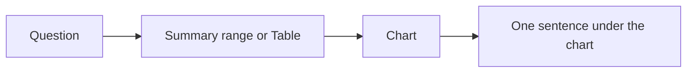

## This week

Week 5 · Excel Ch. 3 · Excel Project 5. Next: datasets and Tables (lecture 6).

## Objectives



- State the one claim a chart is supposed to support
- Match that claim to a chart type (column, bar, line, scatter — and when *not* pie)
- Title axes and the chart with words a reader can check against the sheet
- Paste into Word or PowerPoint as a linked object when the story should update



## A chart is a sentence



- Bad title: `Chart 1`, `Attendance`, `Sheet1`
- Better title: `Club events: film nights drew more attendees than workshops in September`
- If you cannot finish that sentence, you are not ready to Insert → Chart
- The data rectangle from lecture 2 is the evidence; the chart is the argument (GE Goal 1c / 1d)





- Often you chart a **summary** (`COUNTIF` of `Review` vs `OK`), not every student ID
- A column of 40 names is a table, not a chart
- Last week's `Status` column is a good source for a two-bar comparison



## Choosing a chart type



| You want to show | Usually use | Avoid |
| --- | --- | --- |
| Categories vs a number | Column or bar | 3-D column |
| Change over time | Line (time on x) | Category axis that is not in order |
| Relationship of two numbers | Scatter | Line connecting unordered IDs |
| Parts of **one** whole, few slices | Pie, maybe | Pie for many categories or for comparing two years |
| Distribution | Histogram / box (if available) | A pie of bins you made by hand without saying so |





- They encode parts of a single total
- Humans compare angles poorly; a bar chart is usually clearer
- Never: pie of "sales by month" (not a part-whole of one moment)
- If you use one: few slices, labeled with values, no 3-D explosion





- Two vertical axes can make a small series look huge
- If you use a secondary axis, say so in the caption
- Default instinct: two charts, or index both series to a common scale



## Design that does not lie



- Start column/bar axes at zero unless you have a written reason not to
- Time goes left → right; sort the Table first
- One color story: data vs highlight, not a rainbow of categories
- Gridlines light; data labels only when they do not collide
- Excel Ch. 3: chart styles and layouts are costumes — they do not fix a wrong type





- Mini line/column inside a cell: trend per row
- Good for "each section's weekly attendance" next to the name
- Still need a full chart when the claim is the point of a slide





- Click the chart: which range is highlighted?
- If you add rows, a **Table** as the source (next lecture) expands; a static `A1:B6` does not
- Moving a chart to a `Charts` sheet is fine; keep the data on `Data`



## Charts in Word and PowerPoint



- **Linked** (Paste Special → keep source formatting / link): updates when the workbook changes
- **Picture**: a frozen snapshot — use when you email a deck without the `.xlsx`
- Say in a footnote which one you used
- Never type a number on a slide that is not in the workbook





- One sentence: claim + caveat ("September only; waitlist not counted")
- That caption is the analysis; the figure is evidence
- Same habit as a lab report (GE Goal 3)



## Try this in Excel



1. From the gradebook or event Table, build a two-column summary (`Status` | `Count`) with `COUNTIF`
2. Insert a **clustered column** chart (not 3-D, not pie)
3. Chart title = the claim in words
4. Vertical axis title = `Number of students` (or events)
5. Move the chart to a `Charts` sheet; leave the summary next to the data or on `Summary`
6. Paste the chart into a blank PowerPoint slide as a **link**; change one source count; refresh and confirm the slide intent
7. In Word, write the caption sentence including one limitation





- Chart every student ID vs weighted total as a pie
- Write three reasons this fails (part-whole? too many slices? IDs are not a composition?)
- Replace it with a column of counts or a histogram-style bin chart if you have bins





- Designate a note-taker
- When is a table clearer than a chart?
- If Copilot "makes a chart," what do you inspect first: type, source range, or title?



## Takeaways



- One claim per chart; title the claim
- Type follows the comparison; pie is rarely the answer
- Link to Word/PowerPoint when the numbers still live in Excel
- Next lecture: Tables so charts, filters, and formulas keep up when rows are added





- Screenshot: Select Data dialog
- Histogram / Pareto if the Excel 365 version includes them
- Accessibility: don't rely on color alone

