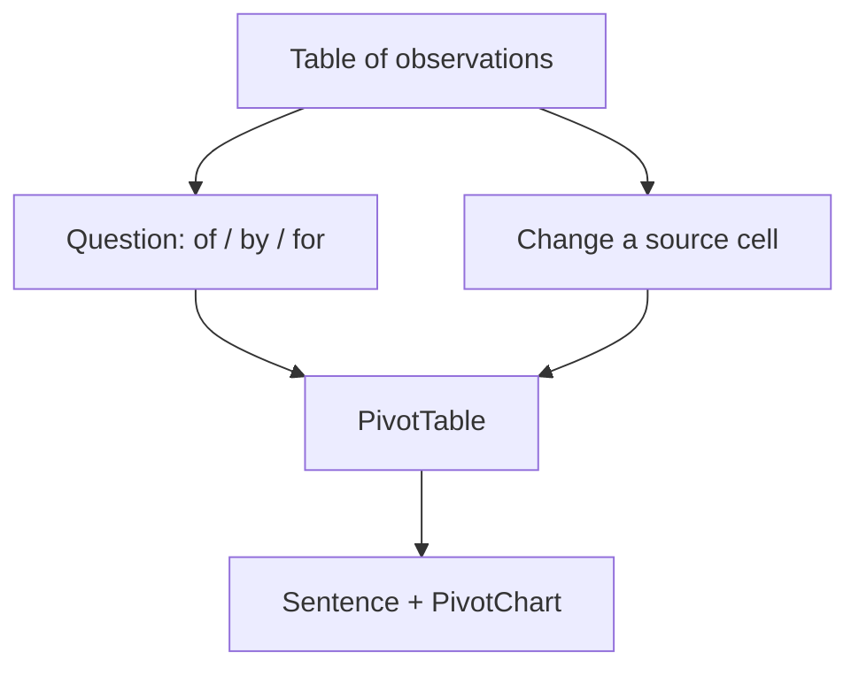

## This week

Weeks 7–8 · Excel Ch. 5 · Excel Projects 7–8 · **Excel Exam 1**. Next: what-if and lookups (lecture 8).

## Objectives



- State a grouped question ("sum of attendance **by** category **for** September")
- Build a PivotTable from a Table (not from a pretty report layout)
- Choose Rows, Columns, Values, and Filters on purpose
- Write one sentence that the pivot actually supports — then refresh after a source change



## Aggregation is a question



- **Of**: which number? (`attendance`, `revenue`, count of events)
- **By**: how grouped? (`category`, `month`, `section`)
- **For**: which subset? (September, one campus, `Status = Review`)
- If you cannot fill those three, you are not ready to drag fields





- `SUMIF` is great for one grouping
- Two groupings (category × month) is a grid — that is a PivotTable
- Pivots are also faster to change: swap Rows and Columns without rewriting formulas
- Exam 1 skill: know when a PivotTable is the right tool vs a helper column + `SUMIF`



## Subtotals vs PivotTables



- Requires a **sorted** list; inserts extra rows into the sheet
- Easy to break the "one observation per row" rule from lecture 2
- Fine for a quick printed outline; poor as a data source for later work
- Prefer a PivotTable that *reads* the Table and writes the summary elsewhere





- Lives on a new sheet (or a dedicated area): source Table stays tidy
- Drag fields; Excel counts, sums, averages
- Refresh when the Table grows (`PivotTable Analyze → Refresh`)
- Does not auto-refresh unless you set it — a classic "the chart is stale" bug



## Pivot grammar



| Zone | Meaning | Example |
| --- | --- | --- |
| Rows | Groups down the side | `category` |
| Columns | Groups across | `month` |
| Values | The number you compute | `Sum of attendance` or `Count of event_id` |
| Filters | Whole-pivot subset | `campus = Main` |





- Default for numbers is often **Sum**; for text **Count**
- `Count of attendance` vs `Sum of attendance` are different questions
- Show as: % of column, running total, difference from — powerful, easy to misread
- If the number looks "too small," you may be counting rows instead of summing a quantity





- Tabular / outline form is easier to read than compact nested labels
- Repeat item labels when you will copy the pivot as values for a chart
- Do not type extra totals into the pivot; use PivotTable totals





- Blank rows in the Table become a `(blank)` group
- Extra header rows and mixed types (lecture 2) split one category into two (`Film` vs `film `)
- Dates grouped by month only work if the column is real dates, not `Fall 26` text
- If the pivot is weird, **look at the Table**, not at more Value settings



## PivotCharts and slicers



- A chart tied to the pivot: change the pivot, the chart follows
- Same rules as lecture 5: one claim, honest axes
- Moving a field from Rows to Filters changes the story — retitle the chart





- Clickable filters that make the pivot feel like a dashboard
- Caption still needs "showing Film + Workshop, Main campus, Sept only"
- PowerPoint: a screenshot of a slicer is a picture; the live file is the analysis



## Try this in Excel



1. Source: a Table `Events` with `date`, `category`, `attendance`, `campus` (build or reuse lecture 2)
2. Insert PivotTable on a new sheet `Pivots`
3. Rows: `category`; Values: `Sum of attendance` **and** `Count of date` (or event id)
4. Filter: one month (or a date timeline)
5. Under the pivot, write: "This table claims … It does not claim …"
6. Change one source attendance; **Refresh**; confirm the sentence still matches
7. PivotChart: column chart of sum by category; title = the claim





- Rows: `category`; Columns: `campus`; Values: average attendance
- Explain in Word why an average of averages can mislead if group sizes differ
- Practice: given a question, sketch the four zones on paper *before* opening Excel
- Exam 1 will mix lectures 1–7: types, tidy Table, `$` refs, `IF`, chart choice, pivot zones





- Designate a note-taker
- Is `(blank)` a category you should drop or a data-quality finding?
- When should you **Copy → Paste Values** a pivot (a snapshot) vs keep it live?



## Takeaways



- Of / by / for — then drag
- Pivot reads a Table; Subtotal rewrites a sheet
- Refresh; inspect `(blank)` and split spellings
- Next: change *parameters* (weights, prices) on purpose and record the scenarios





- Calculated fields vs helper columns in the Table (prefer helper columns you can check)
- Grouping dates by month/quarter
- Exam 1 checklist sheet

