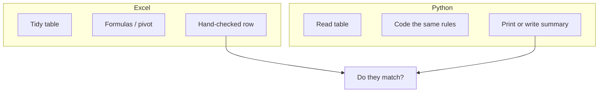

## This week

Weeks 12–14 · Python Projects 1–2 · Excel Projects 14–15. Final exam period: Excel Exam 2.

## Objectives



- Explain when a task should stay in Excel and when it should be automated
- Map cells, types, and formulas to Python variables, types, and expressions
- Run a small script that reads tabular data and writes a summary
- Compare a Python result to a known Excel result (SLO5)



## Why leave the grid



- Fast to see the data
- Formulas stay next to the numbers
- Charts and pivots are built in
- This course is 70% Excel for a reason





- The same cleaning + summary every Monday
- Tens of thousands of rows, or many similar files
- An audit trail: a `.py` file you can re-run
- Fewer copy-paste accidents





- Lecture 1: instructions + typed memory
- Lecture 2: rows and columns with definitions
- Lectures 3–4: algorithms (`$` refs, `IF`, weights, aggregates)
- Lectures 5–7: claims, Tables, grouped questions
- Lectures 8–9: parameters, lookups, distributions; Copilot drafts, you verify
- Python: the same algorithms, written once, run many times





## Excel thinking, Python words



| Excel | Python (idea) |
| --- | --- |
| Cell `B2` | A variable, or `row["score"]` |
| Number vs Text vs Date | `int` / `float` vs `str` vs date types |
| `=C2/$B$1` | `score / points_possible` |
| `=IF(A2>=70,"OK","Review")` | `status = "OK" if total >= 0.7 else "Review"` |
| Fill down | A `for` loop, or a vectorized column operation |
| PivotTable SUM by category | `groupby("category")["attendance"].sum()` |
| `MEDIAN` / `AVERAGE` | `median(...)` / `mean(...)` on a list or column |
| Workbook `.xlsx` | A file you read and write |





- `"10" + "20"` in Python is `"1020"` (text)
- `10 + 20` is `30`
- Same trap as Excel numbers stored as text
- Dates still need to be dates if you want to sort or subtract them





- Some Office 365 Excel builds can run Python in a cell (`=PY(...)`)
- That is still "Excel as the interface, Python as the engine"
- We may also use a simple notebook or `.py` file; the thinking is the same
- Placeholder: confirm lab software (Anaconda, VS Code, Excel Python) on D2L



## A first automation



1. You already have a correct Excel Table and a weighted total
2. Export or save the data (CSV or `.xlsx`)
3. Python reads the rows
4. Python applies the same weights
5. Python prints who is `Review`
6. You compare to the Excel `Status` column





```python
# weights match the Excel parameter cells
W_QUIZ, W_PROJECT, W_EXAM = 0.3, 0.3, 0.4

# one student, same numbers as a checked Excel row
quiz, project, exam = 0.80, 0.70, 0.60
weighted = quiz * W_QUIZ + project * W_PROJECT + exam * W_EXAM
status = "Review" if weighted < 0.7 else "OK"

print(weighted, status)
```

- If this printout disagrees with Excel, fix the **definitions** before writing more code
- Next step in the real project: loop over a file instead of one student





- Read CSV with the standard library or pandas (to be chosen in the assignment)
- Skip the same junk you cleaned in lecture 2 (extra headers, total rows)
- Write a small summary: category totals you already pivoted in lecture 7
- Goal: *same question, same answer, less clicking*



## Checking Excel against Python



- Pick 3 rows: typical, boundary, messy (blank or text number)
- Record Excel values in a `Checks` sheet
- Print Python values for the same IDs
- Differences are bugs (type, rounding, filter, off-by-one), not "Python being different"





- Excel and Python may show `0.699999` vs `0.70`
- Decide a rule (round to 2 decimals before the `IF`) and apply it in **both** places
- This is still SLO4: appropriate data types and formulas





- Allowed: "Write a loop that computes the same weighted total as `=...` in Excel"
- Required: you paste the Excel formula into the prompt and then run the checks above
- Not allowed: a script you cannot walk through in office hours



## Try this



1. In Excel, freeze a checked student: scores, weights, weighted total, status
2. Type those same numbers into the small Python snippet (or Excel `=PY` cell)
3. Confirm printed `weighted` and `status` match
4. Change one score in both places; confirm both update the same way





- Excel: Pivot SUM of attendance by category (lecture 7)
- Python: group the same columns and print the sums
- Optional: median attendance by category vs Excel `MEDIAN` in a value field
- Paste both summaries into Word with one sentence: do they match? if not, why?





- Designate a note-taker
- Which of your Excel projects would be painful to repeat next semester, and what would a script need as input?
- If Python and Excel disagree, list three checks before you blame the language



## Takeaways



- Computers store typed values and follow instructions (lecture 1)
- Data literacy comes before features (lecture 2)
- Excel is where you write and see those instructions (lectures 3–8)
- Distributions and Copilot still require a check (lecture 9)
- Python repeats a verified analysis (this lecture)





- Exact toolchain (Excel Python vs Jupyter vs `.py` in VS Code)
- Starter CSV matching Excel Project data
- Project 1: reproduce a `SUMIF` / pivot
- Project 2: batch two workbooks and write a combined summary
- Excel Exam 2: independent workbook covering the semester, no Copilot

