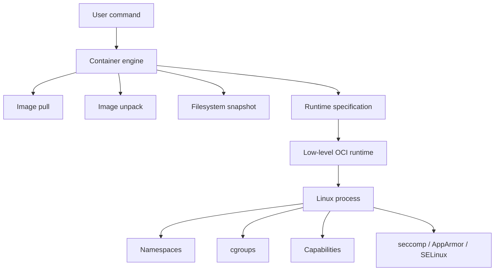
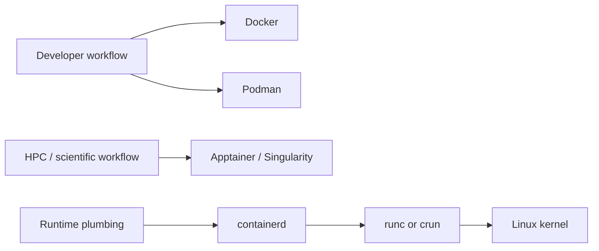
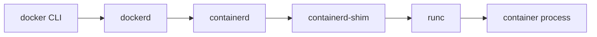
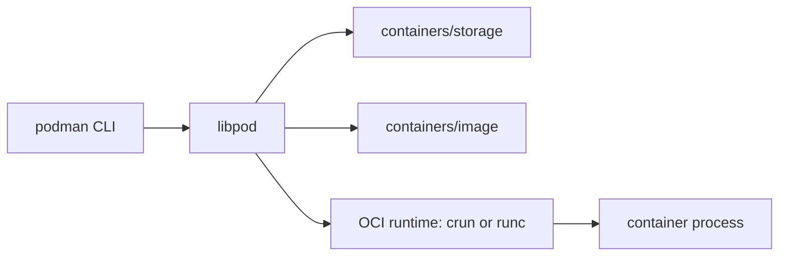

## Container Stack Anatomy



- Up until now, we mainly learn about Docker. 
    - Can Docker do everything?
- In reality, a container platform is a stack of cooperating pieces:
    - a command-line interface
    - an image format
    - an image registry
    - an image store
    - a filesystem layer manager
    - a high-level container engine
    - a low-level runtime
    - Linux kernel isolation features


> A container is not a small virtual machine. A container is a regular process launched with controlled namespaces, cgroups, filesystem mounts, and security restrictions.







- A container engine does not create a virtual machine. 
- Instead, it prepares the environment for a process and asks the operating system to 
isolate that process.
- Important Linux mechanisms:

| Mechanism | What it controls | Container example |
|---|---|---|
| PID namespace | Process IDs | The container sees its own process tree |
| Network namespace | Network interfaces and routes | The container gets its own network stack |
| Mount namespace | Filesystem view | The container sees an image-based root filesystem |
| UTS namespace | Hostname | The container can have its own hostname |
| User namespace | User and group mapping | Root inside the container may map to non-root outside |
| cgroups | Resource limits and accounting | CPU and memory limits |
| capabilities | Fine-grained root privileges | Allow network bind but deny kernel module loading |
| seccomp | System call filtering | Block dangerous or unnecessary syscalls |





Different tools emphasize different layers of the stack.



This lecture uses four tools to explain the ecosystem:

| Tool | Main role | Best mental model |
|---|---|---|
| Docker | Developer-friendly container platform | Convenient default container workflow |
| Podman | Daemonless, often rootless container engine | Docker-like workflow without a central Docker daemon |
| Apptainer / Singularity | HPC and scientific container runtime | Reproducible scientific environment as a portable artifact |
| containerd | Container runtime service | Lower-level runtime layer used by larger systems |




## Docker



{% include figure.liquid path="assets/img/courses/csc468/06-virtualization/05.png" max-width="50%" zoomable=true alt="Docker" %}
{% include figure.liquid path="assets/img/courses/csc468/06-virtualization/06.png" max-width="50%" zoomable=true alt="Docker" %}

- Virtual machines were a major step forward in computing infrastructure.
- Benefits of VMs:
    - Better resource pooling
        - One physical machine can be divided into multiple VMs
    - Easier scaling
    - Natural fit for cloud computing
        - Rapid elasticity
        - Pay-as-you-go model
    - Strong isolation boundary
- Limitations of VMs:
    - Each VM still requires:
        - CPU allocation
        - storage
        - RAM
        - an entire guest operating system
    - More VMs means more guest OS overhead
    - Boot time is higher than process startup time
    - Application portability is not automatically solved
- Containers grew popular because they provide a lighter packaging and execution model.





{% include figure.liquid path="assets/img/courses/csc468/06-virtualization/09.png" max-width="50%" zoomable=true alt="Docker" %}

- Containers and VMs are not enemies. In cloud computing, containers often run inside VMs.
- Common pattern:

```text
physical server -> hypervisor -> VM -> Linux OS -> container engine -> containers
```

- This gives cloud providers the strong tenant isolation of VMs while giving application teams the speed and packaging advantages of containers.





- Docker became popular because it made containers usable for ordinary developers.
    - Speed: No full guest OS to boot
    - Portability: Package software and dependencies together
    - Efficiency: Less overhead than running many full VMs
    - Developer workflow: Build, run, push, pull, and share images with simple commands
    - Ecosystem:Docker Hub and many public base images
- The traditional Docker architecture has a client-server design:



- The Docker CLI talks to the Docker daemon. The daemon coordinates image, network, volume, and container operations.





- The Docker daemon is powerful. Historically, it has often run as root.
- That means access to the Docker daemon is a serious security boundary. A user who can control a root-owned Docker daemon can often obtain root-equivalent power on the host.
- This is one reason alternative designs such as Podman became important.

> Docker is not insecure by nature, but Docker makes it very easy to forget which layer is trusted. That is where the trouble starts.




## Podman



- Originally developed in the Red Hat ecosystem.
- Addresses several concerns associated with traditional Docker deployments:
    - persistent root-owned daemon
    - daemon-level privilege boundary
- Podman satisfies:
    - desire for rootless container workflows
    - desire for Docker-compatible commands without Docker daemon dependency
- Podman characteristics:
    - Docker-like CLI
    - daemonless design for common container operations
    - strong support for rootless containers
    - support for pods
    - compatibility with OCI images
    - integration with tools such as `Buildah` and `Skopeo`

- Common command comparison:

```bash
# Docker
docker run --rm alpine echo hello

# Podman
podman run --rm alpine echo hello
```

- This similarity is intentional. 
- Podman lets users keep much of the Docker workflow while changing the engine model underneath.





- Podman does not rely on a long-running Docker-style daemon for ordinary local container execution.

Simplified Podman path:



- Important supporting projects:

| Component | Role |
|---|---|
| `containers/image` | Pull, push, copy, and inspect container images |
| `containers/storage` | Manage local container image/layer storage |
| `crun` or `runc` | Low-level OCI runtime |
| Buildah | Build container images |
| Skopeo | Inspect and transfer images without necessarily running them |





- A rootless container runs without requiring the user to become root on the host.
    - safer for shared machines
    - safer for student environments
    - better fit for personal Linux workstations
    - reduces dependence on a privileged daemon
- Rootless does not mean "no privileges anywhere." It means privileges are mapped and constrained.
- Example idea:

```text
root inside container -> regular user outside container
```

- This is usually implemented with user namespaces and subordinate UID/GID ranges.
- Example:

```bash
podman info
podman unshare cat /proc/self/uid_map
podman run --rm alpine id
```





- Podman is a good fit when:
    - you want a Docker-like command-line experience
    - you do not want a central Docker daemon
    - you care about rootless workflows
    - you are running on Linux servers or workstations
    - you are teaching container internals and security tradeoffs
- Podman is not automatically better than Docker for every student. Docker Desktop may still be more convenient on laptops, especially on Windows and macOS.




## Apptainer and Singularity



- Singularity began as an open source project in 2015 at Lawrence Berkeley National Laboratory. It was designed to address container needs in scientific and high-performance computing environments.
- Apptainer is the community continuation of the Singularity project. In many HPC environments, users may still hear both names.
- The core motivation is different from Docker and Podman.
    - Docker and Podman often focus on:
        - microservices
        - web applications
        - developer workflows
        - CI/CD pipelines
        - cloud deployment
    - Apptainer/Singularity focuses on:
        - scientific reproducibility
        - HPC compatibility
        - user identity preservation
        - running on shared clusters
        - portable research workflows
        - single-file container artifacts





Traditional container platforms were heavily shaped by web-enabled cloud applications and microservice architectures.

That model is not always suitable for scientific and HPC communities.

Scientific users often need:

- reproducible software environments
- portable workflows
- access to specialized hardware
- compatibility with batch schedulers
- compatibility with shared filesystems
- compatibility with MPI and accelerators
- a security model acceptable to HPC administrators

Before containers, scientists often exchanged:

- data files
- source code
- scripts
- dependency lists

Today, scientists increasingly exchange workflows. The workflow includes code, tools, libraries, runtime assumptions, and sometimes model/data processing pipelines.

Containers help package those assumptions into a runnable environment.





Challenges with traditional Docker on shared HPC systems:

- Docker is commonly managed by a privileged daemon
- access to the daemon can become a privilege-escalation concern
- containers often assume service-style deployment
- container networking may not match HPC networking
- container storage assumptions may not match shared filesystems
- users should not normally become root on a shared research cluster

This is why many HPC centers prefer Apptainer/Singularity.





- Mobility of compute: package the runtime environment into a portable image
- Reproducibility: preserve software environment and dependencies
- User identity preservation: the user inside the container is typically the same user outside
- HPC compatibility: support shared filesystems, MPI, GPUs, and batch schedulers
- Single-file images: SIF files are convenient to archive and transfer

{% include figure.liquid path="assets/img/courses/csc468/06-virtualization/10.png" max-width="50%" zoomable=true alt="Singularity" %}





| Feature | Docker/Podman image | Apptainer SIF image |
|---|---|---|
| Typical storage | Layered local image store | Single image file |
| Common use | Services and applications | Scientific workflows |
| Execution model | Often isolated service process | Often user-preserving execution |
| Distribution | Registry-first | File or registry |
| HPC fit | Possible but administratively complicated | Designed for HPC expectations |




## containerd


- `containerd` is a container runtime service.
- Is not designed primarily as a friendly end-user platform. 
- Provides lower-level container lifecycle management for higher-level systems.
- Handles:
    - pulling images
    - storing image content
    - unpacking image layers
    - managing filesystem snapshots
    - creating container metadata objects
    - starting and supervising container tasks
    - communicating with low-level OCI runtimes such as `runc`

> Docker and Podman are tools humans use directly. containerd is runtime plumbing that platforms use underneath.





Several command-line tools can interact with containerd-related systems.

| Tool | Audience | Purpose |
|---|---|---|
| `ctr` | Runtime developers and administrators | Raw containerd client |
| `nerdctl` | Humans who want Docker-like commands | User-friendly CLI for containerd |
| `crictl` | Kubernetes/node administrators | Debug CRI-compatible runtimes |





| Feature | Docker | Podman | Apptainer / Singularity | containerd |
|---|---|---|---|---|
| Primary audience | Developers, DevOps | Developers, sysadmins, rootless users | HPC/scientific users | Platform/runtime systems |
| Main CLI | `docker` | `podman` | `apptainer` / `singularity` | `ctr`, `nerdctl`, `crictl` |
| Daemon model | Uses Docker daemon | Daemonless for common local use | No Docker-style daemon | Runtime daemon |
| Rootless support | Available | Central design goal | Central HPC expectation | Possible but not beginner-friendly |
| Image format | OCI/Docker images | OCI/Docker images | SIF, can consume Docker/OCI images | OCI images |
| Best use case | General container development | Docker-like Linux workflow without Docker daemon | Reproducible scientific/HPC workflows | Runtime layer for platforms |
| Student takeaway | Convenient on-ramp | Security-conscious Docker alternative | HPC container model | What exists beneath higher-level tools |




## FABRIC Demonstration



This demonstration installs and tests three kinds of container tooling on FABRIC Ubuntu nodes:

1. Podman
    - user-facing, Docker-like container engine
2. Apptainer
    - HPC/scientific container runtime
3. containerd
    - lower-level runtime service

The demonstration intentionally uses a very small image, `alpine`, so that the focus is on the engine behavior rather than application complexity.





This Python snippet assumes that a FABRIC slice already exists and that the `slice` and `fablib` objects are available in the notebook.

```python
from pathlib import Path

nodes = slice.get_nodes()
private_key = fablib.get_default_slice_key()["slice_private_key_file"]
ssh_config = "/home/fabric/work/fabric_config/ssh_config"

inventory = """all:
  children:
    fabric_nodes:
      hosts:
"""

for node in nodes:
    inventory += f"""        {node.get_name()}:
          ansible_host: "{node.get_management_ip()}"
          ansible_user: "{node.get_username()}"
          ansible_ssh_private_key_file: "{private_key}"
          ansible_ssh_common_args: "-F {ssh_config}"
          ansible_python_interpreter: "/usr/bin/python3"
"""

Path("inventory.yml").write_text(inventory)
print(inventory)
```

Test the inventory:

```bash
ansible all -i inventory.yml -m ping
```





Save as `install-container-engines.yml`.


```yaml
---
- name: Install Podman, Apptainer, containerd, and nerdctl on FABRIC Ubuntu nodes
  hosts: fabric_nodes
  become: true
  gather_facts: true

  vars:
    container_user: "{{ ansible_user | default(ansible_facts.user_id) }}"

    # Update this version if a newer nerdctl release is desired.
    nerdctl_version: "2.2.2"

    nerdctl_arch_map:
      x86_64: amd64
      aarch64: arm64

    nerdctl_arch: "{{ nerdctl_arch_map[ansible_architecture] | default('amd64') }}"
    nerdctl_url: "https://github.com/containerd/nerdctl/releases/download/v{{ nerdctl_version }}/nerdctl-{{ nerdctl_version }}-linux-{{ nerdctl_arch }}.tar.gz"

  pre_tasks:
    - name: Update apt cache
      ansible.builtin.apt:
        update_cache: true
        cache_valid_time: 3600

  tasks:
    - name: Install base packages, Podman, containerd, runc, and CNI plugins
      ansible.builtin.apt:
        name:
          - ca-certificates
          - curl
          - gnupg
          - lsb-release
          - software-properties-common
          - python3-apt
          - python3-launchpadlib
          - uidmap
          - slirp4netns
          - fuse-overlayfs
          - runc
          - containernetworking-plugins
          - containerd
          - podman
        state: present

    - name: Add Apptainer Ubuntu PPA
      ansible.builtin.apt_repository:
        repo: ppa:apptainer/ppa
        state: present
        update_cache: true

    - name: Install Apptainer
      ansible.builtin.apt:
        name: apptainer
        state: present

    - name: Ensure containerd configuration directory exists
      ansible.builtin.file:
        path: /etc/containerd
        state: directory
        mode: "0755"

    - name: Generate default containerd configuration if missing
      ansible.builtin.shell: |
        containerd config default > /etc/containerd/config.toml
      args:
        creates: /etc/containerd/config.toml
      notify: Restart containerd

    - name: Use systemd cgroup driver in containerd config
      ansible.builtin.replace:
        path: /etc/containerd/config.toml
        regexp: "SystemdCgroup = false"
        replace: "SystemdCgroup = true"
      notify: Restart containerd

    - name: Enable and start containerd
      ansible.builtin.systemd:
        name: containerd
        enabled: true
        state: started

    - name: Install nerdctl CLI for containerd
      ansible.builtin.unarchive:
        src: "{{ nerdctl_url }}"
        dest: /usr/local/bin
        remote_src: true
        creates: /usr/local/bin/nerdctl

    - name: Ensure nerdctl is executable
      ansible.builtin.file:
        path: /usr/local/bin/nerdctl
        mode: "0755"

    - name: Configure subuid for rootless Podman
      ansible.builtin.lineinfile:
        path: /etc/subuid
        regexp: "^{{ container_user }}:"
        line: "{{ container_user }}:100000:65536"
        create: true

    - name: Configure subgid for rootless Podman
      ansible.builtin.lineinfile:
        path: /etc/subgid
        regexp: "^{{ container_user }}:"
        line: "{{ container_user }}:100000:65536"
        create: true

    - name: Enable lingering for rootless user services
      ansible.builtin.command: "loginctl enable-linger {{ container_user }}"
      changed_when: false
      failed_when: false

    - name: Verify Podman
      ansible.builtin.command: podman --version
      register: podman_version
      changed_when: false

    - name: Verify Apptainer
      ansible.builtin.command: apptainer --version
      register: apptainer_version
      changed_when: false

    - name: Verify containerd
      ansible.builtin.command: containerd --version
      register: containerd_version
      changed_when: false

    - name: Verify nerdctl
      ansible.builtin.command: nerdctl --version
      register: nerdctl_version_output
      changed_when: false

    - name: Show installed versions
      ansible.builtin.debug:
        msg:
          - "{{ podman_version.stdout }}"
          - "{{ apptainer_version.stdout }}"
          - "{{ containerd_version.stdout }}"
          - "{{ nerdctl_version_output.stdout }}"

  handlers:
    - name: Restart containerd
      ansible.builtin.systemd:
        name: containerd
        state: restarted
```


Run it:

```bash
ansible-playbook -i inventory.yml install-container-engines.yml
```





Save as `demo-container-engines.yml`.

This playbook runs all demos with `become: true` for reliability in non-interactive FABRIC/Ansible sessions. In a live terminal, students can also run Podman manually as a regular user to inspect rootless behavior.


```yaml
---
- name: Demonstrate Podman, Apptainer, and containerd on FABRIC nodes
  hosts: fabric_nodes
  become: true
  gather_facts: false

  tasks:
    - name: Podman demo
      ansible.builtin.command: >
        podman run --rm --net=host docker.io/library/alpine:3.20
        sh -c 'echo "Podman demo"; echo "hostname=$(hostname)"; echo "uid=$(id -u) gid=$(id -g)"; cat /etc/alpine-release'
      register: podman_demo
      changed_when: false

    - name: Show Podman output
      ansible.builtin.debug:
        var: podman_demo.stdout_lines

    - name: Apptainer demo using a Docker/OCI image
      ansible.builtin.command: >
        apptainer exec docker://alpine:3.20
        sh -c 'echo "Apptainer demo"; echo "hostname=$(hostname)"; echo "uid=$(id -u) gid=$(id -g)"; cat /etc/alpine-release'
      register: apptainer_demo
      changed_when: false

    - name: Show Apptainer output
      ansible.builtin.debug:
        var: apptainer_demo.stdout_lines

    - name: Pull Alpine into containerd content store using ctr
      ansible.builtin.command: ctr images pull docker.io/library/alpine:3.20
      register: ctr_pull
      changed_when: false

    - name: Run Alpine directly with containerd ctr
      ansible.builtin.command: >
        ctr run --rm docker.io/library/alpine:3.20 ctr-demo
        sh -c 'echo "containerd ctr demo"; echo "hostname=$(hostname)"; echo "uid=$(id -u) gid=$(id -g)"; cat /etc/alpine-release'
      register: ctr_demo
      changed_when: false

    - name: Show ctr output
      ansible.builtin.debug:
        var: ctr_demo.stdout_lines

    - name: Run Alpine with nerdctl
      ansible.builtin.command: >
        nerdctl run --rm --net=host docker.io/library/alpine:3.20
        sh -c 'echo "nerdctl demo"; echo "hostname=$(hostname)"; echo "uid=$(id -u) gid=$(id -g)"; cat /etc/alpine-release'
      register: nerdctl_demo
      changed_when: false

    - name: Show nerdctl output
      ansible.builtin.debug:
        var: nerdctl_demo.stdout_lines

    - name: List Podman images
      ansible.builtin.command: podman images
      register: podman_images
      changed_when: false

    - name: List containerd images
      ansible.builtin.command: ctr images ls
      register: ctr_images
      changed_when: false

    - name: Compare image stores
      ansible.builtin.debug:
        msg:
          - "Podman images:"
          - "{{ podman_images.stdout_lines }}"
          - "containerd images:"
          - "{{ ctr_images.stdout_lines }}"
```


Run it:

```bash
ansible-playbook -i inventory.yml demo-container-engines.yml
```





After the Ansible demo, you can SSH into one FABRIC node and run these commands manually.

Podman:

```bash
podman run --rm alpine:3.20 sh -c 'hostname; id; cat /etc/alpine-release'
podman images
podman info
```

Apptainer:

```bash
apptainer pull alpine.sif docker://alpine:3.20
apptainer exec alpine.sif sh -c 'hostname; id; cat /etc/os-release'
ls -lh alpine.sif
```

containerd:

```bash
sudo systemctl status containerd --no-pager
sudo ctr namespaces ls
sudo ctr images pull docker.io/library/alpine:3.20
sudo ctr images ls
sudo ctr run --rm docker.io/library/alpine:3.20 manual-ctr-demo cat /etc/alpine-release
```

nerdctl:

```bash
sudo nerdctl run --rm --net=host alpine:3.20 cat /etc/alpine-release
sudo nerdctl images
```



