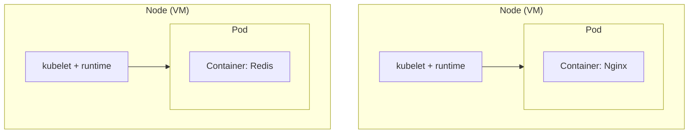

# Pod, Service, and Deployment

## Big Picture

- In Docker, you run containers directly. 
    - Docker Swarm manages containers
- In Kubernetes, you run **pods**, which wrap account containers. 
    - A **node** is a machine (physical or virtual) where **pods** live. 

---

## Pods: Containers and Node Abstraction



- A pod includes one or more containers plus additional share resources. 
    - Shared resources include, but are not limited to, shared IP (internal/external) and storage volumes. 
    - Example pod: one `nginx` webserver container plus one `log-shipper` sidecar container plus shared volume for log data. 
- Pods are scheduled onto `nodes` by the kube-scheduler. 





- Each node runs a kubelet agent. 
- Kubelet talks to the container runtime (containerd in Rancher Desktop). 
- When a pod is deployed, kubelet pulls the associated container image(s) and runs it(them).







- Verify that your Rancher Desktop is up and running

```bash
kubectl get nodes -o wide
```

- Create a file called `nginx-pod.yaml` with the following content

```yaml
apiVersion: v1
kind: Pod
metadata:
    name: nginx
    labels:
        app: nginx
spec:
    containers:
    - name: nginx
      image: nginx:latest   # pulls Docker/OCI image
      ports:
      - containerPort: 80
```

- Run `kubectl` and provide path to your `nginx-pod.yaml`. In the example below, I am in the same directory as my file. 

```bash
kubectl apply -f nginx-pod.yaml
kubectl get pods -o wide
```

{% include figure.liquid path="assets/img/courses/csc478/pod-service-deployment/nginx-pod.png" width="50%" zoomable=true %}


---

## Services: Stable Access to Pods

At this point, if we try to access the above pod using the `containerPort` 80, it will fail. 



- Pods are `ephemeral`
    - Pods can restart and be rescheduled onto different nodes. 
    - Each pod gets a random IP inside the cluster. 
    - How does a client reliably connect to `nginx` if its internal IP changes?
- Docker: `-P` and `-p` is not adequate for this. 




- Kubernetes Service
- A `Service` provides `Pods` with a `stable virtual IP` and `DNS name`. 
- `Service` load-balances traffic to all matching Pods via `label`. 




- A `ClusterIP` service gives access only inside the cluster. 
- A `NodePort` service opens a port on every node's IP. 
- A `LoadBalancer` (on cloud) provisions an external IP (if available). 

~~~bash
kubectl get nodes
~~~




- Create a file called `nginx-svc.yaml` with the following content

```yaml
apiVersion: v1
kind: Service
metadata:
    name: nginx
spec:
    type: NodePort
    selector:
        app: nginx
    ports:
    - protocol: TCP
      port: 80
      targetPort: 80
      nodePort: 30007
```



---

## Deployment




- Pods creation using `kubectl` and Pods-only YAML files is a manual process. 
    - Pod IP addresses will be ephemeral and changed when a Pod crashes/is deleted/is rescheduled. 
- Best practice:
    - Avoid creating bare Pods in production
    - Use `Deployment` (or `StatefulSets`, `DaemonSets`) to manage Pods 
    - Combine with `Service` to maintain stable networking access. 









- Assuming that you have been working on this lecture continuously, you will have one `nginx` pod and one `nginx` service running. 
Use the following commmands to check the existence of the pod and service, then to delete the pod and service. After deletion, check again to confirm that the pod and service are gone. 

```bash
kubectl get pods -o wide
kubectl get svc -o wide
kubectl delete pod nginx
kubectl delete svc nginx
kubectl get pods -o wide
kubectl get svc -o wide
```

{% include figure.liquid path="assets/img/courses/csc478/pod-service-deployment/delete-nginx-pod-svc.png" width="50%" zoomable=true %}

    
    


- In Kubernetes, `Deployment` and `Service` are distinct objects, usually defined in separate YAML files. 
    - `Deployment`: workload management (replicas, rolling updates, Pod templates).
    - `Service`: network exposure (ClusterIP, NodePort, LoadBalancer).
- However, it is common practice for examples and small apps to combine them into a single YAML file, using `---` as a separator. 
- Create a file called `nginx-deployment.yaml` with the following content

```yaml
apiVersion: apps/v1
kind: Deployment
metadata:
name: nginx-deployment
spec:
replicas: 2
selector:
    matchLabels:
    app: nginx
template:
    metadata:
    labels:
        app: nginx
    spec:
    containers:
    - name: nginx
      image: nginx:latest
      ports:
      - containerPort: 80
---
apiVersion: v1
kind: Service
metadata:
name: nginx-service
spec:
type: NodePort
selector:
    app: nginx
ports:
- protocol: TCP
  port: 80
  targetPort: 80
  nodePort: 30007
```

    
    





- Deployment
    - Ensures 2 replics of `nginx` Pods always run
    - Each Pod get a random IP inside the cluster. 
- Service
    - Select all Pods with `app: nginx`. 
    - Provide a stable virual IP and DNS name (`nginx-service`)
    - Expose port `30007` on every node. 


```bash
kubectl apply -f nginx-deployment.yaml
kubectl get deployments
kubectl get pods -o wide
kubectl get svc
```

{% include figure.liquid path="assets/img/courses/csc478/pod-service-deployment/nginx-deployment.png" width="50%" zoomable=true %}

    
    


- From the outcomes of `kubectl get pods -o wide`, delete one pod. 
- Check again and observe how `nginx-deployment` immediately create a replacement pod. 

{% include figure.liquid path="assets/img/courses/csc478/pod-service-deployment/nginx-deployment-delete-pod.png" width="50%" zoomable=true %}        

    
