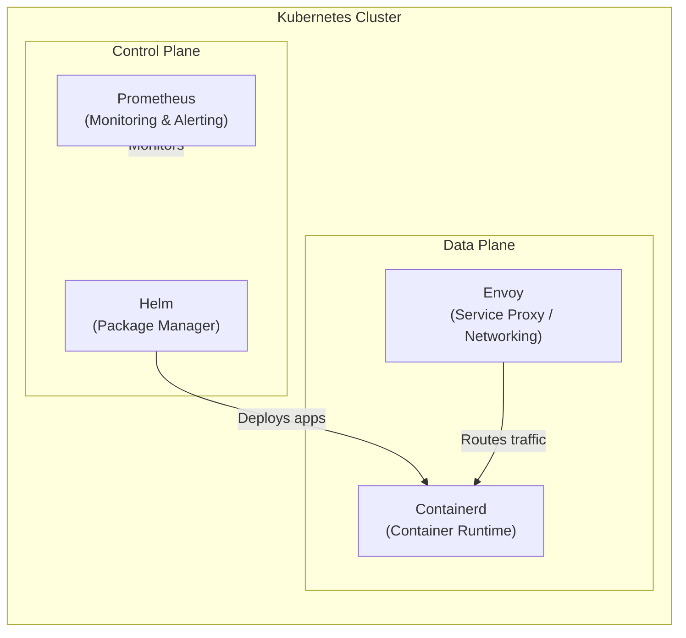
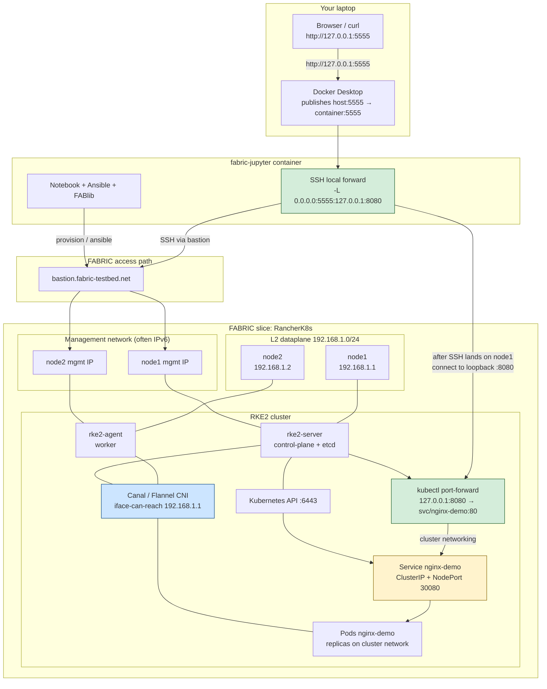

# Rancher RKE2

---

## What is RKE2?



- Rancher Kubernetes Engine 2
- A CNCF-certified Kubernetes distribution developed by SUSE Rancher.
- Designed as the next generation of RKE, focusing on:
    - Security first (FIPS 140-2 compliance, SELinux, CIS hardening profiles).
    - Simplicity of deployment (single binary installer).
    - Production-ready for on-premise, edge, and cloud environments.




- Cloud Native Computing Foundation, part of the Linux Foundation
- To support and advance cloud-native technologies, especially Kubernetes. 
- Other projects:
    - Prometheus: open-source monitoring and alerting system designed for reliability and scalabiliaty. 
    - Envoy: a high-performance service proxy and communication bus designed for microservices
    - Helm: a package manager for Kubernetes, aims to simplify the deployment and management of applications using reusable configuration templates (`charts`)
    - Containerd: lightweight container runtime. 


---

## Key Features



- Built-in support for CIS benchmarks (kube-bench ready).
    - CIS: Center for Internet Security
- SELinux policies enforced by default.
- Containerd (not Docker) as runtime for security and performance.




- Single binary distribution (rke2).
- Automated etcd management.
- Rancher integration for centralized multi-cluster management.




- Works in data centers, cloud, and at the edge.
- Supports air-gapped environments.




- Server Nodes: Run the Kubernetes control plane + etcd.
- Agent Nodes: Run workloads (similar to workers).
- Runtime: Containerd, not Docker.
- Networking: Uses CNI plugins (default: Canal, but others supported).
- Ingress: NGINX ingress controller by default.




- A production-grade Kubernetes distro hardened out-of-the-box.
- Ideal for regulated industries (finance, healthcare, government).
- Designed for multi-cluster management with Rancher.
- Future-facing: aligns with CNCF standards and cloud-native practices.


---

## Hands-on: Typical Installation Workflow



Run a `git pull` (run `git stash` if necessary) on your `fabric-examples` repository. Navigate to `478-examples` and open up the notebook. Run the notebook!



