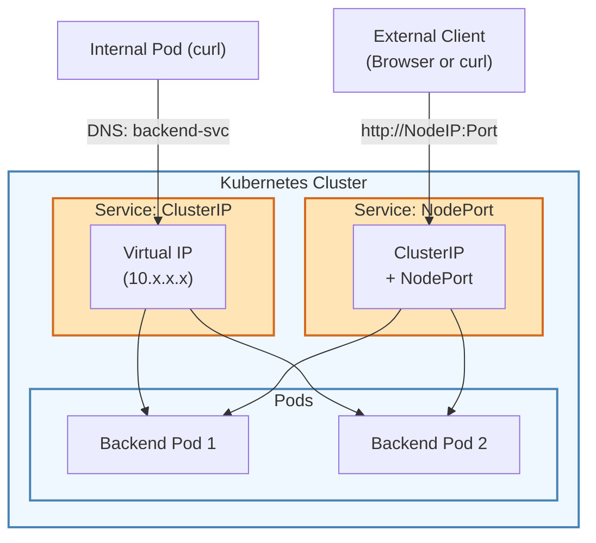
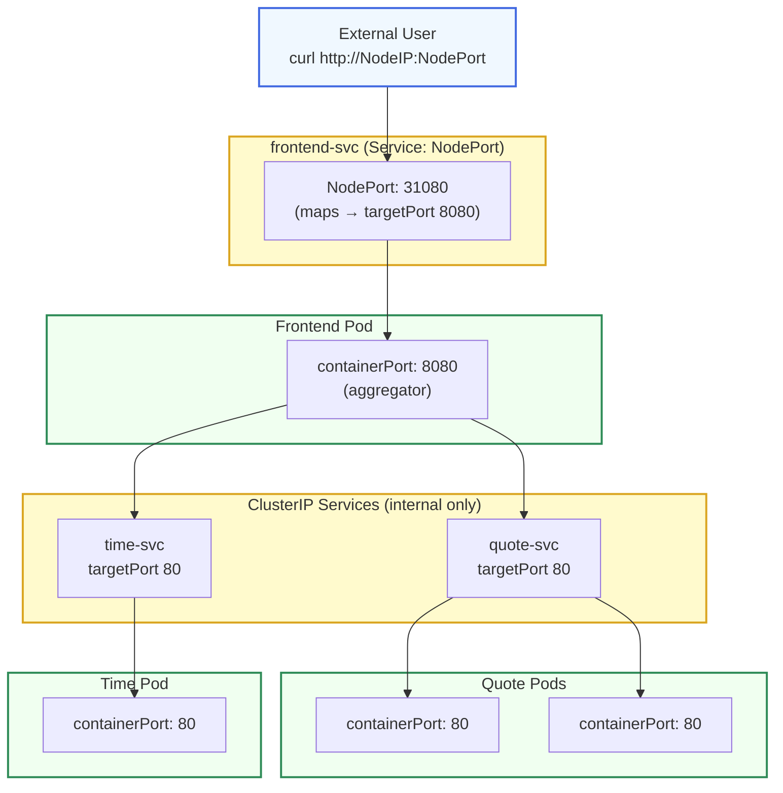
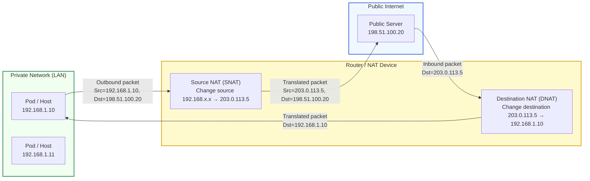

# ClusterIP, NodePort, and Multi-Service Communication

---

## Motivation

- We learned about Pods and Deployments, the unit of execution and how to scale/manage them.
- We also briefly touched on Services. 
    - How do we move move from `running apps` to  `connecting apps`.
- Services in Kubernetes provide stable networking endpoints for ephemeral pods.
- Two important service types:
    - ClusterIP: Internal access within the cluster.
    - NodePort: External access to services from outside the cluster.

---

## Services Overview

- Pods get dynamic IPs that can change when restarted.
- Services provide:
    - Stable DNS names (e.g., my-service.default.svc.cluster.local)
    - Load balancing across pod replicas
- Service types:
    - ClusterIP: Internal only (default).
    - NodePort: Exposes service on a static port on each node.
    - LoadBalancer: Cloud provider managed (beyond today’s scope).




---

## ClusterIP Services



- Internal communication between pods.
- Example: Frontend pod calls a backend service by DNS.




- Create and deploy a backend Pod Deployment (simple HTTP echo app) called `echo-deployment.yaml`:

```yaml
apiVersion: apps/v1
kind: Deployment
metadata:
  name: backend
spec:
  replicas: 2
selector:
  matchLabels:
    app: backend
template:
  metadata:
    labels:
        app: backend
  spec:
    containers:
    - name: backend
      image: nginxdemos/hello:plain-text
      ports:
      - containerPort: 80
```

```bash
kubectl apply -f echo-deployment.yaml
```

- Let's expose it with a ClusterIP service. 
    - Create and deploy a service manifest called `echo-svc.yaml`. 

```yaml
apiVersion: v1
kind: Service
metadata:
  name: backend-svc
spec:
  selector:
    app: backend
  ports:
    - port: 80
    targetPort: 80
```

```bash
kubectl apply -f echo-deployment.yaml
```

- Verify DNS-based resolution inside the cluster:
    - Calling the servce `backend-svc` links us to the Pod. 

```bash
kubectl run curl --image=alpine -it --rm
# inside pod:
apk update
apk add curl
curl backend-svc
```

- Observe how curl can return results from different pods. 

{% include figure.liquid path="assets/img/courses/csc478/clusterip/multi-pods.png" width="50%" zoomable=true %}


---

## NodePort Services




- Makes service accessible from outside cluster.
- Kubernetes opens a static port (30000–32767) on all nodes.





- Manually expose the backend service externally:

```bash
kubectl expose deployment backend --name=backend-nodeport --type=NodePort --port=80 --target-port=80
```

- Check service details:

```bash
kubectl get svc backend-nodeport
```

- You wil be assigned a random port between 30000 and 32767. An example output could be:

{% include figure.liquid path="assets/img/courses/csc478/clusterip/expose-nodeport.png" width="50%" zoomable=true %}

- On a different node, or even a node from a different experiment, runs:

```bash
# NODE_IP should be the hostname/IP address of the CloudLab node you are on. 
# NODE_PORT is the value between 30000 and 32767 that Kubernetes give your backend-nodeport service
curl NODE_IP:NODE_PORT
```


---

## Multi-Service Communication



- In a real apps, multiple services are talking to each other.






- API Service: returns some random quotes
- Time Service: return current server time
- Frontend Service: aggregate both responses and presents a combined message to the user. 





- Create and deploy a deployment manifest called `quote-deployment.yaml`

```yaml
apiVersion: apps/v1
kind: Deployment
metadata:
  name: quote
spec:
  replicas: 2
  selector:
    matchLabels:
      app: quote
  template:
    metadata:
      labels:
        app: quote
    spec:
      containers:
      - name: quote
        image: ealen/echo-server
        env:
        - name: QUOTES
          value: |
            "The journey of a thousand miles begins with a single step."
            "What you do today can improve all your tomorrows."
            "In the middle of difficulty lies opportunity."
        ports:
        - containerPort: 80
---
apiVersion: v1
kind: Service
metadata:
  name: quote-svc
spec:
  selector:
    app: quote
  ports:
  - port: 80
    targetPort: 80
```




- Create and deploy a deployment manifest called `time-deployment.yaml`

```yaml
apiVersion: apps/v1
kind: Deployment
metadata:
  name: time
spec:
  replicas: 1
  selector:
    matchLabels:
      app: time
template:
    metadata:
      labels:
        app: time
    spec:
      containers:
      - name: time
        image: busybox
        command: ["sh","-c"]
        args:
          - |
            while true; do
            printf "HTTP/1.1 200 OK\r\nContent-Type: text/plain\r\n\r\n$(date)\n" \
            | nc -l -p 8080 -s 0.0.0.0;
            done
        ports:
        - containerPort: 8080
---
apiVersion: v1
kind: Service
metadata:
  name: time-svc
spec:
  selector:
    app: time
  ports:
  - port: 80
    targetPort: 8080
```





- Create and deploy a deployment manifest called `time-deployment.yaml`

```yaml
apiVersion: apps/v1
kind: Deployment
metadata:
  name: frontend
spec:
  replicas: 1
  selector:
    matchLabels:
      app: frontend
  template:
    metadata:
      labels:
        app: frontend
    spec:
      containers:
      - name: frontend
        image: busybox
        command: ["sh","-c"]
        args:
          - |
            while true; do
            Q=$(wget -qO- http://quote-svc);
            T=$(wget -qO- http://time-svc);
            printf "HTTP/1.1 200 OK\r\nContent-Type: text/plain\r\n\r\nQuote: $Q\nTime: $T\n" \
            | nc -l -p 8080 -s 0.0.0.0 ;
            done
        ports:
        - containerPort: 8080
---
apiVersion: v1
kind: Service
metadata:
  name: frontend-svc
spec:
  type: NodePort
  selector:
    app: frontend
  ports:
  - port: 80
    targetPort: 8080
```


Test these services with the following:

```bash
kubectl get svc frontend-svc
curl http://<NODE-IP>:<NODEPORT>
```




---

## Kubernetes Networking Theory



- Network Address Translation (NAT) is a technique where a network device (typically a router or firewall) rewrites the source or destination IP address of packets as they pass through.
- Why it exists:
    - IPv4 has a limited address space: NAT lets many internal devices share a single public IP.
    - Provides a layer of isolation/security by hiding internal addresses.
- Types of NAT:
    - SNAT (Source NAT): Rewrites the source IP of outbound traffic (e.g., your laptop 192.168.1.10 to public IP 203.0.113.5).
    - DNAT (Destination NAT): Rewrites the destination IP of inbound traffic (e.g., packets to 203.0.113.5 to 192.168.1.10).
- PAT (Port Address Translation, aka `masquerading`): Multiple devices share one public IP by mapping connections to different ports.   
- In Kubernetes context:
    - Kube-proxy may use NAT (via iptables/ipvs) to redirect Service ClusterIP to Pod IP.
    - The Kubernetes networking model tries to minimize NAT inside the cluster: every Pod gets a unique, routable IP so pods can talk directly, no hidden rewrites. NAT is mostly used only at the cluster boundary (e.g., NodePort, LoadBalancer, egress to the Internet).






- NAT: Network Address Translation
- [Per K8s design](https://kubernetes.io/docs/concepts/cluster-administration/networking/#the-kubernetes-network-model), Kubernetes assumes a flat, non-NATted network between all entities:
    - All pods can communicate with all other pods without NAT.
    - All nodes can communicate with all pods without NAT.
    - Pod IPs are the same inside and outside the pod. (No masquerading from the pod’s perspective).
    - Services (ClusterIP, NodePort, LoadBalancer) are implemented via virtual IPs and iptables/ipvs rules that redirect traffic to backing pods.
- This model makes things simple at the app level: each pod just gets an IP and DNS name, no special networking code.




- ClusterIP: The kube-proxy component sets up iptables or ipvs rules to redirect traffic from the service’s virtual IP to one of the pod IPs behind it.
- NodePort: Kube-proxy additionally opens a port (30000–32767) on each node, then DNATs traffic to the service ClusterIP.




- Kubernetes itself does not implement networking.
- It relies on CNI plugins to configure pod networking.
- CNI is a specification: containers call CNI when they’re created, and CNI sets up network interfaces, IP assignment, and routing.
    - kubelet launches a pod and calls the configured CNI plugin.
    - The plugin sets up a veth pair (virtual Ethernet) to connect the pod’s network namespace to the host.
    - IP address is assigned (via IPAM plugin or cluster-wide allocator).
    - Routes and bridges are created to connect pod-to-pod and pod-to-node traffic.




- Flannel: Simple overlay network (VXLAN), flat layer-3 fabric.
- Calico: Pure layer-3 networking with BGP; supports network policies.
- Cilium: Uses eBPF for dataplane efficiency and fine-grained security.
- Weave Net: Simple mesh overlay, encrypted by default.




- [The CNI Spec (Container Network Interface, CNCF project)](https://github.com/containernetworking/cni)

