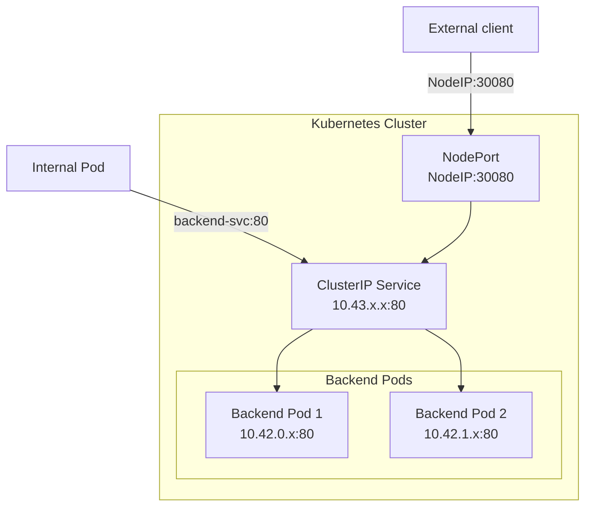
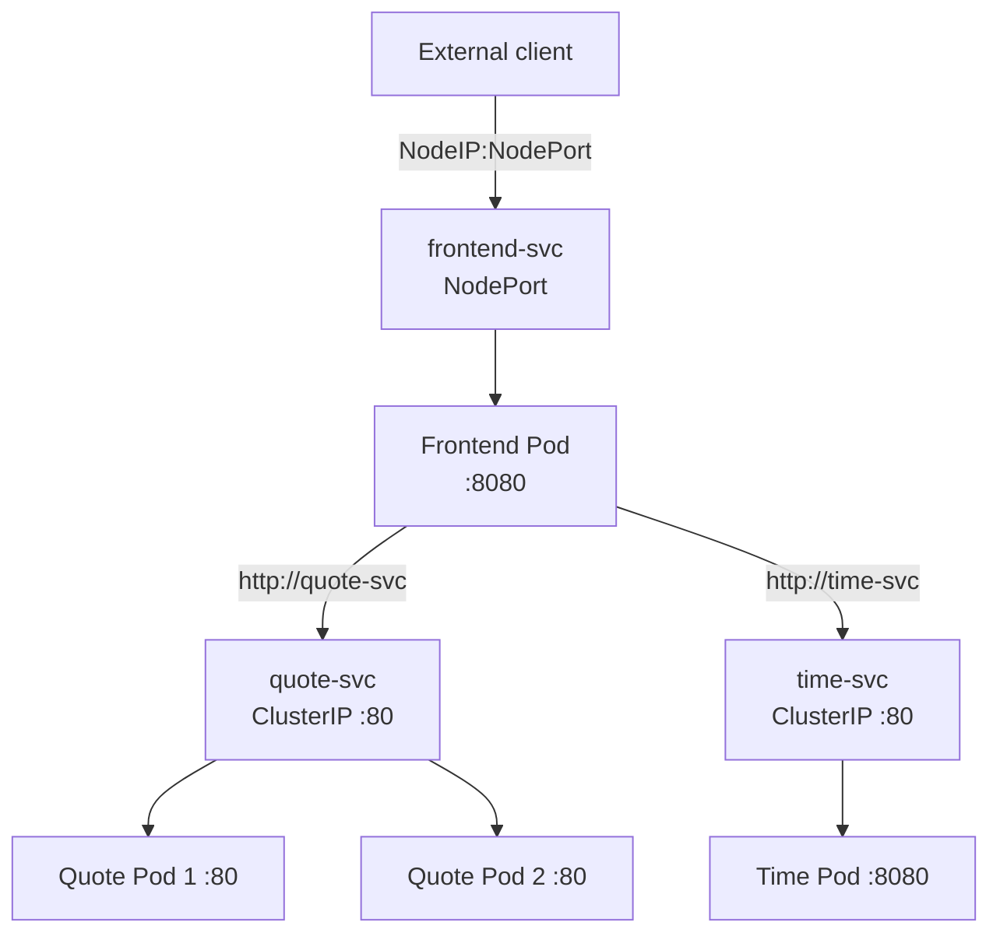
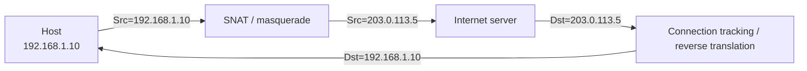

## Overview

- We already know how to create Pods and how Deployments keep the desired number of Pods running.
- The next problem is connectivity:
    - Pod IP addresses are ephemeral.
    - A restarted Pod may receive a new IP address.
    - A scaled Deployment may have several interchangeable Pods.
- Applications therefore should not normally connect directly to a particular Pod IP.
- Kubernetes **Services** provide stable network identities in front of changing sets of Pods.
- In this lecture we focus on two Service types:
    - **ClusterIP**: stable access from inside the cluster.
    - **NodePort**: access through a port on a Kubernetes node.

A useful mental model is:

```text
Deployment  -> keeps Pods running
Service     -> keeps applications connected to those Pods
```



Pods are intentionally replaceable. Consider a Deployment with two replicas:

```text
backend Deployment
    |
    +-- backend Pod A   10.42.0.8
    +-- backend Pod B   10.42.1.4
```

If Pod A is recreated, its replacement may become `10.42.0.12`. A frontend that hard-codes `10.42.0.8` will break.

A Service provides a stable abstraction:

```text
backend-svc
ClusterIP: 10.43.140.207
        |
        +--> backend Pod A
        +--> backend Pod B
```

The Service selects Pods using labels.





| Type | Reachability | Typical use |
|---|---|---|
| `ClusterIP` | Inside the cluster | Backend APIs, databases, internal services |
| `NodePort` | Through a port on node IPs | Labs, simple external exposure, debugging |
| `LoadBalancer` | External load balancer | Cloud-provider production exposure |

`ClusterIP` is the default Service type. A `NodePort` Service also receives a ClusterIP; NodePort adds another way to reach the same Service.



Suppose we have:

```yaml
containers:
  - name: backend
    ports:
      - containerPort: 8080
```

and:

```yaml
ports:
  - port: 80
    targetPort: 8080
    nodePort: 30080
```

Then:

```text
containerPort = 8080   Documentation of the application's container port

targetPort    = 8080   Port on the selected Pods to which the Service forwards

port          = 80     Port exposed by the Service / ClusterIP

nodePort      = 30080  Port exposed on eligible Kubernetes node addresses
```

The traffic path is:

```text
NodeIP:30080 -> Service:80 -> Pod:8080
```



## Deployment Validation

Kubernetes YAML is unforgiving about indentation and field placement. Before applying a manifest, validate it.



If `yamllint` is installed:

```bash
yamllint echo-deployment.yaml
```





```bash
kubectl apply --dry-run=client -f echo-deployment.yaml
```

This parses the YAML and checks the resource structure known to `kubectl`.





Once the cluster is running:

```bash
kubectl apply --dry-run=server -f echo-deployment.yaml
```

This asks the API server to validate the object without storing it.

A useful workflow is:

```bash
kubectl apply --dry-run=client -f app.yaml
kubectl apply --dry-run=server -f app.yaml
kubectl apply -f app.yaml
```






After applying, do not assume success simply because `kubectl apply` returned without an error:

```bash
kubectl get deployments
kubectl get pods -o wide
kubectl describe deployment backend
```




## ClusterIP Services



A ClusterIP Service provides:

- a stable virtual IP address;
- a stable DNS name;
- a logical endpoint in front of one or more Pods;
- traffic distribution among healthy endpoints.

Applications normally use the Service DNS name, not the ClusterIP itself.

For a Service named `backend-svc` in the `default` namespace:

```text
backend-svc
backend-svc.default
backend-svc.default.svc
backend-svc.default.svc.cluster.local
```

are progressively more explicit DNS names.







Create `echo-deployment.yaml`:

```yaml
apiVersion: apps/v1
kind: Deployment
metadata:
  name: backend
spec:
  replicas: 2
  selector:
    matchLabels:
      app: backend
  template:
    metadata:
      labels:
        app: backend
    spec:
      containers:
        - name: backend
          image: nginxdemos/hello:plain-text
          ports:
            - containerPort: 80
```

Validate it first:

```bash
kubectl apply --dry-run=client -f echo-deployment.yaml
```

Then deploy:

```bash
kubectl apply -f echo-deployment.yaml
```

Observe the Pods:

```bash
kubectl get pods -l app=backend -o wide
```

Record the Pod IP addresses for debugging purposes.





Create `echo-svc.yaml`:

```yaml
apiVersion: v1
kind: Service
metadata:
  name: backend-svc
spec:
  selector:
    app: backend
  ports:
    - port: 80
      targetPort: 80
```

Validate and deploy:

```bash
kubectl apply --dry-run=client -f echo-svc.yaml
kubectl apply --dry-run=server -f echo-svc.yaml
kubectl apply -f echo-svc.yaml
```

Inspect the Service:

```bash
kubectl get svc backend-svc -o wide
kubectl describe svc backend-svc
```





Modern Kubernetes represents Service backends using **EndpointSlices**:

```bash
kubectl get endpointslices -l kubernetes.io/service-name=backend-svc -o wide
```

Compare those addresses with:

```bash
kubectl get pods -l app=backend -o wide
```

If the Service has no endpoints, the most common cause is a mismatch between:

```yaml
spec:
  selector:
    app: backend
```

and the Pod labels:

```yaml
metadata:
  labels:
    app: backend
```

Inspect labels with:

```bash
kubectl get pods --show-labels
```






Create a temporary curl Pod:

```bash
kubectl run curl-test \
  --image=curlimages/curl \
  --restart=Never \
  -it --rm -- sh
```

Inside the Pod:

```bash
nslookup backend-svc
curl http://backend-svc
curl http://backend-svc.default.svc.cluster.local
```

Exit when finished:

```bash
exit
```





Get the Pod addresses:

```bash
kubectl get pods -l app=backend -o wide
```

From a temporary curl Pod, compare:

```bash
curl http://<POD-IP>:80
curl http://backend-svc:80
```

The first tests CNI Pod networking directly. The second also tests Service routing and DNS.

{% include figure.liquid path="assets/img/courses/csc478/clusterip/multi-pods.png" max-width="50%" zoomable=true %}





## NodePort Services



A NodePort Service exposes a Service through a port on eligible node addresses.

The default NodePort range is:

```text
30000-32767
```

A NodePort Service still has a ClusterIP. Conceptually:

```text
client
  |
  v
NodeIP:NodePort
  |
  v
ClusterIP:port
  |
  v
selected Pod:targetPort
```

For our FABRIC RKE2 environment, test NodePort against the deliberately configured **dataplane node IP**, such as `192.168.1.1`, rather than assuming that `127.0.0.1` is equivalent. Loopback NodePort behavior depends on kube-proxy mode and configuration.





### Option 1: Create a NodePort imperatively

```bash
kubectl expose deployment backend \
  --name=backend-nodeport \
  --type=NodePort \
  --port=80 \
  --target-port=80
```

Inspect the assigned port:

```bash
kubectl get svc backend-nodeport
```

Example:

```text
NAME               TYPE       CLUSTER-IP      PORT(S)
backend-nodeport   NodePort   10.43.120.50    80:31642/TCP
```

Here:

```text
ClusterIP port = 80
NodePort       = 31642
```

Test from a node or another reachable host:

```bash
curl http://192.168.1.1:31642
```

### Option 2: Specify a fixed NodePort

For repeatable labs, a fixed port can be easier:

```yaml
apiVersion: v1
kind: Service
metadata:
  name: backend-nodeport
spec:
  type: NodePort
  selector:
    app: backend
  ports:
    - port: 80
      targetPort: 80
      nodePort: 30080
```

Validate before deployment:

```bash
kubectl apply --dry-run=server -f backend-nodeport.yaml
kubectl apply -f backend-nodeport.yaml
```

Then:

```bash
curl -v --connect-timeout 5 http://192.168.1.1:30080/
```

### Inspect what backs the Service

```bash
kubectl get svc backend-nodeport -o wide
kubectl get endpointslices \
  -l kubernetes.io/service-name=backend-nodeport \
  -o wide
```

{% include figure.liquid path="assets/img/courses/csc478/clusterip/expose-nodeport.png" max-width="50%" zoomable=true %}



## Multi-Service Communication



Real applications usually contain multiple services. The important design principle is:

> Internal components communicate through Service names, not through Pod IP addresses.

We will build three components:

- **Quote Service**: provides text.
- **Time Service**: provides the current server time.
- **Frontend Service**: calls both internal Services and combines their responses.

Only the frontend needs external exposure.









Notice that the frontend does **not** know the Pod IPs for quote or time. It only knows their Service names.





Create `quote.yaml`:

```yaml
apiVersion: apps/v1
kind: Deployment
metadata:
  name: quote
spec:
  replicas: 2
  selector:
    matchLabels:
      app: quote
  template:
    metadata:
      labels:
        app: quote
    spec:
      containers:
        - name: quote
          image: nginxdemos/hello:plain-text
          ports:
            - containerPort: 80
---
apiVersion: v1
kind: Service
metadata:
  name: quote-svc
spec:
  selector:
    app: quote
  ports:
    - port: 80
      targetPort: 80
```

```bash
kubectl apply --dry-run=server -f quote.yaml
kubectl apply -f quote.yaml
```





Create `time.yaml`:

```yaml
apiVersion: apps/v1
kind: Deployment
metadata:
  name: time
spec:
  replicas: 1
  selector:
    matchLabels:
      app: time
  template:
    metadata:
      labels:
        app: time
    spec:
      containers:
        - name: time
          image: busybox
          command: ["sh", "-c"]
          args:
            - |
              while true; do
                printf "HTTP/1.1 200 OK\r\nContent-Type: text/plain\r\nConnection: close\r\n\r\n$(date)\n" \
                | nc -l -p 8080 -s 0.0.0.0;
              done
          ports:
            - containerPort: 8080
---
apiVersion: v1
kind: Service
metadata:
  name: time-svc
spec:
  selector:
    app: time
  ports:
    - port: 80
      targetPort: 8080
```

```bash
kubectl apply --dry-run=server -f time.yaml
kubectl apply -f time.yaml
```





Create `frontend.yaml`:

```yaml
apiVersion: apps/v1
kind: Deployment
metadata:
  name: frontend
spec:
  replicas: 1
  selector:
    matchLabels:
      app: frontend
  template:
    metadata:
      labels:
        app: frontend
    spec:
      containers:
        - name: frontend
          image: busybox
          command: ["sh", "-c"]
          args:
            - |
              while true; do
                Q=$(wget -qO- http://quote-svc);
                T=$(wget -qO- http://time-svc);
                printf "HTTP/1.1 200 OK\r\nContent-Type: text/plain\r\nConnection: close\r\n\r\nQuote service:\n$Q\nTime: $T\n" \
                | nc -l -p 8080 -s 0.0.0.0;
              done
          ports:
            - containerPort: 8080
---
apiVersion: v1
kind: Service
metadata:
  name: frontend-svc
spec:
  type: NodePort
  selector:
    app: frontend
  ports:
    - port: 80
      targetPort: 8080
      nodePort: 30080
```

Validate and deploy:

```bash
kubectl apply --dry-run=server -f frontend.yaml
kubectl apply -f frontend.yaml
```

Inspect everything:

```bash
kubectl get deployments
kubectl get pods -o wide
kubectl get svc
kubectl get endpointslices
```

Test internal Services first:

```bash
kubectl run curl-test \
  --image=curlimages/curl \
  --restart=Never \
  -it --rm -- sh
```

Inside:

```bash
curl http://quote-svc
curl http://time-svc
curl http://frontend-svc
```

Then test the NodePort from a FABRIC node:

```bash
curl -v --connect-timeout 5 http://192.168.1.1:30080/
```






## A Layered Troubleshooting Workflow

When a Service fails, do not begin by changing random firewall, MTU, or offload settings. Test one layer at a time.

Suppose:

```text
Pod IP:      10.42.0.10
ClusterIP:   10.43.140.207
Node IP:     192.168.1.1
NodePort:    30080
```

### Layer 1: Is the application actually running?

```bash
kubectl get pods -o wide
kubectl logs <pod-name>
kubectl exec <pod-name> -- wget -qO- http://127.0.0.1:80/
```

If localhost inside the Pod fails, the problem is the application/container, not Kubernetes networking.

### Layer 2: Can the node reach a Pod directly?

```bash
curl -v --connect-timeout 5 http://10.42.0.10:80/
```

If this fails, investigate CNI/routing before looking at Services.

### Layer 3: Can the ClusterIP Service be reached?

```bash
curl -v --connect-timeout 5 http://10.43.140.207:80/
```

Also verify Service endpoints:

```bash
kubectl get endpointslices \
  -l kubernetes.io/service-name=backend-svc \
  -o wide
```

If direct Pod access works but ClusterIP fails, investigate kube-proxy / Service rules.

### Layer 4: Can the NodePort be reached?

```bash
curl -v --connect-timeout 5 http://192.168.1.1:30080/
```

If Pod and ClusterIP work but NodePort fails, investigate NodePort rules, eligible node addresses, and host firewall behavior.

### Do not confuse ports

For:

```text
80:30080/TCP
```

correct tests are:

```bash
curl http://<POD-IP>:80
curl http://<CLUSTER-IP>:80
curl http://<NODE-IP>:30080
```

These are **not** equivalent:

```bash
curl http://<POD-IP>:30080       # usually wrong
curl http://<CLUSTER-IP>:30080   # usually wrong
```

### `curl` HTTP code `000`

A command such as:

```bash
curl -s -o /dev/null -w '%{http_code}\n' http://192.168.1.1:30080/
```

returns `000` when curl never receives an HTTP response. During debugging, remove `-s` and use:

```bash
curl -v --connect-timeout 5 http://192.168.1.1:30080/
```

Distinguish:

- `Connection refused`
- `Connection timed out`
- `Network is unreachable`

They point to different layers.

### Useful inspection commands

```bash
kubectl get pods -o wide
kubectl get svc -o wide
kubectl get endpointslices -o wide
kubectl get nodes -o wide
ip route
ip addr
```

For kube-proxy rules on an iptables-based cluster:

```bash
sudo iptables-save | grep KUBE
sudo iptables-save | grep 30080
```

## Kubernetes Networking Theory



Network Address Translation rewrites network-layer addressing as packets cross a boundary.

Common forms:

- **SNAT**: change the source address.
- **DNAT**: change the destination address.
- **PAT / masquerading**: combine address and port translation so multiple clients can share an address.

Example:



In Kubernetes, NAT commonly appears in Service and egress handling. The Pod networking model itself aims to make Pod addresses directly meaningful within the cluster rather than placing every Pod behind a separate NAT boundary.





At a conceptual level, Kubernetes expects:

- Pods can communicate with other Pods across nodes.
- Nodes can communicate with Pods.
- A Pod sees its own IP as the same IP other cluster participants use to address it.
- Services provide stable virtual identities in front of changing Pod endpoints.

That model allows application developers to think in terms of:

```text
frontend -> backend-svc
```

rather than:

```text
frontend -> discover Pod -> inspect host -> translate address -> connect
```





A Service object does not normally create a process that listens on the ClusterIP.

Instead:

1. The Service selector identifies matching Pods.
2. Kubernetes maintains EndpointSlices containing backend addresses.
3. kube-proxy (or another implementation of Service routing) programs the node dataplane.
4. Packets addressed to the Service are redirected to one of the endpoints.

For a NodePort Service:

```text
NodeIP:30080
      |
      v
Service virtual IP:80
      |
      v
PodIP:targetPort
```

Depending on the kube-proxy mode, rules may be implemented with iptables, nftables, or another dataplane mechanism.

Inspect an iptables-based node with:

```bash
sudo iptables-save | grep KUBE-SERVICES
sudo iptables-save | grep KUBE-NODEPORTS
sudo iptables-save | grep 30080
```

Do not depend on `127.0.0.1:<NodePort>` as your primary NodePort test. Loopback NodePort support depends on kube-proxy mode and configuration. In this course, test the known FABRIC dataplane IP instead.





Kubernetes delegates Pod network setup to CNI plugins.

When a Pod is created, the networking stack typically must:

1. create a network namespace;
2. create a veth pair;
3. place one end in the Pod namespace;
4. assign the Pod an IP address;
5. install routes;
6. connect the Pod to local and inter-node networking;
7. remove that configuration when the Pod is deleted.

A useful troubleshooting distinction is:

```text
Pod is Running
```

versus:

```text
Pod networking is actually functional
```

A container can be running while return routing, Service routing, or the overlay network is broken.

If Pod deletion hangs with an error such as:

```text
KillPodSandboxError
failed to destroy network for sandbox
cni plugin not initialized
```

inspect CNI configuration and the CNI DaemonSet before assuming the workload itself is responsible.





For the RKE2 clusters used in this course, Canal combines:

- Flannel for the inter-node overlay;
- Calico for workload networking and policy.

Useful commands:

```bash
kubectl -n kube-system get pods -o wide
ip link | grep -E 'cali|flannel'
ip route | grep 10.42
```

On a healthy two-node example:

```text
node1 local Pod subnet:  10.42.0.0/24
node2 local Pod subnet:  10.42.1.0/24
```

Node1 may contain direct routes such as:

```text
10.42.0.10 dev caliXXXXXXXX scope link
```

and a remote route such as:

```text
10.42.1.0/24 via 10.42.1.0 dev flannel.1 onlink
```

The two route types represent different pieces of the path:

```text
cali*      -> local Pod attachment
flannel.1  -> remote Pod subnet over the overlay
```





- **Flannel**: simple overlay networking, commonly VXLAN.
- **Calico**: routed networking and network policy; may use several dataplane modes depending on configuration.
- **Cilium**: eBPF-based networking, observability, and policy.
- **Canal**: combines Flannel networking with Calico policy/workload integration; this is the default CNI in RKE2.


