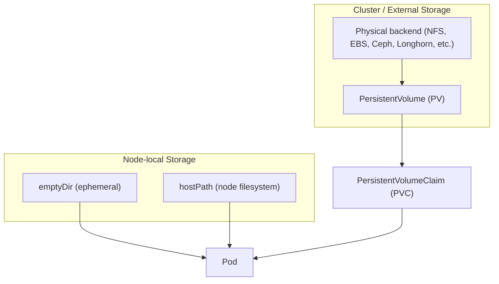
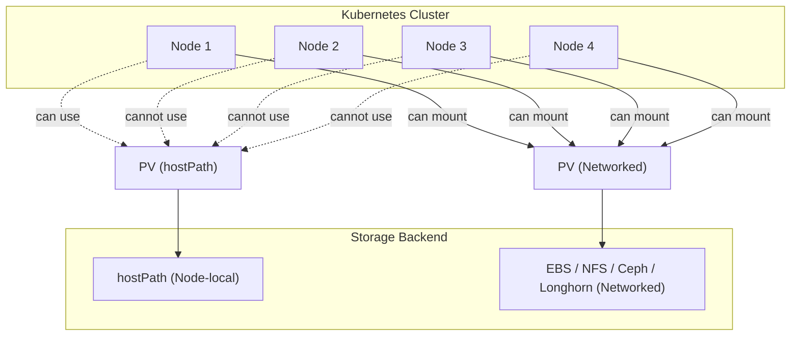

# Storage Volumes in Kubernetes

---

## Motivation & Problem Setup




  **Containers are ephemeral:** when a pod dies, its local storage is lost.



- Database workloads (MongoDB, MySQL, PostgreSQL).
- Logs that must outlive a pod.
- Shared storage between pods.




- Abstract away underlying storage to achieve portability across clusters (on-prem, cloud, hybrid).




- Separation of compute resources (pods) and storage resources (volumes).
- Lifecycle mismatch: pod vs. volume.
    - Pods are more ephemeral and can have shorter lifecycle (node failure, maintenance, etc)
    - Volumes need to be more persistent for long-term reliable storage of data
- Tension between flexibility (dynamic provisioning) and control (security, quotas).


---

## Kubernetes Volumes: The Basics




- Degree of ephemeral is tied to the pod. 
  - Persistence across container restarts within the same Pod. 
  - First created when a Pod is assigned to a node.
  - Exists as long as the Pod remains on the same node.
- Useful for scratch space.
    - Temporary storage
    - Shared workspace among containers
    - Temporary log aggregation location





- Create the following deployment manifest called `emptyDir.yaml`. 

```yaml
apiVersion: v1
kind: Pod
metadata:
  name: emptydirpod
spec:
  containers:
  - name: my-app-container
    image: nginx
    volumeMounts:
    - name: shared-data
      mountPath: /var/data
  - name: my-sidecar-container
    image: busybox
    command: ["sh", "-c", "echo 'hello from sidecar' > /shared/file.txt && sleep 60"]
    volumeMounts:
    - name: shared-data
      mountPath: /shared
  volumes:
  - name: shared-data
    emptyDir: {}

```

- Deploy the pod using `kubectl apply -f`. 
- Use `kubectl get pods`to identify the pod name
- Use `kubectl describe pod` to identify the container names. 
- Use `kubectl exec` with additional `-c` flag to get into the `my-app-container` container. 
- Confirm the content inside `/var/data/file.txt`. 





- Direct mounting from the host node filesystem to the pod
    - Not recommended for production.
- Node-specific
- Breaks abstraction: Physical to Container
- Security implications
- Persistence





- Create the following deployment manifest called `hostpath.yaml`. 

```yaml
apiVersion: v1
kind: Pod
metadata:
  name: hostpathpod
spec:
  containers:
  - name: my-container
    image: busybox
    command: ["sh", "-c", "echo 'hello from the other side' > /mnt/hostpath/file.txt && sleep 3600"]
    volumeMounts:
    - name: host-volume
      mountPath: /mnt/hostpath
  volumes:
  - name: host-volume
    hostPath:
      path: /home/YOUR_USER_NAME_HERE/hostpath
      type: DirectoryOrCreate
```

- Deploy the pod using `kubectl apply -f`. 
- One the pod is ready, check the content inside `~/hostpath/` directory. 
- Create another file inside `~/hostpath/` directory. 
- Use `kubectl exec` to get into the pod and check the content of `/mnt/hostpath/` directory. 


---

## Persistent Volumes and Claims



- Abstract representation of a peice of storage in a Kubernetes cluster.
- Provisioned by administrator or dynamically through `StorageClass`. 
- Independent of a Pod's lifecycle
- Represents different types of [StorageClass](https://kubernetes.io/docs/concepts/storage/storage-classes/)
    - Local storage
    - NSF shares
    - Other types of storage. 





- User request for storage.
- Namespace-scoped resource that defines the desired charactersistics of the storage
    - Size
    - Access modes
        - ReadWriteOnce (RWO): one node mounted read/write.
        - ReadOnlyMany (ROX): multiple nodes, read-only.
        - ReadWriteMany (RWX)L multiple nodes, read/write.
    - Storage Class (optional)
- Kubernetes attempts to bind a PVC to an available PV that satisfies its requirements. 




- Administartors provisions PVs or defines Storage Classes
- Users/applications create PVC
- Kubernetes binds PVC to PV
- Pods mounts PVC as per manifest. 





- Retain
    - PV is not deleted; data remains intact. 
    - Storage asset is orphaned until an admin manually reclaims it (by wiping or reassigning). 
    - Best for sensitive data (databases, regulated workloads).
    - Example Use Case: Production database volumes (Postgres, MySQL, MongoDB) where accidental data loss must be avoided.
- Delete
    - Both the PV object and the underlying storage asset (e.g., AWS EBS volume, GCP PD, Ceph RBD) are deleted.
    - Fully automated cleanup.
        - **Data is lost once PVC is deleted.**
    - Example Use Case: Scratch workloads, CI/CD environments, development namespaces, or any scenario where ephemeral but persistent-like storage is needed.admin manually reclaims.










- Volumes are not tied to containers, but to pods
- Data is preserved across container restarts but not across pod rescheduling, unless backed by PV/PVC.


--- 

## PV on multi-node cluster



- A Persistent Volume (PV) is a `cluster-wide` resource. 
- **However**, the actual storage backend dictates whether a pod scheduled on another node can still access that PV. 




- hostPath ties the PV to a directory on a specific node.
- If the pod is scheduled elsewhere, the mount fails.
- The pod may go ContainerCreating with volume mount errors.
- *hostPath is not recommended for production or multi-node clusters.*




- Same limitation: bound to the node where it was created.
- The provisioner usually pins the pod to the node with the volume (via node affinity).
- Good for dev/test clusters, but limited for failover.




- PV points to shared storage that all nodes can reach over the network.
- A pod rescheduled on Node 2 or Node 4, then volume is reattached automatically.
- This is the production pattern: 
    - PVs abstract away location, Kubernetes handles re-mounting on whichever node the pod lands.




- ReadWriteOnce (RWO): only one node can mount read/write at a time (e.g., AWS EBS). 
    - Pod rescheduling detaches from Node 1, attaches to Node 2.
- ReadWriteMany (RWX): multiple pods/nodes can read/write concurrently (e.g., NFS, CephFS, Longhorn). 
    - Needed for shared workloads (like WordPress + PHP pods writing to the same files).
- ReadOnlyMany (ROX): multiple pods/nodes can read concurrently, but no writes.




- When a pod requests a PVC
    - Kubernetes binds PVC to PV.
- If the PV backend is node-local, the scheduler will add node affinity so the pod only runs on that node.
- If the PV backend is networked, the pod can run on any node and the volume follows.







