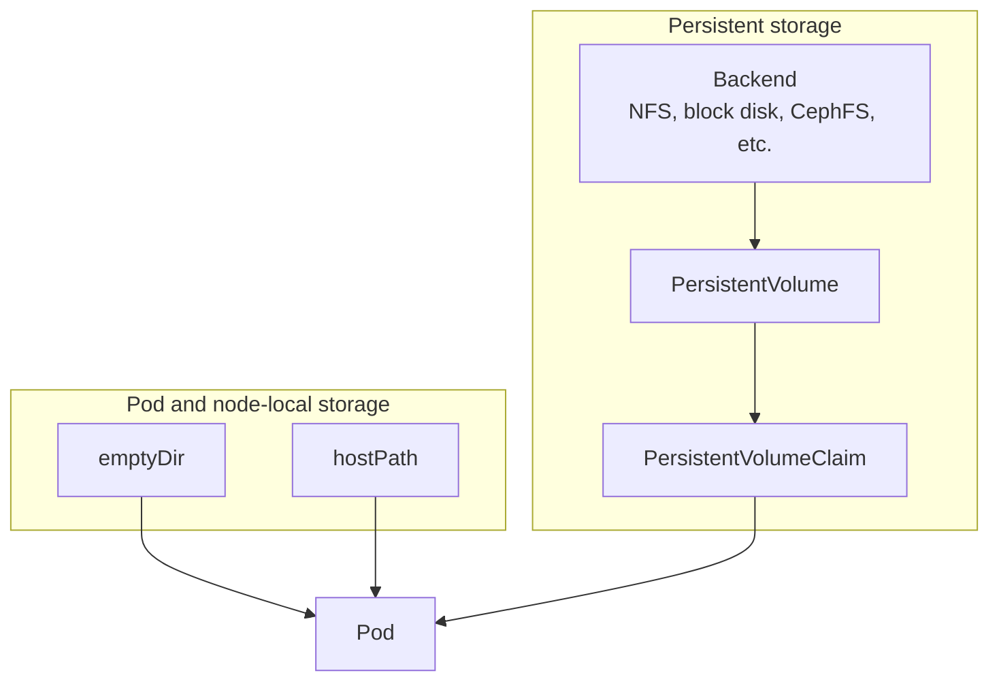
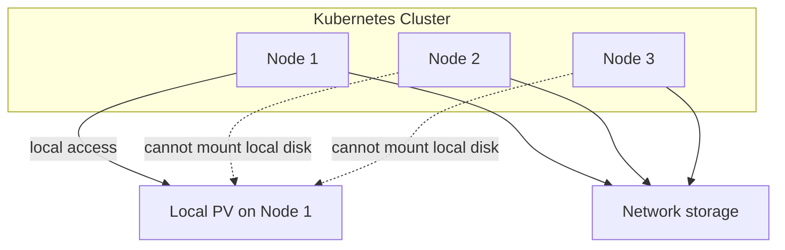
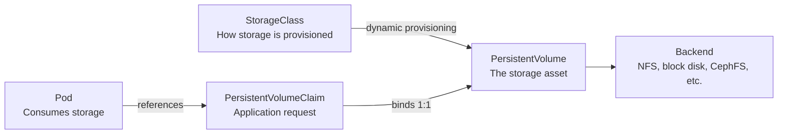
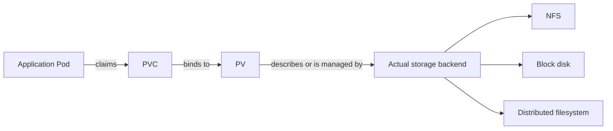
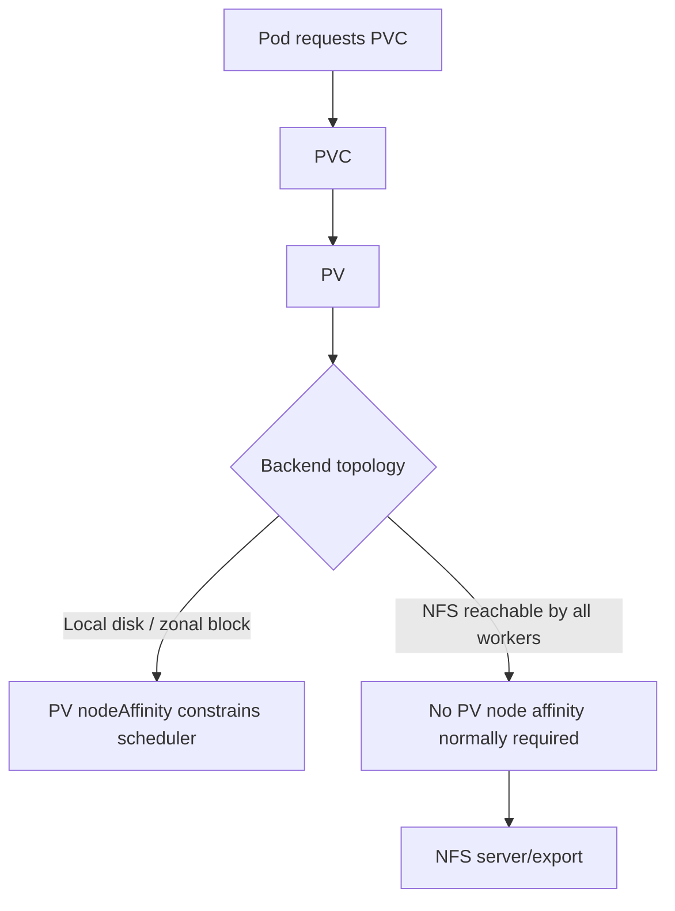

## Motivation & Problem Setup



**Containers are ephemeral:** when a Pod is deleted, data written only to a
container's writable layer is lost. Kubernetes volumes provide explicit
storage with a lifecycle appropriate to the workload.




- Database workloads (MongoDB, MySQL, PostgreSQL).
- Logs that must outlive a pod.
- Shared storage between pods.




- Abstract away underlying storage to achieve portability across clusters (on-prem, cloud, hybrid).




- Separation of compute resources (pods) and storage resources (volumes).
- Lifecycle mismatch: pod vs. volume.
    - Pods are more ephemeral and can have shorter lifecycle (node failure, maintenance, etc)
    - Volumes need to be more persistent for long-term reliable storage of data
- Tension between flexibility (dynamic provisioning) and control (security, quotas).




## Kubernetes Volumes: The Basics



- Degree of ephemeral is tied to the pod. 
  - Persistence across container restarts within the same Pod.
    - First created when a Pod is assigned to a node.
    - Exists as long as the Pod remains on the same node.
- Useful for scratch space.
    - Temporary storage
    - Shared workspace among containers
    - Temporary log aggregation location

- Create the following deployment manifest called `emptyDir.yaml`. 

```yaml
apiVersion: v1
kind: Pod
metadata:
  name: emptydirpod
spec:
  containers:
  - name: my-app-container
    image: nginx
    volumeMounts:
    - name: shared-data
      mountPath: /var/data
  - name: my-sidecar-container
    image: busybox
    command: ["sh", "-c", "echo 'hello from sidecar' > /shared/file.txt && sleep 60"]
    volumeMounts:
    - name: shared-data
      mountPath: /shared
  volumes:
  - name: shared-data
    emptyDir: {}

```

- Deploy the Pod using `kubectl apply -f emptyDir.yaml`.
- Use `kubectl get pods` to identify the Pod name.
- Use `kubectl describe pod` to identify the container names. 
- Use `kubectl exec` with additional `-c` flag to get into the `my-app-container` container. 
- Confirm the content inside `/var/data/file.txt`. 

```bash
kubectl get pod emptydirpod -o jsonpath='{.spec.containers[*].name}'
kubectl exec -it emptydirpod -c my-app-container -- sh
cat /var/data/file.txt
```

{% include figure.liquid path="assets/img/courses/csc478/persistent-volumes/emptydirpod.png" max-width="50%" zoomable=true %}





- Direct mounting from the host node filesystem to the pod
    - Not recommended for production.
- Node-specific
- Breaks abstraction: Physical to Container
- Security implications
- Persistence

- Create the following deployment manifest called `hostpath.yaml`. 

```yaml
apiVersion: v1
kind: Pod
metadata:
  name: hostpathpod
spec:
  containers:
  - name: my-container
    image: busybox
    command: ["sh", "-c", "echo 'hello from the other side' > /mnt/hostpath/file.txt && sleep 3600"]
    volumeMounts:
    - name: host-volume
      mountPath: /mnt/hostpath
  volumes:
  - name: host-volume
    hostPath:
      path: /home/ubuntu/hostpath
      type: DirectoryOrCreate
```

- Deploy the Pod using `kubectl apply -f hostpath.yaml`.
- Once the Pod is ready, check the content inside the `~/hostpath/` directory.
- Create another file inside `~/hostpath/` directory. 
- Use `kubectl exec` to get into the pod and check the content of `/mnt/hostpath/` directory. 

```bash
kubectl exec -it hostpathpod -c my-app-container -- sh
cat /mnt/hostpath/datafile.txt
```

- Is this file on `node1`? Which node is it on?

{% include figure.liquid path="assets/img/courses/csc478/persistent-volumes/nodepath-1.png" max-width="50%" zoomable=true %}

{% include figure.liquid path="assets/img/courses/csc478/persistent-volumes/nodepath-2.png" max-width="50%" zoomable=true %}




## Persistent Volumes and Claims



- Abstract representation of a piece of storage in a Kubernetes cluster.
- Provisioned by an administrator or dynamically through a
  [StorageClass](https://kubernetes.io/docs/concepts/storage/storage-classes/).
- Independent of a Pod's lifecycle.
- Backed by storage such as a local disk, NFS export, cloud block disk, or
  distributed filesystem.






- User request for storage.
- Namespace-scoped resource that defines the desired characteristics of the storage
    - Size
    - Access modes
        - ReadWriteOnce (RWO): one node mounted read/write.
        - ReadOnlyMany (ROX): multiple nodes, read-only.
        - ReadWriteMany (RWX): multiple nodes, read/write.
        - ReadWriteOncePod (RWOP): one Pod in the cluster, read/write.
    - Storage Class (optional)
- Kubernetes attempts to bind a PVC to an available PV that satisfies its requirements. 





- Administrators provision PVs or define StorageClasses.
- Users/applications create PVCs.
- Kubernetes binds each PVC to a compatible PV.
- Pods mount PVCs as declared in their manifests.





- `Retain`
    - The PV object and backing data are not automatically reused.
    - An administrator must recover, sanitize, or reassign the storage.
    - Appropriate when accidental deletion would be especially damaging.
- `Delete`
    - A dynamic provisioner normally deletes both the PV object and its
      backing storage asset after the PVC is deleted.
    - Appropriate for disposable environments only when automated deletion
      matches the data-retention policy.

The reclaim policy is not a backup policy. `Retain` can reduce accidental
deletion risk, but it does not protect against corruption, server failure, or
malicious modification.






```mermaid
flowchart TD
    subgraph NodeLocal["Pod and node-local storage"]
        A["emptyDir"]
        B["hostPath"]
    end

    subgraph Durable["Persistent storage"]
        C["Backend\nNFS, block disk, CephFS, etc."]
        D["PersistentVolume"]
        E["PersistentVolumeClaim"]
    end

    F["Pod"]
    A --> F
    B --> F
    C --> D
    D --> E
    E --> F
```





- Volumes are declared by Pods and mounted into one or more containers.
- Data in a Pod volume survives a container restart.
- Only suitably backed persistent storage survives Pod replacement or
  rescheduling.





Storage decisions appear in cloud engineer, platform engineer, site
reliability engineer (SRE), and DevOps responsibilities. A practitioner is
often expected to answer:

- Which data may be ephemeral, and which data must survive node loss?
- Does the workload require one writer, many readers, or many writers?
- Who owns backups, restores, encryption, capacity, and retention?
- What recovery time is expected after a node, zone, or storage-service
  failure?

In an architecture review, saying “the application uses a PVC” is incomplete.
A stronger explanation identifies the backend, failure domain, access
pattern, reclaim behavior, backup owner, and tested recovery process.

One widely discussed example is
[GitLab's 2017 database outage](https://about.gitlab.com/blog/postmortem-of-database-outage-of-january-31/).
After accidental data deletion, the team discovered that a version mismatch
had caused its expected `pg_dump` backups to fail. Recovery depended on an
older LVM snapshot, and copying the data took roughly 18 hours because storage
throughput became the bottleneck. The lesson for practitioners is concrete:
storage existence, backup success, and tested restore performance are three
different claims.




## PV on multi-node cluster



- A PV is a cluster-scoped Kubernetes resource.
- The actual backend determines where it can be mounted.
- `hostPath` is tied to one node and is not a production multi-node storage
  solution.
- A local PV includes node affinity so the scheduler places the Pod on the
  node containing that disk.
- Network storage can follow a Pod only to nodes that can reach and mount the
  backend.





- `RWO` block storage is commonly detached from one node and attached to
  another during rescheduling. Detach/attach may take time.
- `RWX` filesystems such as NFS or CephFS can be mounted from several nodes.
- `ROX` supports many readers but no writers.
- Access modes describe mounting support, not application-level concurrent
  write safety.


```mermaid
flowchart TD
    subgraph Cluster["Kubernetes Cluster"]
        N1["Node 1"]
        N2["Node 2"]
        N3["Node 3"]
    end

    L["Local PV on Node 1"]
    R["Network storage"]

    N1 -- "local access" --> L
    N2 -. "cannot mount local disk" .-> L
    N3 -. "cannot mount local disk" .-> L

    N1 --> R
    N2 --> R
    N3 --> R
```





The same Kubernetes manifest may target different infrastructure through a
StorageClass and CSI driver:

- AWS EBS, Azure Disk, and Google Persistent Disk commonly provide
  single-node block storage for `RWO` workloads.
- AWS EFS, Azure Files, Google Cloud Filestore, and enterprise NFS commonly
  provide shared filesystem storage for `RWX` workloads.
- Ceph, Portworx, and Longhorn are examples of platforms a team may operate
  to provide storage from within or alongside a cluster.

The abstraction is valuable, but it does not make the backends
interchangeable. Latency, throughput, availability, snapshots, quotas,
expansion, and cost remain backend-specific. Industry interviews often test
whether a candidate can reason beyond the YAML and explain these tradeoffs.



## Volume Selection and Lifecycle



The word **persistent** is easy to misuse. Ask two separate questions:

1. Does the data survive a **container restart**?
2. Does the data survive deletion and replacement of the **Pod**?

| Volume type | Container restart | Pod replacement | Node failure | Typical purpose |
|---|---:|---:|---:|---|
| Container writable layer | No guarantee | No | No | Never use for durable application data |
| `emptyDir` | Yes | No | No | Cache, scratch data, files shared by containers in one Pod |
| `hostPath` | Yes | Only on same node | Usually no | Node agents and tightly controlled labs |
| Local PV | Yes | Yes, on its node | No automatic failover | Fast local disks where applications replicate data |
| Network/cloud PV | Yes | Yes | Usually yes | Databases, uploads, shared content |
| ConfigMap/Secret/projected | Re-created from API data | Yes | Yes | Read-only configuration and credentials |

An `emptyDir` is not erased when one container crashes. It is erased when the
Pod leaves its node or is deleted. A Deployment replacing a Pod creates a
**new Pod**, so the new Pod receives a new `emptyDir`.






```mermaid
flowchart LR
    SC["StorageClass\nHow storage is provisioned"] -->|"dynamic provisioning"| PV["PersistentVolume\nThe storage asset"]
    PVC["PersistentVolumeClaim\nApplication request"] -->|"binds 1:1"| PV
    POD["Pod\nConsumes storage"] -->|"references"| PVC
    PV --> BACKEND["Backend\nNFS, block disk, CephFS, etc."]
```

- A **volume** is a Pod-level mount declaration.
- A **PV** represents storage capacity and lifecycle at cluster scope.
- A **PVC** is a namespaced request for storage.
- A **StorageClass** describes a provisioner, parameters, reclaim policy,
  binding mode, and mount options.
- Binding is normally one PVC to one PV. Multiple Pods can reference the same
  PVC only when the access mode and backend support that pattern.

PVC capacity is a scheduling and provisioning request. For a statically
defined NFS PV, `capacity.storage: 10Gi` does not automatically impose a
10-GiB server-side quota. Enforcement must come from the NFS server,
filesystem quotas, or the dynamic provisioner.





Access modes describe supported attachment/mount patterns and should not be confused with general filesystem permissions

- `ReadWriteOnce` (`RWO`): read/write from Pods on one node. Several Pods on
  that same node may still be able to mount it.
- `ReadWriteOncePod` (`RWOP`): read/write by one Pod cluster-wide. Use this
  when a CSI driver supports it and the application requires single-writer
  protection.
- `ReadOnlyMany` (`ROX`): read-only from many nodes.
- `ReadWriteMany` (`RWX`): read/write from many nodes.

`RWO` does **not** mean “one Pod.” It means “one node.” Also, Kubernetes access
modes do not prevent two processes from corrupting a file format that does
not support concurrent writers. NFS may provide RWX mounting while an
application such as SQLite still requires a single application writer.





With **static provisioning**, an administrator creates the PV and users create
PVCs that match it. With **dynamic provisioning**, a PVC causes a CSI or
external provisioner to create the backing storage and PV.

For a static PV that should not use the cluster's default StorageClass, set
this on both PV and PVC:

```yaml
storageClassName: ""
```

For dynamic storage, specify the intended class:

```yaml
spec:
  storageClassName: fast-csi
  accessModes:
    - ReadWriteOnce
  resources:
    requests:
      storage: 5Gi
```

Inspect available classes and the default:

```bash
kubectl get storageclass
kubectl get storageclass \
  -o custom-columns=NAME:.metadata.name,PROVISIONER:.provisioner,BINDING:.volumeBindingMode,DEFAULT:'.metadata.annotations.storageclass\.kubernetes\.io/is-default-class'
```





Suppose a team proposes one PVC for a web application:

```text
NGINX cache + customer uploads + database + logs -> one shared PVC
```

A platform engineer should separate the data by lifecycle:

- cache: `emptyDir` because it can be rebuilt;
- customer uploads: object storage or an RWX filesystem with backup;
- database: database-appropriate block storage and database-aware backups;
- application logs: `stdout`/`stderr` and a centralized logging platform.

It is important to be able to convert business requirements such as durability, recovery time, concurrency, compliance,
and cost into different storage policies.




## Hands-on Stateful Web Stack

This lab combines several storage patterns in one Pod:

- NGINX is the public web server.
- A small Python HTTP service stores request counters in SQLite.
- NGINX writes access and error logs to a shared `emptyDir`.
- A sidecar rotates those logs.
- SQLite is stored on a PVC and survives Pod replacement.

The example intentionally uses one replica. SQLite is a local file database,
not a multi-node database service. Scaling this Deployment to several replicas
against the same database file would be an application design error even if
the storage backend allowed RWX.



Choose an available StorageClass:

```bash
kubectl get storageclass
kubectl create namespace volume-demo
```

If the cluster has no dynamic StorageClass, first create the static NFS PV and
PVC in the NFS section below, then use `claimName: web-db-nfs` in the
Deployment.

Create `web-pvc.yaml`. Replace `YOUR_STORAGE_CLASS` with a class from the
previous command. If your cluster has a default StorageClass, the
`storageClassName` line may be omitted.

```yaml
apiVersion: v1
kind: PersistentVolumeClaim
metadata:
  name: web-db
  namespace: volume-demo
spec:
  accessModes:
    - ReadWriteOnce
  storageClassName: YOUR_STORAGE_CLASS
  resources:
    requests:
      storage: 1Gi
```

Validate and apply:

```bash
kubectl apply --dry-run=server -f web-pvc.yaml
kubectl apply -f web-pvc.yaml
kubectl -n volume-demo get pvc web-db -w
```

The expected phase is `Bound`. If the class uses
`volumeBindingMode: WaitForFirstConsumer`, the PVC may remain `Pending` until
the Pod is created. That is expected because the scheduler has not selected a
storage topology yet.





Create `web-config.yaml`:

```yaml
apiVersion: v1
kind: ConfigMap
metadata:
  name: web-config
  namespace: volume-demo
data:
  app.py: |
    import json
    import os
    import sqlite3
    from http.server import BaseHTTPRequestHandler, ThreadingHTTPServer

    DB = os.environ.get("DB_PATH", "/data/requests.db")

    def initialize():
        with sqlite3.connect(DB) as db:
            db.execute("""
                CREATE TABLE IF NOT EXISTS requests (
                    id INTEGER PRIMARY KEY AUTOINCREMENT,
                    path TEXT NOT NULL,
                    requested_at TEXT NOT NULL DEFAULT CURRENT_TIMESTAMP
                )
            """)

    class Handler(BaseHTTPRequestHandler):
        def do_GET(self):
            with sqlite3.connect(DB, timeout=10) as db:
                db.execute("INSERT INTO requests(path) VALUES (?)", (self.path,))
                count = db.execute(
                    "SELECT COUNT(*) FROM requests"
                ).fetchone()[0]

            body = json.dumps({
                "message": "hello from persistent storage",
                "path": self.path,
                "request_count": count
            }).encode()
            self.send_response(200)
            self.send_header("Content-Type", "application/json")
            self.send_header("Content-Length", str(len(body)))
            self.end_headers()
            self.wfile.write(body)

        def log_message(self, format, *args):
            print(format % args, flush=True)

    initialize()
    ThreadingHTTPServer(("0.0.0.0", 8080), Handler).serve_forever()

  nginx.conf: |
    events {}
    http {
      log_format lab '$remote_addr - $remote_user [$time_local] '
                     '"$request" $status $body_bytes_sent '
                     'request_time=$request_time';
      access_log /var/log/nginx/access.log lab;
      error_log  /var/log/nginx/error.log notice;

      server {
        listen 80;
        location / {
          proxy_pass http://127.0.0.1:8080;
          proxy_set_header Host $host;
          proxy_set_header X-Forwarded-For $proxy_add_x_forwarded_for;
        }
      }
    }

  logrotate.conf: |
    /var/log/nginx/*.log {
      su root root
      size 10k
      rotate 3
      compress
      missingok
      notifempty
      copytruncate
    }
```

The ConfigMap is mounted read-only. It carries configuration and source code,
not mutable data.

```bash
kubectl apply --dry-run=server -f web-config.yaml
kubectl apply -f web-config.yaml
```





Create `web-deployment.yaml`:

```yaml
apiVersion: apps/v1
kind: Deployment
metadata:
  name: stateful-web
  namespace: volume-demo
spec:
  replicas: 1
  strategy:
    type: Recreate
  selector:
    matchLabels:
      app: stateful-web
  template:
    metadata:
      labels:
        app: stateful-web
    spec:
      securityContext:
        fsGroup: 2000
      containers:
        - name: nginx
          image: nginx:1.27-alpine
          ports:
            - name: http
              containerPort: 80
          volumeMounts:
            - name: config
              mountPath: /etc/nginx/nginx.conf
              subPath: nginx.conf
              readOnly: true
            - name: logs
              mountPath: /var/log/nginx
          readinessProbe:
            httpGet:
              path: /
              port: http
            initialDelaySeconds: 2
            periodSeconds: 5

        - name: app
          image: python:3.12-alpine
          command: ["python", "/config/app.py"]
          env:
            - name: DB_PATH
              value: /data/requests.db
          volumeMounts:
            - name: config
              mountPath: /config
              readOnly: true
            - name: database
              mountPath: /data

        - name: log-rotator
          image: alpine:3.20
          command: ["/bin/sh", "-c"]
          args:
            - |
              apk add --no-cache logrotate
              while true; do
                logrotate /config/logrotate.conf
                sleep 15
              done
          volumeMounts:
            - name: config
              mountPath: /config
              readOnly: true
            - name: logs
              mountPath: /var/log/nginx

      volumes:
        - name: config
          configMap:
            name: web-config
        - name: logs
          emptyDir:
            sizeLimit: 100Mi
        - name: database
          persistentVolumeClaim:
            claimName: web-db
---
apiVersion: v1
kind: Service
metadata:
  name: stateful-web
  namespace: volume-demo
spec:
  type: NodePort
  selector:
    app: stateful-web
  ports:
    - name: http
      port: 80
      targetPort: http
```

`Recreate` prevents a rolling update from briefly running an old and a new Pod
against the same SQLite file. It is a teaching safeguard, not a substitute for
a production database.

Apply and inspect:

```bash
kubectl apply --dry-run=server -f web-deployment.yaml
kubectl apply -f web-deployment.yaml
kubectl -n volume-demo rollout status deployment/stateful-web
kubectl -n volume-demo get pod,pvc,svc -o wide
```





Use port forwarding:

```bash
kubectl -n volume-demo port-forward service/stateful-web 8080:80
```

From another terminal:

```bash
for i in $(seq 1 20); do curl -s http://127.0.0.1:8080/demo; echo; done
```

Identify the Pod:

```bash
POD=$(kubectl -n volume-demo get pod -l app=stateful-web \
  -o jsonpath='{.items[0].metadata.name}')
```

Inspect NGINX logs from both containers that mount the same `emptyDir`:

```bash
kubectl -n volume-demo exec "$POD" -c nginx -- \
  ls -lh /var/log/nginx
kubectl -n volume-demo exec "$POD" -c log-rotator -- \
  ls -lh /var/log/nginx
kubectl -n volume-demo exec "$POD" -c nginx -- \
  tail /var/log/nginx/access.log
```

Inspect the persistent database:

```bash
kubectl -n volume-demo exec "$POD" -c app -- \
  ls -lh /data
kubectl -n volume-demo exec "$POD" -c app -- python -c \
  'import sqlite3; db=sqlite3.connect("/data/requests.db"); print(db.execute("select count(*) from requests").fetchone())'
```

The two log views show **intra-Pod sharing**. The database inspection shows
the PVC mounted only in the application container.





The rotator checks every 15 seconds and rotates after the active log reaches
10 KiB. Generate enough traffic:

```bash
for i in $(seq 1 500); do curl -s http://127.0.0.1:8080/load >/dev/null; done
sleep 20
kubectl -n volume-demo exec "$POD" -c nginx -- \
  ls -lh /var/log/nginx
```

Expected files include an active log and one or more archives:

```text
access.log
access.log.1
access.log.2.gz
```

This lab uses `copytruncate` because containers cannot signal each other by
default. Production NGINX normally rotates by renaming the file and sending
NGINX `USR1` so it reopens file descriptors. Another production pattern is to
write application logs to `stdout`/`stderr` and let the container runtime and
cluster logging agent handle rotation and shipping.

Do not treat rotating a file as log durability. The `emptyDir` and every
rotated file disappear when the Pod is deleted. Durable audit logs should be
shipped to a remote logging system such as Loki, Elasticsearch, or a cloud
logging service.





Capture the database request count:

```bash
curl -s http://127.0.0.1:8080/before-delete
kubectl -n volume-demo delete pod "$POD"
kubectl -n volume-demo rollout status deployment/stateful-web
```

Reconnect port forwarding if necessary, then:

```bash
curl -s http://127.0.0.1:8080/after-delete
```

The count continues because the replacement Pod mounts the same PVC. Now
inspect the new Pod's logs:

```bash
POD=$(kubectl -n volume-demo get pod -l app=stateful-web \
  -o jsonpath='{.items[0].metadata.name}')
kubectl -n volume-demo exec "$POD" -c nginx -- \
  ls -lh /var/log/nginx
```

The old logs are gone because a replacement Pod receives a new `emptyDir`.





- Pin images by digest in controlled production environments.
- Avoid installing packages at container startup; build a dedicated log
  rotator image.
- Run containers as non-root when images and filesystem permissions permit.
- Set CPU and memory requests/limits.
- Back up the database independently of the PVC.
- Do not place credentials in ConfigMaps.
- A PVC is not a backup, and a replica is not a backup.
- For multi-replica applications, use a database designed for network clients
  such as PostgreSQL rather than a shared SQLite file.





For a project report, internship discussion, or technical interview, document
evidence rather than only stating that Kubernetes was used:

1. Draw the request and storage path: client -> NGINX -> Python -> SQLite PVC.
2. Explain why logs use `emptyDir` while the database uses a PVC.
3. Show the request count before and after deleting the Pod.
4. Show that the database survives while the old log files do not.
5. Explain why `replicas: 1` and `strategy: Recreate` were selected.
6. Propose a production evolution: centralized logs and a network database.

A strong résumé bullet could be:

> Built and tested a multi-container Kubernetes workload with shared
> `emptyDir` logging, automated log rotation, and PVC-backed application data;
> verified persistence behavior through controlled Pod replacement.

Only claim measurements or outcomes that you actually collected.




## NFS and Storage Affinity



No. **PV and PVC are storage abstractions, not storage systems.** They describe
how Kubernetes discovers, allocates, mounts, and releases storage, but they do
not store bytes by themselves. Every PV still needs a backend such as:

- an NFS export;
- a cloud or SAN block volume;
- a local disk;
- CephFS, Longhorn, or another distributed storage system;
- a managed file service such as Amazon EFS or Azure Files.

The relationship is:


```mermaid
flowchart LR
    POD["Application Pod"] -->|"claims"| PVC["PVC"]
    PVC -->|"binds to"| PV["PV"]
    PV -->|"describes or is managed by"| BACKEND["Actual storage backend"]
    BACKEND --> NFS["NFS"]
    BACKEND --> BLOCK["Block disk"]
    BACKEND --> DIST["Distributed filesystem"]
```

Therefore, the decision is not **NFS or PV/PVC**. If Kubernetes applications
use NFS, they should normally access it **through PVs and PVCs**.





It can, but an ordinary NFS server Pod is rarely the best default. The answer
depends on what stores the NFS server's own data.

### Option 1: External NFS server with Kubernetes PVs

```text
Application Pod -> PVC -> PV -> NFS server outside the cluster
```

This is usually the simplest choice when an organization already operates an
NFS service. Kubernetes nodes are clients; the NFS server has an independent
lifecycle, backup policy, export configuration, and failure domain.

For this course environment, the existing `192.168.1.1:/opt/scratch` export
fits this model. Keep the server external and represent its exports with
PVs/PVCs. There is no benefit in deploying a second ad hoc NFS server Pod just
to make the storage appear “more Kubernetes-native.”

### Option 2: An NFS provisioner runs in Kubernetes

An NFS CSI driver or NFS subdirectory external provisioner may run as
Kubernetes controllers and node components:

```text
PVC -> in-cluster provisioner/CSI driver -> directory on external NFS server
```

The provisioner automates PV creation. It is **not necessarily the NFS
server** and does not make the backend data live inside the cluster. This is a
useful production pattern when many teams need dynamically provisioned RWX
claims.

### Option 3: The NFS server itself runs as a Pod

```text
Application Pods -> NFS Service -> NFS server Pod -> server's backing volume
```

This can be useful for a lab, edge deployment, or a deliberate storage
appliance design. However, it adds a second storage layer and raises a
bootstrap question: **what makes the NFS server's own volume durable?**

- If it uses `emptyDir`, all exported data is ephemeral.
- If it uses `hostPath` or a local PV, the server and data are tied to one
  node. A node failure takes down the export.
- If it uses a durable RWO block PVC, Kubernetes may move the NFS server to
  another node, but clients experience downtime during detach, attach, and
  server restart.
- If it uses an RWX distributed filesystem underneath, re-exporting that
  filesystem through NFS may be redundant unless a specific compatibility
  requirement justifies it.

A single NFS server Pod also becomes a throughput bottleneck and single point
of service failure. A highly available in-cluster file service requires
replication, failover, fencing, monitoring, and tested recovery—not merely a
Deployment with several NFS replicas.





- Use a normal CSI-backed `RWO` PVC directly for a single-writer database or
  application data when the cluster provides suitable block storage.
- Use external or managed NFS through PV/PVC when several nodes need `RWX`
  shared files.
- Add an in-cluster NFS CSI driver/provisioner when dynamic creation of NFS
  claims is needed; this does not require moving the NFS server into
  Kubernetes.
- Use a purpose-built distributed storage platform such as Ceph or Longhorn
  only when the team is prepared to operate storage as part of the cluster.
- Run a standalone NFS server Pod mainly for learning or when its backing
  storage, availability model, and recovery process are explicitly designed.

For the course cluster, the practical recommendation is:

```text
Existing external NFS
        +
Kubernetes PV/PVC abstraction
        +
Optional NFS CSI provisioner for dynamic claims
```

NFS remains useful for shared files. PV/PVC makes that NFS storage consumable
in a Kubernetes-native way.





Consider a web application that originally stores customer uploads on each
server's local disk. After the application scales to several Pods, users
occasionally cannot retrieve files because a later request reaches a different
Pod.

```text
Before:
Pod A -> local uploads on Node 1
Pod B -> local uploads on Node 2

After:
Pod A --\
         +-> RWX PVC -> managed NFS/file service
Pod B --/
```

The Kubernetes change is small, but the production work also includes:

- migrating existing files and validating checksums;
- selecting UID/GID and permission behavior;
- testing concurrent writes and application locking;
- measuring latency and throughput;
- defining snapshots, backups, retention, and restore tests;
- estimating capacity and operation costs;
- planning rollback if the new mount performs poorly.

This is representative platform engineering work: coordinating application,
infrastructure, security, and operations concerns around a seemingly simple
volume mount.





Storage affinity is not one Kubernetes field. It commonly refers to three
different constraints:

1. **PV node affinity**: which nodes can access a topology-bound volume.
2. **Pod node affinity**: which nodes are eligible to run the workload.
3. **Delayed binding**: choosing or provisioning storage after the scheduler
   knows the selected node.


```mermaid
flowchart TD
    POD["Pod requests PVC"] --> PVC["PVC"]
    PVC --> PV["PV"]
    PV --> LOCAL{"Backend topology"}
    LOCAL -->|"Local disk / zonal block"| AFF["PV nodeAffinity constrains scheduler"]
    LOCAL -->|"NFS reachable by all workers"| ANY["No PV node affinity normally required"]
    ANY --> NFS["NFS server/export"]
```

An NFS server can run on one machine while its export remains network
accessible from every worker. The Pod does **not** need to run on the NFS
server node. Pinning every NFS-backed Pod to the server defeats the purpose of
network storage and creates an unnecessary single-node scheduling constraint.





Before using NFS, verify every eligible worker can resolve and reach the
server, and has the required NFS client support:

```bash
showmount -e 192.168.1.1
nc -vz 192.168.1.1 2049
```

Create `nfs-web-db.yaml`, adapting server and export path:

```yaml
apiVersion: v1
kind: PersistentVolume
metadata:
  name: nfs-web-db
spec:
  capacity:
    storage: 5Gi
  accessModes:
    - ReadWriteMany
  persistentVolumeReclaimPolicy: Retain
  storageClassName: ""
  mountOptions:
    - nfsvers=4.2
    - hard
    - timeo=600
    - retrans=2
  nfs:
    server: 192.168.1.1
    path: /opt/scratch/volume-demo
---
apiVersion: v1
kind: PersistentVolumeClaim
metadata:
  name: web-db-nfs
  namespace: volume-demo
spec:
  accessModes:
    - ReadWriteMany
  storageClassName: ""
  volumeName: nfs-web-db
  resources:
    requests:
      storage: 1Gi
```

Important details:

- `storageClassName: ""` prevents accidental dynamic provisioning.
- `volumeName` explicitly binds this claim to the intended static PV.
- `Retain` preserves server data after claim deletion, but still requires an
  administrative recovery procedure.
- NFSv4 normally does not need the `nolock` option; locking is part of the
  NFSv4 protocol.
- The export directory must already exist and its UID/GID permissions must
  permit the workload to write.





NFS usually needs no PV `nodeAffinity` when all workers can mount the export.
Use **Pod node affinity** when only a subset of nodes has:

- routing to the storage network;
- an NFS client package/kernel module;
- firewall access to TCP 2049;
- acceptable latency to the server;
- authorization in the NFS export policy.

Label eligible nodes:

```bash
kubectl label node worker-a storage.example.com/nfs-client=true
kubectl label node worker-b storage.example.com/nfs-client=true
```

Add a required rule to the Pod template:

```yaml
spec:
  affinity:
    nodeAffinity:
      requiredDuringSchedulingIgnoredDuringExecution:
        nodeSelectorTerms:
          - matchExpressions:
              - key: storage.example.com/nfs-client
                operator: In
                values: ["true"]
```

`requiredDuringSchedulingIgnoredDuringExecution` is enforced when scheduling.
If the node's label later changes, Kubernetes does not automatically evict the
running Pod.

Use a **preferred** rule when proximity is an optimization, not a hard
requirement:

```yaml
spec:
  affinity:
    nodeAffinity:
      preferredDuringSchedulingIgnoredDuringExecution:
        - weight: 100
          preference:
            matchExpressions:
              - key: topology.kubernetes.io/zone
                operator: In
                values: ["storage-zone-a"]
```

Hard affinity can leave Pods `Pending` during failures. Prefer hard rules only
for real reachability or correctness constraints.





PV `nodeAffinity` belongs on topology-bound storage such as a local disk:

```yaml
apiVersion: v1
kind: PersistentVolume
metadata:
  name: local-db-pv
spec:
  capacity:
    storage: 20Gi
  volumeMode: Filesystem
  accessModes:
    - ReadWriteOnce
  persistentVolumeReclaimPolicy: Retain
  storageClassName: local-storage
  local:
    path: /mnt/disks/db
  nodeAffinity:
    required:
      nodeSelectorTerms:
        - matchExpressions:
            - key: kubernetes.io/hostname
              operator: In
              values: ["worker-a"]
```

The scheduler combines this PV constraint with the Pod's other requirements.
Do not add this pattern to an NFS PV merely because the NFS server resides on
`worker-a`; the NFS export is remote storage from the clients' perspective.





Topology-aware storage systems often use:

```yaml
apiVersion: storage.k8s.io/v1
kind: StorageClass
metadata:
  name: zonal-csi
provisioner: example.csi.driver
volumeBindingMode: WaitForFirstConsumer
allowedTopologies:
  - matchLabelExpressions:
      - key: topology.kubernetes.io/zone
        values:
          - zone-a
          - zone-b
```

`Immediate` binding may provision a zonal disk before the scheduler considers
the Pod's node affinity and resource needs. `WaitForFirstConsumer` delays that
decision so storage and Pod topology are selected together.

Do not set `spec.nodeName` to force a Pod onto a node when testing delayed
binding; doing so bypasses normal scheduler participation and can leave the
PVC pending. Use node affinity or a node selector instead.





NFS commonly supports RWX, but RWX answers only “can these nodes mount this
filesystem?” It does not answer:

- Does the application use correct file locking?
- Are rename and cache semantics acceptable?
- Can multiple replicas safely modify the same files?
- Is latency acceptable for fsync-heavy databases?
- Does the server provide snapshots, quotas, and backups?

SQLite over NFS can have locking and latency problems and should not be used
as a multi-replica database architecture. PostgreSQL, MySQL, and similar
systems should normally own their data directory on storage supported by the
database and expose a network protocol to clients.

NFS is a strong fit for shared uploads, static assets, read-mostly data,
build artifacts, and shared content—provided file-level concurrency is
understood.




## Operations and Troubleshooting



Start with Kubernetes objects:

```bash
kubectl -n volume-demo get pod,pvc
kubectl get pv
kubectl get storageclass
kubectl -n volume-demo describe pod <pod-name>
kubectl -n volume-demo describe pvc <claim-name>
kubectl get events -A --sort-by=.lastTimestamp
```

Interpret common states:

- PVC `Pending`: no compatible PV, provisioner failure, or delayed binding
  waiting for a consumer.
- Pod `Pending`: scheduler cannot satisfy node, resource, taint, or volume
  topology constraints.
- Pod `ContainerCreating`: scheduled, but image pull, mount, CNI, or runtime
  setup is incomplete.
- `FailedMount`: kubelet could not mount or prepare the volume.
- `Multi-Attach error`: a block volume is still attached elsewhere or its
  access mode conflicts with placement.

Then inspect the exact event message instead of repeatedly deleting the Pod.





A common alert is “application unavailable after rescheduling.” An effective
on-call engineer builds a timeline and narrows the failure layer:

1. The scheduler placed the replacement Pod on another node.
2. The PVC remained `Bound`.
3. The Pod stayed in `ContainerCreating`.
4. Events reported `FailedMount`.
5. The new node could not reach TCP 2049 or lacked an NFS mount helper.

The immediate mitigation might be restoring network access or scheduling onto
an eligible node. Follow-up work should remove the hidden dependency:

- label and test NFS-capable nodes;
- use affinity only when the constraint is real;
- monitor mount failures and server capacity;
- standardize node configuration;
- write and rehearse a recovery runbook.

In incident reports and interviews, clearly distinguish **symptom**, **root
cause**, **mitigation**, and **preventive action**.

A public
[Kubernetes issue about a failed NFS share](https://github.com/kubernetes/kubernetes/issues/90593)
describes this failure pattern: after the NFS server died, Pods remained stuck
and kubelet operations on affected nodes blocked around broken mounts. It is a
useful example of why an incident that begins as a storage outage can also
look like a Pod-lifecycle or node-health problem.





A PVC and PV must agree on:

- requested capacity;
- compatible access modes;
- `volumeMode` (`Filesystem` or `Block`);
- StorageClass name;
- label selector, if the PVC has one;
- availability—the PV cannot already be bound elsewhere.

Useful queries:

```bash
kubectl -n volume-demo get pvc web-db -o yaml
kubectl get pv -o custom-columns=NAME:.metadata.name,STATUS:.status.phase,CLAIM:.spec.claimRef.namespace/.spec.claimRef.name,CLASS:.spec.storageClassName,MODES:.spec.accessModes,STORAGE:.spec.capacity.storage
```

Avoid manually setting `claimRef` unless intentionally managing static
pre-binding. Let the PV controller bind ordinary claims.





From every eligible worker:

```bash
getent hosts 192.168.1.1
nc -vz 192.168.1.1 2049
showmount -e 192.168.1.1
sudo mkdir -p /mnt/nfs-test
sudo mount -t nfs -o nfsvers=4.2 192.168.1.1:/opt/scratch /mnt/nfs-test
touch /mnt/nfs-test/kubernetes-write-test
sudo umount /mnt/nfs-test
```

Check kubelet events and logs when manual mounting succeeds but Pod mounting
does not:

```bash
kubectl describe pod <pod-name>
sudo journalctl -u rke2-agent --since "15 minutes ago"
```

Depending on the distribution, kubelet may run under another unit. Common
causes include missing NFS client helpers, export restrictions, DNS failure,
root squashing, UID/GID mismatch, and blocked TCP 2049.





Before deleting claims, inspect reclaim behavior:

```bash
kubectl get pv \
  -o custom-columns=NAME:.metadata.name,RECLAIM:.spec.persistentVolumeReclaimPolicy,CLAIM:.spec.claimRef.namespace/.spec.claimRef.name
```

Cleanup for the web lab:

```bash
kubectl delete namespace volume-demo
```

Deleting the namespace deletes namespaced PVCs. What happens to backing
storage depends on each PV's reclaim policy:

- `Delete`: the provisioner normally deletes the storage asset.
- `Retain`: data remains and requires manual administrative recovery or
  disposal.

Always test restoration. A backup that has never been restored is only an
assumption.


