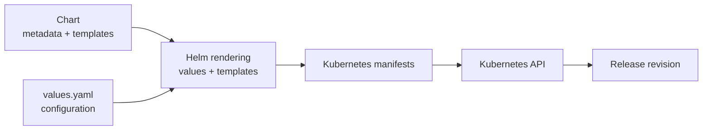
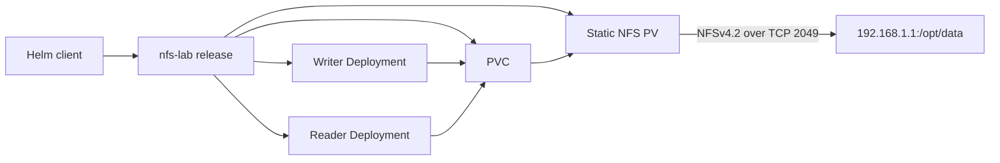



This lab mounts `192.168.1.1:/opt/data`. Confirm that this is the
instructor-provided lab export before proceeding.

- Do not point the chart at a production or personal NFS export.
- Delete only the known files created by this exercise.
- NFS access does not replace authorization, quotas, backups, or server-side
  export controls.
- The advertised PV capacity does not enforce a server-side NFS quota.



## Why Helm

[Helm](https://helm.sh/docs/) is a package manager and templating system for
Kubernetes.

- `Helm chart`:
    - resource templates
    - default configuration
    - package metadata
- Installation of a `chart` creates a versioned `release`.



```yaml
apiVersion: apps/v1
kind: Deployment
metadata:
  name: nginx
spec:
  replicas: 2
  selector:
    matchLabels:
      app: nginx
  template:
    metadata:
      labels:
        app: nginx
    spec:
      containers:
        - name: nginx
          image: nginx:1.27
          ports:
            - containerPort: 80
```





- Directory structure

```bash
nginx-chart/
├── Chart.yaml
├── values.yaml
└── templates/
    └── deployment.yaml
```

- **Chart.yaml**

```yaml
apiVersion: v2
name: nginx-chart
description: A simple nginx Helm chart
type: application
version: 0.1.0
appVersion: "1.27"
```

- **values.yaml**

```yaml
replicaCount: 2

image:
  repository: nginx
  tag: "1.27"

containerPort: 80
```

- **templates/deployment.yaml**

```yaml
apiVersion: apps/v1
kind: Deployment
metadata:
  name: {{ .Release.Name }}-nginx
spec:
  replicas: {{ .Values.replicaCount }}
  selector:
    matchLabels:
      app: {{ .Release.Name }}-nginx
  template:
    metadata:
      labels:
        app: {{ .Release.Name }}-nginx
    spec:
      containers:
        - name: nginx
          image: "{{ .Values.image.repository }}:{{ .Values.image.tag }}"
          ports:
            - containerPort: {{ .Values.containerPort }}
```






Without a packaging layer, teams commonly encounter:

- repeated YAML with only a few values changed;
- inconsistent names and labels across resources;
- manual installation order and incomplete cleanup;
- no concise record of which configuration was deployed;
- difficult upgrades and rollbacks;
- application documentation separated from deployment artifacts.

Helm renders templates into ordinary Kubernetes resources and submits them to the Kubernetes API.







Helm is useful when:

- several resources form one deployable application;
- configuration must vary without copying templates;
- an application needs repeatable install, upgrade, and uninstall operations;
- a vendor distributes supported Kubernetes resources as a chart.

Helm is not a reason to template every field. Excessive conditionals can make
a chart harder to understand than plain YAML. Secrets also should not be
placed in `values.yaml`, command history, or a packaged chart. This lab's NFS
server and export path are ordinary configuration values; credentials for
other storage systems would require a separate secret-management design.





The CNCF's
[ZEISS Vision Care architecture case study](https://architecture.cncf.io/architectures/zeiss/)
documents a production platform supporting more than 200 microservices. Its
delivery pipeline uses a centralized Helm chart stored in Git, generates
environment- and service-specific values files, and deploys each service as a
separate Helm release.

This illustrates why chart design matters professionally:

- a shared chart can standardize labels, probes, security settings, and
  deployment behavior across many teams;
- values separate service configuration from reusable templates;
- independent releases preserve service-level deployment history;
- an error in a widely shared chart can also create a large blast radius.

Platform engineers therefore version, test, review, and roll out shared chart
changes as carefully as application code.



## Charts, Releases, and Values



- **Chart**: a package containing `Chart.yaml`, `values.yaml`, templates, and
  optional dependencies.
- **Release**: one installed instance of a chart in a namespace.
- **Revision**: a numbered release state created by install, upgrade, or
  rollback.
- **Values**: configuration merged with chart defaults before rendering.
- **Template**: a Kubernetes manifest containing Go-template expressions.
- **Repository or OCI registry**: a location from which packaged charts can be
  distributed.

The same chart can be installed more than once:

```text
Chart: nfs-lab
  |
  +-- Release: team-a-storage, namespace: team-a
  +-- Release: team-b-storage, namespace: team-b
```

Release-aware names and labels prevent those installations from accidentally
managing each other's resources.





The chart authored in this lab will have:

```text
nfs-lab/
├── Chart.yaml
├── values.yaml
└── templates/
    ├── _helpers.tpl
    ├── pv.yaml
    ├── pvc.yaml
    ├── writer-deployment.yaml
    └── reader-deployment.yaml
```

`Chart.yaml` describes the package. `values.yaml` provides safe defaults.
Files under `templates/` render into Kubernetes API objects. Files beginning
with `_` define reusable template helpers but do not render as resources.





For an installation, values are assembled from lowest to highest precedence:

```text
chart values.yaml
    < parent chart values, when used as a dependency
    < user-supplied -f file
    < --set or --set-string
```

Prefer a version-controlled values file for substantial configuration.
`--set` is useful for a short experiment, but shell history is not an
appropriate place for passwords, tokens, or client secrets.



## Helm Lifecycle and Safe Inspection



```bash
helm lint ./my-chart
helm template my-release ./my-chart --namespace my-namespace
helm install my-release ./my-chart --namespace my-namespace
helm status my-release --namespace my-namespace
helm upgrade my-release ./my-chart --namespace my-namespace
helm history my-release --namespace my-namespace
helm rollback my-release 1 --namespace my-namespace
helm uninstall my-release --namespace my-namespace
```

The release name and namespace together identify the release. Use the same
namespace flag for status, history, upgrade, rollback, and uninstall.





For a local chart:

```bash
helm lint ./my-chart
helm template my-release ./my-chart \
  --namespace my-namespace --debug
```

For a third-party chart:

```bash
helm show chart <chart-reference>
helm show values <chart-reference>
helm template test-release <chart-reference> \
  --namespace test-namespace
```

Rendering catches template errors and exposes the resources a chart intends to
create. It does not prove that the API server accepts those resources or that
the resulting application works. In a controlled environment, follow it with
server-side validation or an installation in a test cluster.





`helm get values`, release metadata, shell history, CI logs, and rendered
manifests may expose values supplied to a chart. Never pass passwords, tokens,
private keys, or cloud credentials through `--set` or commit them to
`values.yaml`.

The NFS server and export path in this lab are not secrets. If an environment
requires NFS credentials, use the storage provider's supported authentication
mechanism and a dedicated secret-management workflow.



## Architecture and Limitations



This lab uses Kubernetes' static NFS PV support. The NFS server remains outside
Kubernetes; Helm manages the Kubernetes objects that refer to the export.

Important limitations:

- The NFS server and export must already exist.
- Every eligible worker needs network access to TCP 2049 and an NFS mount
  helper.
- `ReadWriteMany` permits multiple mounts but does not guarantee that an
  application safely handles concurrent writes.
- `capacity.storage` is Kubernetes metadata for a static NFS PV; it does not
  create a server-side quota.
- NFS normally needs no PV node affinity when all workers can reach the export.

## Prerequisites

You need:

- permission to create/delete PersistentVolumes and the required namespaced
  resources;
- `kubectl` and Helm 3.12 or newer;
- at least two schedulable worker nodes;
- access to each worker node;
- the NFS client package on every worker;
- access to `192.168.1.1:/opt/data`.

Check the administrative tools:

```bash
kubectl cluster-info
helm version
kubectl get nodes -o wide
```

On Ubuntu workers, install the NFS client if necessary:

```bash
sudo apt-get update
sudo apt-get install -y nfs-common
```

## Validate the NFS Backend



SSH to every worker that may run a lab Pod:

```bash
nc -vz 192.168.1.1 2049
showmount -e 192.168.1.1
```

TCP 2049 must be reachable. `showmount` is useful when the server exposes the
older RPC mount service, but it may not list exports on an NFSv4-only server.
Treat the manual NFSv4.2 mount in the next step as the authoritative test.





On each worker, test the export:

```bash
sudo mkdir -p /mnt/nfs-lab-test
sudo mount -t nfs \
  -o nfsvers=4.2,hard,timeo=600,retrans=2 \
  192.168.1.1:/opt/data /mnt/nfs-lab-test
printf 'manual NFS validation\n' | \
  sudo tee /mnt/nfs-lab-test/manual-validation.txt
sudo cat /mnt/nfs-lab-test/manual-validation.txt
sudo umount /mnt/nfs-lab-test
```

This verifies network reachability, the NFS mount helper, mount options, and
write permission independently of Kubernetes and Helm.





```bash
kubectl create namespace pv-lab \
  --dry-run=client -o yaml | kubectl apply -f -
```

The PV will be cluster-scoped. The PVC and Deployments will belong to
`pv-lab`.





A public
[Kubernetes NFS failure report](https://github.com/kubernetes/kubernetes/issues/90593)
describes an NFS server failure that left Pods stuck and blocked kubelet
operations around broken mounts. The visible symptoms extended beyond storage:
Pod deletion, startup, and node-level reconciliation were affected.

For an SRE or platform engineer, this changes the operational checklist:

- monitor NFS availability and latency, not only PVC status;
- alert on repeated `FailedMount` events and Pods stuck terminating;
- document how to identify stale mounts on affected workers;
- restore backend connectivity before repeatedly restarting workloads;
- test failure behavior during a maintenance window.

A PVC can remain `Bound` while its backend is unavailable. Kubernetes object
state and storage-service health are separate signals.



## Build the NFS Chart

Create the chart directories:

```bash
mkdir -p nfs-lab/templates
```



Create `nfs-lab/Chart.yaml`:

```yaml
apiVersion: v2
name: nfs-lab
description: Helm lab for a static NFS PersistentVolume
type: application
version: 0.1.0
appVersion: "1.0"
```

`version` identifies the chart package. `appVersion` is descriptive metadata;
Helm does not use it to determine release revisions.





Create `nfs-lab/values.yaml`:

```yaml
nfs:
  server: 192.168.1.1
  path: /opt/data

storage:
  capacity: 5Gi
  claimSize: 1Gi
  accessModes:
    - ReadWriteMany
  reclaimPolicy: Retain
  mountOptions:
    - nfsvers=4.2
    - hard
    - timeo=600
    - retrans=2

image:
  repository: busybox
  tag: "1.36"
  pullPolicy: IfNotPresent

writer:
  message: "installed by Helm revision 1"
```

The requested claim size can be smaller than the PV capacity. Neither value
enforces a quota on `/opt/data`.





Create `nfs-lab/templates/_helpers.tpl`:


```liquid
{{- define "nfs-lab.fullname" -}}
{{- .Release.Name | trunc 63 | trimSuffix "-" -}}
{{- end -}}

{{- define "nfs-lab.labels" -}}
app.kubernetes.io/name: {{ .Chart.Name }}
app.kubernetes.io/instance: {{ .Release.Name }}
app.kubernetes.io/managed-by: {{ .Release.Service }}
helm.sh/chart: {{ printf "%s-%s" .Chart.Name .Chart.Version | replace "+" "_" }}
{{- end -}}

{{- define "nfs-lab.selectorLabels" -}}
app.kubernetes.io/name: {{ .Chart.Name }}
app.kubernetes.io/instance: {{ .Release.Name }}
{{- end -}}
```


The release name becomes the base name for the chart's resources. This lab
installs one release in each student's independent FABRIC cluster.





Create `nfs-lab/templates/pv.yaml`:


```liquid
apiVersion: v1
kind: PersistentVolume
metadata:
  name: {{ include "nfs-lab.fullname" . }}
  labels:
    {{- include "nfs-lab.labels" . | nindent 4 }}
spec:
  capacity:
    storage: {{ .Values.storage.capacity }}
  accessModes:
    {{- toYaml .Values.storage.accessModes | nindent 4 }}
  persistentVolumeReclaimPolicy: {{ .Values.storage.reclaimPolicy }}
  storageClassName: ""
  mountOptions:
    {{- toYaml .Values.storage.mountOptions | nindent 4 }}
  nfs:
    server: {{ .Values.nfs.server | quote }}
    path: {{ .Values.nfs.path | quote }}
```


The chart templates the server and export path, but Helm does not create or
configure the NFS server.





Create `nfs-lab/templates/pvc.yaml`:


```liquid
apiVersion: v1
kind: PersistentVolumeClaim
metadata:
  name: {{ include "nfs-lab.fullname" . }}
  labels:
    {{- include "nfs-lab.labels" . | nindent 4 }}
spec:
  accessModes:
    {{- toYaml .Values.storage.accessModes | nindent 4 }}
  storageClassName: ""
  volumeName: {{ include "nfs-lab.fullname" . }}
  resources:
    requests:
      storage: {{ .Values.storage.claimSize }}
```


Empty `storageClassName` values prevent the default StorageClass from
dynamically provisioning unrelated storage. `volumeName` pre-binds this claim
to the release's static PV.





Create `nfs-lab/templates/writer-deployment.yaml`:


```liquid
apiVersion: apps/v1
kind: Deployment
metadata:
  name: {{ include "nfs-lab.fullname" . }}-writer
  labels:
    {{- include "nfs-lab.labels" . | nindent 4 }}
    app.kubernetes.io/component: writer
spec:
  replicas: 1
  selector:
    matchLabels:
      {{- include "nfs-lab.selectorLabels" . | nindent 6 }}
      app.kubernetes.io/component: writer
  template:
    metadata:
      labels:
        {{- include "nfs-lab.selectorLabels" . | nindent 8 }}
        app.kubernetes.io/component: writer
    spec:
      affinity:
        podAntiAffinity:
          requiredDuringSchedulingIgnoredDuringExecution:
            - labelSelector:
                matchLabels:
                  {{- include "nfs-lab.selectorLabels" . | nindent 18 }}
                  app.kubernetes.io/component: reader
              topologyKey: kubernetes.io/hostname
      containers:
        - name: writer
          image: "{{ .Values.image.repository }}:{{ .Values.image.tag }}"
          imagePullPolicy: {{ .Values.image.pullPolicy }}
          command: ["sh", "-c"]
          args:
            - |
              printf '%s\n' "$LAB_MESSAGE" > /data/helm-release.txt
              sleep 3600
          env:
            - name: LAB_MESSAGE
              value: {{ .Values.writer.message | quote }}
          volumeMounts:
            - name: shared-data
              mountPath: /data
      volumes:
        - name: shared-data
          persistentVolumeClaim:
            claimName: {{ include "nfs-lab.fullname" . }}
```


Changing `writer.message` changes the Pod template. A Helm upgrade therefore
triggers a Deployment rollout and writes the new message to NFS.





Create `nfs-lab/templates/reader-deployment.yaml`:


```liquid
apiVersion: apps/v1
kind: Deployment
metadata:
  name: {{ include "nfs-lab.fullname" . }}-reader
  labels:
    {{- include "nfs-lab.labels" . | nindent 4 }}
    app.kubernetes.io/component: reader
spec:
  replicas: 1
  selector:
    matchLabels:
      {{- include "nfs-lab.selectorLabels" . | nindent 6 }}
      app.kubernetes.io/component: reader
  template:
    metadata:
      labels:
        {{- include "nfs-lab.selectorLabels" . | nindent 8 }}
        app.kubernetes.io/component: reader
    spec:
      affinity:
        podAntiAffinity:
          requiredDuringSchedulingIgnoredDuringExecution:
            - labelSelector:
                matchLabels:
                  {{- include "nfs-lab.selectorLabels" . | nindent 18 }}
                  app.kubernetes.io/component: writer
              topologyKey: kubernetes.io/hostname
      containers:
        - name: reader
          image: "{{ .Values.image.repository }}:{{ .Values.image.tag }}"
          imagePullPolicy: {{ .Values.image.pullPolicy }}
          command: ["sh", "-c", "sleep 3600"]
          volumeMounts:
            - name: shared-data
              mountPath: /data
      volumes:
        - name: shared-data
          persistentVolumeClaim:
            claimName: {{ include "nfs-lab.fullname" . }}
```




## Lint, Render, and Install



```bash
helm lint ./nfs-lab
helm template nfs-lab ./nfs-lab \
  --namespace pv-lab \
  --debug > nfs-lab-rendered.yaml
```

Inspect the generated objects and NFS settings:

```bash
grep '^kind:' nfs-lab-rendered.yaml
grep -E 'server:|path:|storageClassName:|volumeName:' \
  nfs-lab-rendered.yaml
```

Rendering verifies template execution but does not contact Kubernetes.





```bash
kubectl -n pv-lab apply --dry-run=server \
  -f nfs-lab-rendered.yaml
```

Server-side dry-run validates API structure but does not prove the NFS export
can be mounted.





```bash
helm install nfs-lab ./nfs-lab \
  --namespace pv-lab \
  --wait \
  --timeout 5m
```

Inspect the release and resources:

```bash
helm list -n pv-lab
helm status nfs-lab -n pv-lab
helm get values nfs-lab -n pv-lab --all
helm get manifest nfs-lab -n pv-lab
kubectl get pv \
  -l app.kubernetes.io/instance=nfs-lab
kubectl -n pv-lab get pvc,deploy,pod -o wide
```

The PV and PVC should be `Bound`, and both Deployments should have one ready
Pod. Confirm that the `NODE` column places the writer and reader on different
workers. Required Pod anti-affinity makes this a cross-node RWX test rather
than merely two mounts on one node.





Create `wait-for-message.sh` to poll the mounted file without assuming that
the Pod is ready immediately:

```bash
cat > wait-for-message.sh <<'EOF'
#!/bin/sh
set -u

EXPECTED=$1
ATTEMPT=1

while [ "$ATTEMPT" -le 36 ]; do
  MOUNTED=$(kubectl -n pv-lab exec deployment/nfs-lab-reader -- \
    cat /data/helm-release.txt 2>/dev/null || true)

  if [ "$MOUNTED" = "$EXPECTED" ]; then
    printf 'reader observed: %s\n' "$EXPECTED"
    exit 0
  fi

  ATTEMPT=$((ATTEMPT + 1))
  sleep 5
done

printf 'timed out waiting for: %s\n' "$EXPECTED" >&2
printf 'mounted value: %s\n' "$MOUNTED" >&2
exit 1
EOF

chmod 700 wait-for-message.sh
./wait-for-message.sh "installed by Helm revision 1"
```

Write from the reader and read from the writer:

```bash
kubectl -n pv-lab exec deployment/nfs-lab-reader -- \
  sh -c 'echo "written by reader" > /data/from-reader.txt'
kubectl -n pv-lab exec deployment/nfs-lab-writer -- \
  cat /data/from-reader.txt
```

On the NFS server, verify the backend directly:

```bash
sudo ls -l /opt/data
sudo cat /opt/data/helm-release.txt
sudo cat /opt/data/from-reader.txt
```



## Upgrade and Roll Back



```bash
helm upgrade nfs-lab ./nfs-lab \
  --namespace pv-lab \
  --set-string writer.message="updated by Helm revision 2" \
  --wait \
  --timeout 5m
```

Inspect the revision and new data:

```bash
helm history nfs-lab -n pv-lab
helm get values nfs-lab -n pv-lab
kubectl -n pv-lab rollout status deployment/nfs-lab-writer --timeout=5m
./wait-for-message.sh "updated by Helm revision 2"
```

Helm changed the Deployment template, Kubernetes rolled out a new Pod, and the
application wrote through the existing PVC.





```bash
helm history nfs-lab -n pv-lab
helm rollback nfs-lab 1 \
  --namespace pv-lab \
  --wait \
  --timeout 5m
kubectl -n pv-lab rollout status deployment/nfs-lab-writer --timeout=5m
./wait-for-message.sh "installed by Helm revision 1"
```

Rollback creates a new release revision containing the earlier Kubernetes
configuration. It does not restore earlier versions of arbitrary NFS files.





The CNCF
[Subaru case study](https://www.cncf.io/case-studies/subaru/)
describes a team that initially ran shell scripts containing Helm commands.
The scripts worked, but deployment procedures and environment differences
were difficult to standardize. Subaru retained its Helm assets while moving
delivery to Argo CD and Helmfile; the resulting GitOps workflow manages 25
application definitions declaratively.

This reflects a common career progression:

```text
manual Helm commands
    -> reviewed charts and values in Git
    -> automated rendering and validation
    -> GitOps reconciliation and audit history
```

The commands in this lab teach the release mechanics. In production, those
same operations are commonly executed by a controlled pipeline or GitOps
controller using reviewed chart versions and environment-specific values.



## Persistence and Release Deletion



Create a sentinel that the writer does not overwrite:

```bash
kubectl -n pv-lab exec deployment/nfs-lab-reader -- \
  sh -c 'date -Iseconds > /data/persistent-sentinel.txt'
```

Restart the writer Deployment:

```bash
kubectl -n pv-lab rollout restart deployment/nfs-lab-writer
kubectl -n pv-lab rollout status deployment/nfs-lab-writer --timeout=5m
kubectl -n pv-lab exec deployment/nfs-lab-reader -- \
  cat /data/persistent-sentinel.txt
```

The replacement Pod mounts the same PVC, so the sentinel remains.





Uninstall the chart-managed resources:

```bash
helm uninstall nfs-lab \
  --namespace pv-lab \
  --cascade foreground \
  --wait \
  --timeout 5m
helm list -n pv-lab
kubectl -n pv-lab get pvc,deploy,pod
kubectl get pv \
  -l app.kubernetes.io/instance=nfs-lab
```

Helm deletes the PV and PVC API objects because both belong to the release.
The NFS files remain in `/opt/data`; Helm manages Kubernetes configuration,
not files on the external server.

Verify from the NFS server:

```bash
sudo cat /opt/data/persistent-sentinel.txt
```

Reinstall and read the same file through a new claim and Pods:

```bash
helm install nfs-lab ./nfs-lab \
  --namespace pv-lab \
  --wait \
  --timeout 5m
kubectl -n pv-lab exec deployment/nfs-lab-reader -- \
  cat /data/persistent-sentinel.txt
```

The chart's writer may replace `helm-release.txt`, but it does not replace the
sentinel.



## Troubleshooting



Inspect release ownership before deleting anything:

```bash
helm list -A
kubectl get pv \
  -l app.kubernetes.io/instance=nfs-lab \
  -o yaml
kubectl -n pv-lab get pvc nfs-lab -o yaml
```

Helm will not adopt an existing resource owned by another release. Do not
manually change ownership metadata unless an administrator has confirmed that
adoption is safe.





Compare the rendered PV and PVC:

```bash
kubectl get pv -o wide
kubectl -n pv-lab describe pvc nfs-lab
helm get manifest nfs-lab -n pv-lab
```

Verify capacity, access modes, `storageClassName: ""`, and `volumeName`. The PV
must not already be bound to another claim.





```bash
kubectl -n pv-lab get pods -o wide
kubectl -n pv-lab describe pod <POD_NAME>
kubectl -n pv-lab get events --sort-by=.lastTimestamp
```

From the Pod's assigned worker, repeat:

```bash
nc -vz 192.168.1.1 2049
showmount -e 192.168.1.1
command -v mount.nfs
```

Common causes are a missing NFS client helper, blocked TCP 2049, an
unexported path, incompatible NFS version, or server-side export permissions.





Inspect ownership from a mounted Pod and on the server:

```bash
kubectl -n pv-lab exec deployment/nfs-lab-reader -- \
  sh -c 'id; ls -ldn /data; touch /data/permission-test'
sudo ls -ldn /opt/data
```

Do not solve permission errors with an unrestricted `chmod 777` on a shared
export. Align workload UID/GID, Pod `fsGroup`, and server export permissions.
Account for NFS root squashing.





```bash
helm status nfs-lab -n pv-lab
helm history nfs-lab -n pv-lab
kubectl -n pv-lab get events --sort-by=.lastTimestamp
```

If an upgrade created a failed revision, select a known-good revision:

```bash
helm rollback nfs-lab <REVISION> \
  --namespace pv-lab \
  --wait \
  --timeout 5m
```

Rollback restores chart-managed Kubernetes configuration. It does not roll
back files on the NFS server.



## Cleanup

Remove the release and namespace:

```bash
helm uninstall nfs-lab \
  --namespace pv-lab \
  --ignore-not-found \
  --cascade foreground \
  --wait \
  --timeout 5m
kubectl delete namespace pv-lab --ignore-not-found
rm -f wait-for-message.sh
```

The NFS backend is intentionally retained. On the NFS server, inspect files
before deleting only the artifacts created by this lab:

```bash
sudo ls -la /opt/data
sudo rm -f \
  /opt/data/helm-release.txt \
  /opt/data/from-reader.txt \
  /opt/data/persistent-sentinel.txt \
  /opt/data/manual-validation.txt \
  /opt/data/permission-test
```

Do not recursively delete `/opt/data`; remove only the known lab files.



This exercise connects Helm package management with storage operations:

- translating a known-good NFS PV/PVC design into reusable chart templates;
- separating configurable server, path, capacity, and mount options;
- generating release-aware names for cluster- and namespace-scoped objects;
- validating rendered manifests before installation;
- performing install, upgrade, rollback, uninstall, and reinstall operations;
- distinguishing Helm release state from persistent application data;
- troubleshooting across Helm, Kubernetes, Linux NFS clients, and the server.

The engineering conclusions are:

- Helm packages Kubernetes configuration; it does not operate the NFS server.
- A successful template render does not prove that a node can mount an export.
- Release rollback does not roll back NFS data.
- RWX mount capability does not guarantee safe concurrent application writes.
- A PVC, a retained PV, and an NFS server are not substitutes for backups.


