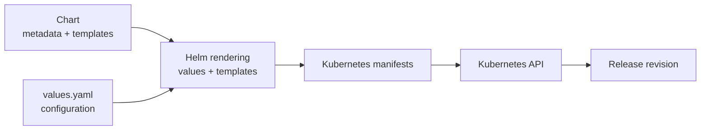



The FABRIC RKE2 notebook already exports `192.168.1.1:/opt/data` from `node1`.
Use that export as it is. This lab only checks that it is reachable.

- Do not install NFS packages or change `/etc/exports`.
- Do not point the chart at a different server or path.
- Delete only the known files created by this exercise.
- NFS access does not replace authorization, quotas, backups, or server-side
  export controls.
- The advertised PV capacity does not enforce a server-side NFS quota.



## Why Helm

[Helm](https://helm.sh/docs/) is a package manager and templating system for
Kubernetes.

- `Helm chart`:
    - resource templates
    - default configuration
    - package metadata
- Installation of a `chart` creates a versioned `release`.



```yaml
apiVersion: apps/v1
kind: Deployment
metadata:
  name: nginx
spec:
  replicas: 2
  selector:
    matchLabels:
      app: nginx
  template:
    metadata:
      labels:
        app: nginx
    spec:
      containers:
        - name: nginx
          image: nginx:1.27
          ports:
            - containerPort: 80
```





- Directory structure

```bash
nginx-chart/
├── Chart.yaml
├── values.yaml
└── templates/
    └── deployment.yaml
```

- **Chart.yaml**

```yaml
apiVersion: v2
name: nginx-chart
description: A simple nginx Helm chart
type: application
version: 0.1.0
appVersion: "1.27"
```

- **values.yaml**

```yaml
replicaCount: 2

image:
  repository: nginx
  tag: "1.27"

containerPort: 80
```

- **templates/deployment.yaml**

```yaml
apiVersion: apps/v1
kind: Deployment
metadata:
  name: {{ .Release.Name }}-nginx
spec:
  replicas: {{ .Values.replicaCount }}
  selector:
    matchLabels:
      app: {{ .Release.Name }}-nginx
  template:
    metadata:
      labels:
        app: {{ .Release.Name }}-nginx
    spec:
      containers:
        - name: nginx
          image: "{{ .Values.image.repository }}:{{ .Values.image.tag }}"
          ports:
            - containerPort: {{ .Values.containerPort }}
```






Without a packaging layer, teams commonly encounter:

- repeated YAML with only a few values changed;
- inconsistent names and labels across resources;
- manual installation order and incomplete cleanup;
- no concise record of which configuration was deployed;
- difficult upgrades and rollbacks;
- application documentation separated from deployment artifacts.

Helm renders templates into ordinary Kubernetes resources and submits them to the Kubernetes API.







Helm is useful when:

- several resources form one deployable application;
- configuration must vary without copying templates;
- an application needs repeatable install, upgrade, and uninstall operations;
- a vendor distributes supported Kubernetes resources as a chart.

Helm is not a reason to template every field. Excessive conditionals can make
a chart harder to understand than plain YAML. Secrets also should not be
placed in `values.yaml`, command history, or a packaged chart. This lab's NFS
server and export path are ordinary configuration values; credentials for
other storage systems would require a separate secret-management design.





The CNCF's
[ZEISS Vision Care architecture case study](https://architecture.cncf.io/architectures/zeiss/)
documents a production platform supporting more than 200 microservices. Its
delivery pipeline uses a centralized Helm chart stored in Git, generates
environment- and service-specific values files, and deploys each service as a
separate Helm release.

This illustrates why chart design matters professionally:

- a shared chart can standardize labels, probes, security settings, and
  deployment behavior across many teams;
- values separate service configuration from reusable templates;
- independent releases preserve service-level deployment history;
- an error in a widely shared chart can also create a large blast radius.

Platform engineers therefore version, test, review, and roll out shared chart
changes as carefully as application code.



## Charts, Releases, and Values



- **Chart**: a package containing `Chart.yaml`, `values.yaml`, templates, and
  optional dependencies.
- **Release**: one installed instance of a chart in a namespace.
- **Revision**: a numbered release state created by install, upgrade, or
  rollback.
- **Values**: configuration merged with chart defaults before rendering.
- **Template**: a Kubernetes manifest containing Go-template expressions.
- **Repository or OCI registry**: a location from which packaged charts can be
  distributed.

The same chart can be installed more than once:

```text
Chart: nfs-lab
  |
  +-- Release: team-a-storage, namespace: team-a
  +-- Release: team-b-storage, namespace: team-b
```

Release-aware names and labels prevent those installations from accidentally
managing each other's resources.





The chart authored in this lab will have:

```text
nfs-lab/
├── Chart.yaml
├── values.yaml
└── templates/
    ├── _helpers.tpl
    ├── pv.yaml
    ├── pvc.yaml
    ├── writer-deployment.yaml
    └── reader-deployment.yaml
```

`Chart.yaml` describes the package. `values.yaml` provides safe defaults.
Files under `templates/` render into Kubernetes API objects. Files beginning
with `_` define reusable template helpers but do not render as resources.





For an installation, values are assembled from lowest to highest precedence:

```text
chart values.yaml
    < parent chart values, when used as a dependency
    < user-supplied -f file
    < --set or --set-string
```

Prefer a version-controlled values file for substantial configuration.
`--set` is useful for a short experiment.



## Prerequisites

Launch the cluster with the FABRIC RKE2 notebook at
`478_examples/rancher_k8s/rke2.ipynb`. That notebook already runs:

- `playbook-prereqs.yml`
- `playbook-nfs.yml`, which exports `192.168.1.1:/opt/data` from `node1` and
  installs NFS clients on the other nodes
- `playbook-rke2.yml`

Use that slice. Do not configure NFS again. The steps below install Helm on
`node1` and confirm the cluster.

You need:

- permission to create and delete PersistentVolumes and the namespaced
  resources in this lab;
- Helm 3.12 or newer on `node1`;
- at least two schedulable worker nodes;
- `kubectl` on `node1`.



Helm is installed with Ansible from the FABRIC Jupyter environment, the same
way the notebook runs the RKE2 and NFS playbooks. The inventory written by the
notebook is `478_examples/playbook/inventory.yml`. Run the playbook only
against `node1`.

From the `fabric-examples` repository root in the Jupyter terminal, create
`478_examples/playbook/playbook-helm.yml`:

```yaml
---
- name: Install Helm on node1
  hosts: node1
  become: true
  tasks:
    - name: Download the Helm 3 install script
      ansible.builtin.get_url:
        url: https://raw.githubusercontent.com/helm/helm/main/scripts/get-helm-3
        dest: /tmp/get-helm-3.sh
        mode: "0755"

    - name: Install Helm
      ansible.builtin.command:
        cmd: /tmp/get-helm-3.sh
      args:
        creates: /usr/local/bin/helm

    - name: Show Helm version
      ansible.builtin.command:
        cmd: helm version
      register: helm_version
      changed_when: false

    - name: Display Helm version
      ansible.builtin.debug:
        var: helm_version.stdout
```

Run it in a cell of your FABRIC Jupyter notebook :

```bash
!ansible-playbook -i ../playbook/inventory.yml ../playbook/playbook-helm.yml
```

{% include figure.liquid path="assets/img/courses/csc478/persistent-volumes/helm-ansible.png" max-width="50%" zoomable=true %}

SSH to `node1` and confirm Helm and the cluster:

```bash
helm version
kubectl cluster-info
kubectl get nodes -o wide
```

{% include figure.liquid path="assets/img/courses/csc478/persistent-volumes/helm-validate.png" max-width="50%" zoomable=true %}

`helm version` should report v3.12 or newer. Stay on `node1` for the rest of
the lab unless a step says to check another node.



## Validate the NFS Backend

The NFS server, the `/opt/data` export, and the NFS clients are already in
place from `playbook-nfs.yml`. Do not install packages, edit exports, or
create a manual mount. Check reachability, then return to `node1`.



SSH into each of the nodes and run the followings:

```bash
showmount -e 192.168.1.1
nc -vz 192.168.1.1 2049
```





```bash
kubectl create namespace pv-lab
```

The PV will be cluster-scoped. The PVC and Deployments will belong to
`pv-lab`.




## Build the NFS Chart

Create the `nfs-lab` chart on `node1` before the Helm commands in the next
section. 

```bash
cd /home/ubuntu
mkdir -p nfs-lab/templates
```



Create `nfs-lab/Chart.yaml`:

```yaml
apiVersion: v2
name: nfs-lab
description: Helm lab for a static NFS PersistentVolume
type: application
version: 0.1.0
appVersion: "1.0"
```

`version` identifies the chart package. `appVersion` is descriptive metadata;
Helm does not use it to determine release revisions.





Create `nfs-lab/values.yaml`:

```yaml
nfs:
  server: 192.168.1.1
  path: /opt/data

storage:
  capacity: 5Gi
  claimSize: 1Gi
  accessModes:
    - ReadWriteMany
  reclaimPolicy: Retain
  mountOptions:
    - nfsvers=4.2
    - hard
    - timeo=600
    - retrans=2

image:
  repository: busybox
  tag: "1.36"
  pullPolicy: IfNotPresent

writer:
  message: "installed by Helm revision 1"
```

The requested claim size can be smaller than the PV capacity. Neither value
enforces a quota on `/opt/data`.





Create `nfs-lab/templates/_helpers.tpl`:


```liquid
{{- define "nfs-lab.fullname" -}}
{{- .Release.Name | trunc 63 | trimSuffix "-" -}}
{{- end -}}

{{- define "nfs-lab.labels" -}}
app.kubernetes.io/name: {{ .Chart.Name }}
app.kubernetes.io/instance: {{ .Release.Name }}
app.kubernetes.io/managed-by: {{ .Release.Service }}
helm.sh/chart: {{ printf "%s-%s" .Chart.Name .Chart.Version | replace "+" "_" }}
{{- end -}}

{{- define "nfs-lab.selectorLabels" -}}
app.kubernetes.io/name: {{ .Chart.Name }}
app.kubernetes.io/instance: {{ .Release.Name }}
{{- end -}}
```


The release name becomes the base name for the chart's resources. 





Create `nfs-lab/templates/pv.yaml`:


```liquid
apiVersion: v1
kind: PersistentVolume
metadata:
  name: {{ include "nfs-lab.fullname" . }}
  labels:
    {{- include "nfs-lab.labels" . | nindent 4 }}
spec:
  capacity:
    storage: {{ .Values.storage.capacity }}
  accessModes:
    {{- toYaml .Values.storage.accessModes | nindent 4 }}
  persistentVolumeReclaimPolicy: {{ .Values.storage.reclaimPolicy }}
  storageClassName: ""
  mountOptions:
    {{- toYaml .Values.storage.mountOptions | nindent 4 }}
  nfs:
    server: {{ .Values.nfs.server | quote }}
    path: {{ .Values.nfs.path | quote }}
```


The chart templates the server and export path, but Helm does not create or
configure the NFS server.





Create `nfs-lab/templates/pvc.yaml`:


```liquid
apiVersion: v1
kind: PersistentVolumeClaim
metadata:
  name: {{ include "nfs-lab.fullname" . }}
  labels:
    {{- include "nfs-lab.labels" . | nindent 4 }}
spec:
  accessModes:
    {{- toYaml .Values.storage.accessModes | nindent 4 }}
  storageClassName: ""
  volumeName: {{ include "nfs-lab.fullname" . }}
  resources:
    requests:
      storage: {{ .Values.storage.claimSize }}
```


Empty `storageClassName` values prevent the default StorageClass from
dynamically provisioning unrelated storage. `volumeName` pre-binds this claim
to the release's static PV.





Create `nfs-lab/templates/writer-deployment.yaml`:


```liquid
apiVersion: apps/v1
kind: Deployment
metadata:
  name: {{ include "nfs-lab.fullname" . }}-writer
  labels:
    {{- include "nfs-lab.labels" . | nindent 4 }}
    app.kubernetes.io/component: writer
spec:
  replicas: 1
  selector:
    matchLabels:
      {{- include "nfs-lab.selectorLabels" . | nindent 6 }}
      app.kubernetes.io/component: writer
  template:
    metadata:
      labels:
        {{- include "nfs-lab.selectorLabels" . | nindent 8 }}
        app.kubernetes.io/component: writer
    spec:
      affinity:
        podAntiAffinity:
          requiredDuringSchedulingIgnoredDuringExecution:
            - labelSelector:
                matchLabels:
                  {{- include "nfs-lab.selectorLabels" . | nindent 18 }}
                  app.kubernetes.io/component: reader
              topologyKey: kubernetes.io/hostname
      containers:
        - name: writer
          image: "{{ .Values.image.repository }}:{{ .Values.image.tag }}"
          imagePullPolicy: {{ .Values.image.pullPolicy }}
          command: ["sh", "-c"]
          args:
            - |
              printf '%s\n' "$LAB_MESSAGE" > /data/helm-release.txt
              sleep 3600
          env:
            - name: LAB_MESSAGE
              value: {{ .Values.writer.message | quote }}
          volumeMounts:
            - name: shared-data
              mountPath: /data
      volumes:
        - name: shared-data
          persistentVolumeClaim:
            claimName: {{ include "nfs-lab.fullname" . }}
```


Changing `writer.message` changes the Pod template. A Helm upgrade therefore
triggers a Deployment rollout and writes the new message to NFS.





Create `nfs-lab/templates/reader-deployment.yaml`:


```liquid
apiVersion: apps/v1
kind: Deployment
metadata:
  name: {{ include "nfs-lab.fullname" . }}-reader
  labels:
    {{- include "nfs-lab.labels" . | nindent 4 }}
    app.kubernetes.io/component: reader
spec:
  replicas: 1
  selector:
    matchLabels:
      {{- include "nfs-lab.selectorLabels" . | nindent 6 }}
      app.kubernetes.io/component: reader
  template:
    metadata:
      labels:
        {{- include "nfs-lab.selectorLabels" . | nindent 8 }}
        app.kubernetes.io/component: reader
    spec:
      affinity:
        podAntiAffinity:
          requiredDuringSchedulingIgnoredDuringExecution:
            - labelSelector:
                matchLabels:
                  {{- include "nfs-lab.selectorLabels" . | nindent 18 }}
                  app.kubernetes.io/component: writer
              topologyKey: kubernetes.io/hostname
      containers:
        - name: reader
          image: "{{ .Values.image.repository }}:{{ .Values.image.tag }}"
          imagePullPolicy: {{ .Values.image.pullPolicy }}
          command: ["sh", "-c", "sleep 3600"]
          volumeMounts:
            - name: shared-data
              mountPath: /data
      volumes:
        - name: shared-data
          persistentVolumeClaim:
            claimName: {{ include "nfs-lab.fullname" . }}
```




## Helm Lifecycle and Safe Inspection



These commands use the `nfs-lab` chart created on `node1` in **Build the NFS
Chart**. The release name is `nfs-lab` and the namespace is `pv-lab`. From
`/home/ubuntu`, `./nfs-lab` is that directory. **Lint, Render, and Install**
carries out this sequence.

```bash
helm lint ./nfs-lab
helm template nfs-lab ./nfs-lab --namespace pv-lab
helm install nfs-lab ./nfs-lab --namespace pv-lab
helm status nfs-lab --namespace pv-lab
helm upgrade nfs-lab ./nfs-lab --namespace pv-lab
helm history nfs-lab --namespace pv-lab
helm rollback nfs-lab 1 --namespace pv-lab
helm uninstall nfs-lab --namespace pv-lab
```


{% include figure.liquid path="assets/img/courses/csc478/persistent-volumes/helm-inspection.png" max-width="50%" zoomable=true %}

The release name and namespace together identify the release. Use the same
namespace flag for status, history, upgrade, rollback, and uninstall.





For the local `nfs-lab` chart:

```bash
helm lint ./nfs-lab
helm template nfs-lab ./nfs-lab --namespace pv-lab --debug
```

Rendering catches template errors and exposes the resources a chart intends to
create. It does not prove that the API server accepts those resources or that
the resulting application works. In a controlled environment, follow it with
server-side validation or an installation in a test cluster.





`helm get values`, release metadata, shell history, CI logs, and rendered
manifests may expose values supplied to a chart. Never pass passwords, tokens,
private keys, or cloud credentials through `--set` or commit them to
`values.yaml`.

The NFS server and export path in this lab are not secrets. If an environment
requires NFS credentials, use the storage provider's supported authentication
mechanism and a dedicated secret-management workflow.



## Lint, Render, and Install



From `/home/ubuntu` on `node1`:

```bash
cd /home/ubuntu
helm lint ./nfs-lab
helm template nfs-lab ./nfs-lab --namespace pv-lab --debug > nfs-lab-rendered.yaml
```

Rendering verifies template execution but does not contact Kubernetes.





```bash
kubectl -n pv-lab apply --dry-run=server -f nfs-lab-rendered.yaml
```


{% include figure.liquid path="assets/img/courses/csc478/persistent-volumes/helm-render.png" max-width="50%" zoomable=true %}

Server-side dry-run validates API structure but does not prove the NFS export
can be mounted.





```bash
helm install nfs-lab ./nfs-lab --namespace pv-lab --wait --timeout 5m
```

{% include figure.liquid path="assets/img/courses/csc478/persistent-volumes/helm-install.png" max-width="50%" zoomable=true %}

Inspect the release and resources:

```bash
helm list -n pv-lab
helm status nfs-lab -n pv-lab
helm get values nfs-lab -n pv-lab --all
helm get manifest nfs-lab -n pv-lab
kubectl get pv -l app.kubernetes.io/instance=nfs-lab
kubectl -n pv-lab get pvc,deploy,pod -o wide
```

The PV and PVC should be `Bound`, and both Deployments should have one ready
Pod. Confirm that the `NODE` column places the writer and reader on different
workers. Required Pod anti-affinity makes this a cross-node RWX test rather
than merely two mounts on one node.





Create `wait-for-message.sh` to poll the mounted file without assuming that
the Pod is ready immediately:

```bash
cat > wait-for-message.sh <<'EOF'
#!/bin/sh
set -u

EXPECTED=$1
ATTEMPT=1

while [ "$ATTEMPT" -le 36 ]; do
  MOUNTED=$(kubectl -n pv-lab exec deployment/nfs-lab-reader -- \
    cat /data/helm-release.txt 2>/dev/null || true)

  if [ "$MOUNTED" = "$EXPECTED" ]; then
    printf 'reader observed: %s\n' "$EXPECTED"
    exit 0
  fi

  ATTEMPT=$((ATTEMPT + 1))
  sleep 5
done

printf 'timed out waiting for: %s\n' "$EXPECTED" >&2
printf 'mounted value: %s\n' "$MOUNTED" >&2
exit 1
EOF

chmod 700 wait-for-message.sh
./wait-for-message.sh "installed by Helm revision 1"
```

Write from the reader and read from the writer:

```bash
kubectl -n pv-lab exec deployment/nfs-lab-reader -- sh -c 'echo "written by reader" > /data/from-reader.txt'
kubectl -n pv-lab exec deployment/nfs-lab-writer -- cat /data/from-reader.txt
```

On the NFS server, verify the backend directly:

```bash
sudo ls -l /opt/data
sudo cat /opt/data/helm-release.txt
sudo cat /opt/data/from-reader.txt
```



## Upgrade and Roll Back



```bash
helm upgrade nfs-lab ./nfs-lab \
  --namespace pv-lab \
  --set-string writer.message="updated by Helm revision 2" \
  --wait \
  --timeout 5m
```

Inspect the revision and new data:

```bash
helm history nfs-lab -n pv-lab
helm get values nfs-lab -n pv-lab
kubectl -n pv-lab rollout status deployment/nfs-lab-writer --timeout=5m
./wait-for-message.sh "updated by Helm revision 2"
```

Helm changed the Deployment template, Kubernetes rolled out a new Pod, and the
application wrote through the existing PVC.





```bash
helm history nfs-lab -n pv-lab
helm rollback nfs-lab 1 \
  --namespace pv-lab \
  --wait \
  --timeout 5m
kubectl -n pv-lab rollout status deployment/nfs-lab-writer --timeout=5m
./wait-for-message.sh "installed by Helm revision 1"
```

Rollback creates a new release revision containing the earlier Kubernetes
configuration. It does not restore earlier versions of arbitrary NFS files.





The CNCF
[Subaru case study](https://www.cncf.io/case-studies/subaru/)
describes a team that initially ran shell scripts containing Helm commands.
The scripts worked, but deployment procedures and environment differences
were difficult to standardize. Subaru retained its Helm assets while moving
delivery to Argo CD and Helmfile; the resulting GitOps workflow manages 25
application definitions declaratively.



## Persistence and Release Deletion



Create a sentinel that the writer does not overwrite:

```bash
kubectl -n pv-lab exec deployment/nfs-lab-reader -- sh -c 'date -Iseconds > /data/persistent-sentinel.txt'
```

Restart the writer Deployment:

```bash
kubectl -n pv-lab rollout restart deployment/nfs-lab-writer
kubectl -n pv-lab rollout status deployment/nfs-lab-writer --timeout=5m
kubectl -n pv-lab exec deployment/nfs-lab-reader -- cat /data/persistent-sentinel.txt
```

The replacement Pod mounts the same PVC, so the sentinel remains.





Uninstall the chart-managed resources:

```bash
helm uninstall nfs-lab \
  --namespace pv-lab \
  --cascade foreground \
  --wait \
  --timeout 5m
helm list -n pv-lab
kubectl -n pv-lab get pvc,deploy,pod
kubectl get pv \
  -l app.kubernetes.io/instance=nfs-lab
```

Helm deletes the PV and PVC API objects because both belong to the release.
The NFS files remain in `/opt/data`; Helm manages Kubernetes configuration,
not files on the external server.

Verify from the NFS server:

```bash
sudo cat /opt/data/persistent-sentinel.txt
```

Reinstall and read the same file through a new claim and Pods:

```bash
helm install nfs-lab ./nfs-lab \
  --namespace pv-lab \
  --wait \
  --timeout 5m
kubectl -n pv-lab exec deployment/nfs-lab-reader -- \
  cat /data/persistent-sentinel.txt
```

The chart's writer may replace `helm-release.txt`, but it does not replace the
sentinel.


