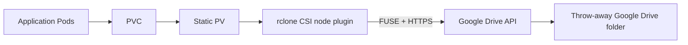

# Kubernetes PV/PVC Lab with Google Drive

This lab exposes a folder in a throw-away Google Drive account as a Kubernetes
PersistentVolume (PV). A PersistentVolumeClaim (PVC) binds to that PV, and
multiple Pods mount the claim.

Google Drive is not a native Kubernetes or POSIX filesystem. The lab uses the
third-party
[Veloxpack rclone CSI driver](https://github.com/veloxpack/csi-driver-rclone),
which translates filesystem operations into Google Drive API calls.



The OAuth refresh token grants access to files authorized for this lab. A
Kubernetes Secret is only base64-encoded unless the cluster is configured to
encrypt Secrets at rest.

- Do not use a personal, school, or employer Google account.
- Do not place the OAuth client secret, token, `rclone.conf`, or Kubernetes
  Secret in Git.
- Delete the Kubernetes Secret and revoke Google access after the lab.
- Do not use this design for databases, confidential data, or production
  workloads.



## Architecture and Limitations



The PV's advertised capacity is metadata; Google Drive quota controls the
actual available capacity. Google Drive also does not provide normal POSIX
ownership, permissions, locking, atomic rename, or consistency guarantees.
`ReadWriteMany` means that Kubernetes permits multiple mounts; it does not make
concurrent writes to the same file safe.

This lab is useful for learning PV/PVC and CSI concepts, but NFS, block
storage, or a distributed filesystem is a better backend for ordinary
Kubernetes application storage.

## Prerequisites

You need:

- a throw-away Gmail account with no valuable files;
- cluster-admin access;
- `kubectl`, Helm 3, and `rclone` on an administrative workstation;
- Linux worker nodes with FUSE support;
- outbound HTTPS access from every worker node to Google APIs;
- access from the cluster to `ghcr.io` to pull the CSI driver images.



The rclone CSI node plugin must continuously reach Google OAuth and Drive API
endpoints. Test from every worker node:

```bash
curl -I https://oauth2.googleapis.com
curl -I https://www.googleapis.com
```

An HTTP error response still proves network connectivity. DNS, timeout, or TLS
errors must be fixed before this lab can work.



Check FUSE on every worker node:

```bash
sudo modprobe fuse
ls -l /dev/fuse
```

If `/dev/fuse` is missing on Ubuntu:

```bash
sudo apt-get update
sudo apt-get install -y fuse3
sudo modprobe fuse
```

Check the administrative tools:

```bash
kubectl cluster-info
helm version
rclone version
```

If `rclone` is not installed on Ubuntu:

```bash
sudo apt-get update
sudo apt-get install -y rclone
```

Use a current rclone release because Google's OAuth requirements and the Drive
backend change over time.

## Google Drive API and OAuth Setup

Google Drive access uses an OAuth client ID, client secret, and user token. An
API key alone is not sufficient.

1. Sign in to the
   [Google Cloud Console](https://console.cloud.google.com/) with the throw-away
   Gmail account.
2. Create a project named `kubernetes-gdrive-lab`.
3. Open **APIs & Services -> Library**, find **Google Drive API**, and select
   **Enable**.
4. Open **Google Auth Platform**. Depending on the current console interface,
   these settings may appear under **OAuth consent screen**.
5. Under **Branding**, enter an application name such as `rclone-pv-lab`, a
   support email, and a developer contact email.
6. Under **Audience**, choose **External**, keep the app in **Testing**, and add
   the throw-away Gmail address as a test user.
7. Under **Data Access**, add the
   `https://www.googleapis.com/auth/drive.file` scope. This limits the
   application to files it creates or opens rather than granting access to all
   Drive files.
8. Open **Clients** or **APIs & Services -> Credentials**, select
   **Create client -> OAuth client ID**, and choose **Desktop app**.
9. Name it `rclone-desktop` and create it.
10. Copy the client ID and client secret to a temporary password manager entry.
    Do not create an API key or service-account key for this lab.

An External application left in Testing may issue refresh tokens that expire
after seven days. That is acceptable for this short-lived lab; repeat the
authorization if the token expires.

## Generate the rclone Configuration

Run the interactive configuration on a trusted workstation:

```bash
rclone config
```

Use these answers. Prompt wording and menu numbers can vary by rclone version:

1. Create a new remote named `gdrive`.
2. Select **Google Drive** as the storage backend.
3. Enter the OAuth client ID and client secret created above.
4. Select the `drive.file` scope.
5. Leave the root folder ID blank.
6. Leave the service-account credentials file blank.
7. Decline advanced configuration.
8. Authorize rclone in a browser using the throw-away Gmail account.
9. If Google displays an unverified-app warning, continue only after confirming
   that the page names the OAuth project you created.
10. Select **My Drive**, not a Shared Drive.
11. Save the remote.

If the workstation has no browser, answer **No** when rclone asks to open one.
Follow its instructions to run `rclone authorize` on a separate machine with a
browser, then paste the resulting token into the original session.

Verify the remote and create a dedicated folder:

```bash
rclone lsd gdrive:
rclone mkdir gdrive:pv-lab
rclone lsf gdrive:pv-lab
rclone config file
```

The final command prints the location of `rclone.conf`. The file contains the
OAuth client secret and refresh token; do not display or commit it.

## Install the rclone CSI Driver



An instructor or cluster administrator should install the CSI driver once.
Students sharing a cluster should not install separate copies.



Install the driver using its official OCI Helm chart:

```bash
helm upgrade --install csi-rclone \
  oci://ghcr.io/veloxpack/charts/csi-driver-rclone \
  --namespace veloxpack \
  --create-namespace \
  --wait \
  --timeout 5m
```

Verify the driver:

```bash
helm list -n veloxpack
kubectl get pods -n veloxpack \
  -l app.kubernetes.io/name=csi-driver-rclone -o wide
kubectl get csidriver rclone.csi.veloxpack.io
```

The node component should run on every worker that may host a lab Pod.

## Create the Namespace and Secret

Create the namespace:

```bash
kubectl create namespace pv-lab \
  --dry-run=client -o yaml | kubectl apply -f -
```

Set `RCLONE_CONFIG` to the path printed by `rclone config file`, then create the
Secret directly from that file:

```bash
RCLONE_CONFIG="$HOME/.config/rclone/rclone.conf"

kubectl -n pv-lab create secret generic gdrive-rclone \
  --from-file=configData="$RCLONE_CONFIG" \
  --from-literal=remote=gdrive \
  --from-literal=remotePath=pv-lab \
  --dry-run=client -o yaml | kubectl apply -f -
```

Confirm only that the expected keys exist. Do not print or decode their values:

```bash
kubectl -n pv-lab describe secret gdrive-rclone
```

## PersistentVolume and Claim

Create `gdrive-pv-pvc.yaml`:

```yaml
apiVersion: v1
kind: PersistentVolume
metadata:
  name: pv-google-drive
spec:
  capacity:
    storage: 1Gi
  accessModes:
    - ReadWriteMany
  persistentVolumeReclaimPolicy: Retain
  storageClassName: ""
  mountOptions:
    - vfs-cache-mode=writes
    - vfs-write-back=2s
    - dir-cache-time=10s
  csi:
    driver: rclone.csi.veloxpack.io
    volumeHandle: pv-lab-google-drive
    nodePublishSecretRef:
      name: gdrive-rclone
      namespace: pv-lab
    volumeAttributes:
      remote: gdrive
      remotePath: pv-lab
---
apiVersion: v1
kind: PersistentVolumeClaim
metadata:
  name: gdrive-pvc
  namespace: pv-lab
spec:
  accessModes:
    - ReadWriteMany
  storageClassName: ""
  volumeName: pv-google-drive
  resources:
    requests:
      storage: 1Gi
```

The empty `storageClassName` values keep this example statically bound to the
PV instead of asking a default provisioner to create storage.

Apply and inspect:

```bash
kubectl apply --dry-run=server -f gdrive-pv-pvc.yaml
kubectl apply -f gdrive-pv-pvc.yaml
kubectl get pv pv-google-drive
kubectl -n pv-lab get pvc gdrive-pvc
```

Continue when both resources report `Bound`.

## Mount and Test the Volume

Create `gdrive-pods.yaml`:

```yaml
apiVersion: v1
kind: Pod
metadata:
  name: gdrive-writer
  namespace: pv-lab
spec:
  containers:
    - name: shell
      image: busybox:1.36
      command: ["sh", "-c", "sleep 3600"]
      volumeMounts:
        - name: drive
          mountPath: /drive
  volumes:
    - name: drive
      persistentVolumeClaim:
        claimName: gdrive-pvc
---
apiVersion: v1
kind: Pod
metadata:
  name: gdrive-reader
  namespace: pv-lab
spec:
  containers:
    - name: shell
      image: busybox:1.36
      command: ["sh", "-c", "sleep 3600"]
      volumeMounts:
        - name: drive
          mountPath: /drive
  volumes:
    - name: drive
      persistentVolumeClaim:
        claimName: gdrive-pvc
```

Apply the Pods and wait for both mounts:

```bash
kubectl apply -f gdrive-pods.yaml
kubectl -n pv-lab wait --for=condition=Ready \
  pod/gdrive-writer pod/gdrive-reader --timeout=180s
kubectl -n pv-lab get pods -o wide
```

Write from one Pod:

```bash
kubectl -n pv-lab exec gdrive-writer -- sh -c \
  'date -Iseconds > /drive/from-writer.txt'
```

Allow time for VFS upload and directory-cache refresh, then read from the other
Pod:

```bash
sleep 15
kubectl -n pv-lab exec gdrive-reader -- \
  cat /drive/from-writer.txt
```

Write in the opposite direction:

```bash
kubectl -n pv-lab exec gdrive-reader -- sh -c \
  'echo "hello from the reader pod" > /drive/from-reader.txt'
sleep 15
kubectl -n pv-lab exec gdrive-writer -- ls -l /drive
rclone lsf gdrive:pv-lab
```

The two files should also appear in the `pv-lab` folder in the Google Drive web
interface. Delays are expected because each mount has a VFS cache and Google
Drive is remotely accessed through an API.

## Pod Replacement and Reclaim Behavior

Delete and recreate the writer Pod:

```bash
kubectl -n pv-lab delete pod gdrive-writer
kubectl apply -f gdrive-pods.yaml
kubectl -n pv-lab wait --for=condition=Ready \
  pod/gdrive-writer --timeout=180s
kubectl -n pv-lab exec gdrive-writer -- \
  cat /drive/from-writer.txt
```

The file survives because it resides in Google Drive, not in the deleted Pod.

To observe reclaim behavior, first remove both Pods and then delete the claim:

```bash
kubectl -n pv-lab delete pod gdrive-writer gdrive-reader
kubectl -n pv-lab delete pvc gdrive-pvc
kubectl get pv pv-google-drive
rclone lsf gdrive:pv-lab
```

The static PV enters `Released`, while `Retain` leaves the Google Drive files
unchanged. Deleting a Kubernetes PV object also does not delete this Drive
folder.

## Troubleshooting



Inspect the Pod and recent events:

```bash
kubectl -n pv-lab describe pod <pod-name>
kubectl -n pv-lab get events --sort-by=.lastTimestamp
```

Then inspect the CSI driver:

```bash
kubectl get pods -n veloxpack -o wide
kubectl logs -n veloxpack \
  -l app.kubernetes.io/name=csi-driver-rclone \
  --all-containers --tail=100
```

Common causes are missing `/dev/fuse`, blocked outbound HTTPS, an unavailable
driver Pod on the selected node, or invalid OAuth credentials.





Reconnect the local rclone remote:

```bash
rclone config reconnect gdrive:
rclone lsf gdrive:pv-lab
```

Recreate the Secret from the updated configuration:

```bash
kubectl -n pv-lab create secret generic gdrive-rclone \
  --from-file=configData="$RCLONE_CONFIG" \
  --from-literal=remote=gdrive \
  --from-literal=remotePath=pv-lab \
  --dry-run=client -o yaml | kubectl apply -f -
```

Delete and recreate the lab Pods so the volume is mounted with the new token.





Wait at least the configured `dir-cache-time`, close the writing process's file
descriptor, and check the backend directly:

```bash
rclone lsf gdrive:pv-lab
```

Google Drive and independent VFS mounts are not strongly consistent. This is
one reason the backend is unsuitable for databases and lock-sensitive
applications.



## Cleanup and Credential Revocation

Delete the Kubernetes workload and credentials:

```bash
kubectl -n pv-lab delete pod \
  gdrive-writer gdrive-reader --ignore-not-found
kubectl -n pv-lab delete pvc gdrive-pvc --ignore-not-found
kubectl delete pv pv-google-drive --ignore-not-found
kubectl -n pv-lab delete secret gdrive-rclone --ignore-not-found
kubectl delete namespace pv-lab --ignore-not-found
```

Delete the remote folder only after confirming that it contains no needed
data:

```bash
rclone delete gdrive:pv-lab
rclone rmdir gdrive:pv-lab
```

Finally:

1. Remove the `gdrive` remote with `rclone config`.
2. Delete the local `rclone.conf` if it contains no other remotes.
3. In the Google account's security settings, revoke the lab application's
   access.
4. Delete the OAuth client or the entire Google Cloud project.
5. Delete the throw-away Gmail account if it is no longer needed.

Do not uninstall the cluster-wide CSI driver if other students are using it.
An administrator may remove a dedicated installation with:

```bash
helm uninstall csi-rclone -n veloxpack
kubectl delete namespace veloxpack
```



This exercise shows more than writing a PV manifest:

- installing and validating a third-party CSI driver;
- using OAuth credentials without embedding them in a PV;
- distinguishing Kubernetes-declared capacity from backend-enforced quota;
- testing multi-Pod access, Pod replacement, and reclaim behavior;
- diagnosing failures across Kubernetes, FUSE, networking, OAuth, and a remote
  storage API.

The main engineering conclusion is also important: making an API-backed object
store look like a filesystem does not give it POSIX filesystem semantics.
Backend behavior must match the application's consistency, locking,
performance, durability, and security requirements.


