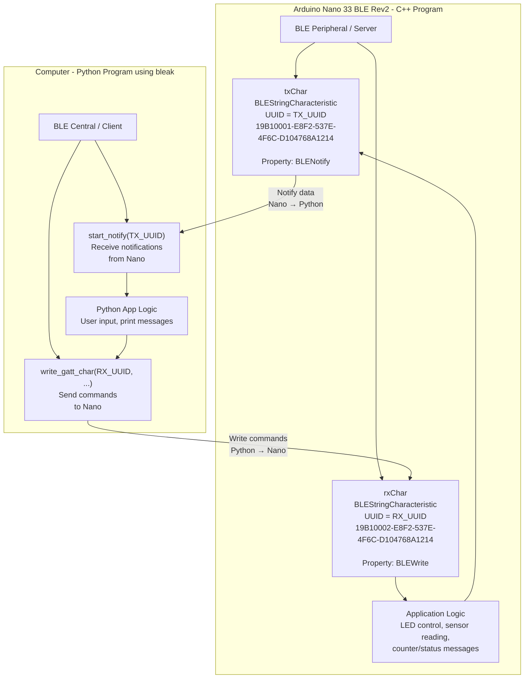

- The `Nano33BLE` device for this class supports [Bluetooth Low Energy](https://www.bluetooth.com/learn-about-bluetooth/tech-overview/)
    - Support IoT, weatables, and sensors
    - Remain in sleep state and send short data burst (150 and 500 Kb/s rates)

- Update the `tinyml` conda environment

```bash
# cd into your tinyml folder
git pull
conda activate tinyml
conda env update -f environment.yml
```

- Create a new PlatformIO project called `Light_Control`. 
    - Copy `led_controller.cpp` into `src/`
    - Copy `led_controller.h` into `include/`

- Create `main.cpp` in `src/` with the following contents:
    - [Arduino BLE API](https://github.com/arduino-libraries/ArduinoBLE/blob/master/docs/api.md)


```cpp
#include <Arduino.h>
#include <ArduinoBLE.h>

#include "led_controller.h"

BLEService tinymlService("19B10000-E8F2-537E-4F6C-D104768A1214");
BLEStringCharacteristic txChar(
  "19B10001-E8F2-537E-4F6C-D104768A1214",
  BLENotify,
  40
);

BLEStringCharacteristic rxChar(
  "19B10002-E8F2-537E-4F6C-D104768A1214",
  BLEWrite,
  40
);

unsigned long lastSend = 0;
int counter = 0;

void setup() {
  Serial.begin(9600);
  if (!BLE.begin()) {
    Serial.println("BLE failed to start.");
    while (1);
  }

  beginLED();
  setoff();

  BLE.setLocalName("TinyML-Nano33");
  BLE.setAdvertisedService(tinymlService);

  tinymlService.addCharacteristic(txChar);
  tinymlService.addCharacteristic(rxChar);
  BLE.addService(tinymlService);

  txChar.writeValue("ready");

  BLE.advertise();
  Serial.println("BLE advertising as TinyML-Nano33");
}

void loop() {
  BLEDevice central = BLE.central();

  if (central) {
    Serial.print("Connected to: ");
    Serial.println(central.address());

    while (central.connected()) {
      if (rxChar.written()) {
        String cmd = rxChar.value();

        Serial.print("Received: ");
        Serial.println(cmd);

        if (cmd == "red") {
          setred();
        } else if (cmd == "green") {
          setgreen();
        } else if (cmd == "yellow") {
          setyellow();
        } else if (cmd == "off") {
          setoff();
        }
      }

      if (millis() - lastSend > 1000) {
        lastSend = millis();
        String msg = "count=" + String(counter++);
        txChar.writeValue(msg);
        Serial.println(msg);
      }
      BLE.poll();
    }

    Serial.println("Disconnected.");
  }
}
```


- From the main `tinymyl` directory, create `light_control.py` in `python/programs/light_control` with the following contents:



```python
import asyncio
from bleak import BleakScanner, BleakClient

DEVICE_NAME = "TinyML-Nano33"
TX_UUID = "19B10001-E8F2-537E-4F6C-D104768A1214"  # Nano -> computer
RX_UUID = "19B10002-E8F2-537E-4F6C-D104768A1214"  # computer -> Nano

def handle_notification(sender, data):
    print("Nano:", data.decode(errors="ignore"))

async def main():
    print("Scanning for BLE devices...")
    devices = await BleakScanner.discover(timeout=5.0)
    target = None
    for d in devices:
        print(d.name, d.address)
        if d.name == DEVICE_NAME:
            target = d
            break
    if target is None:
        print("Could not find TinyML-Nano33.")
        return

    print(f"Connecting to {target.name}...")
    async with BleakClient(target.address) as client:
        print("Connected.")
        await client.start_notify(TX_UUID, handle_notification)
        print("Sending commands. Try: red, green, blue, off, quit")

        while True:
            cmd = input("> ").strip()
            if cmd == "quit":
                break
            await client.write_gatt_char(RX_UUID, cmd.encode())
        await client.stop_notify(TX_UUID)

asyncio.run(main())
```

 
Below is the diagram of how these two programs are connected: 



