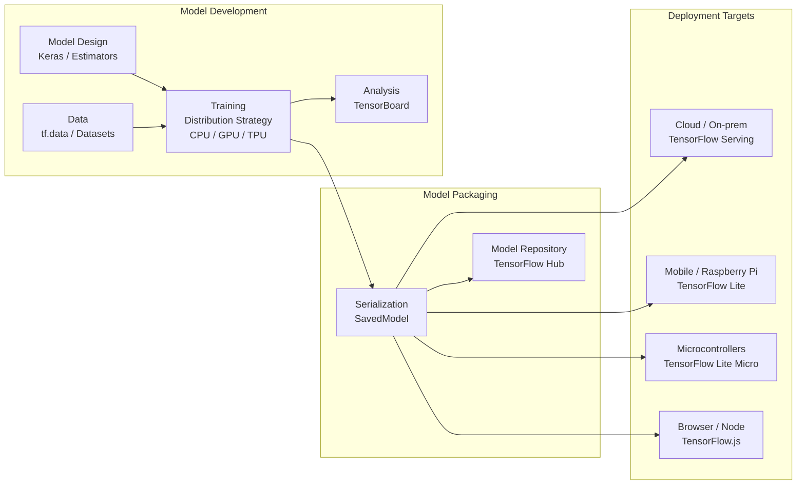
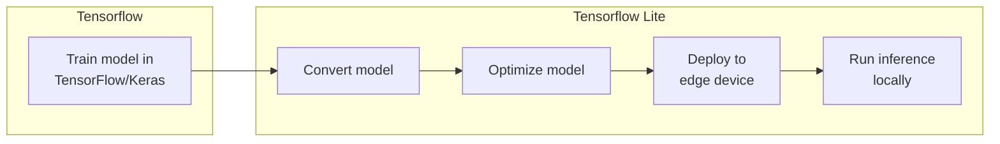

## Overview

This lecture introduces **TensorFlow Lite** as the deployment-oriented part of the TensorFlow ecosystem. The central idea is that training a model and deploying a model are different engineering problems. TensorFlow is commonly used to build, train, and evaluate models on development machines or servers. TensorFlow Lite is used to run trained models efficiently on edge devices such as phones, Raspberry Pi boards, and embedded devices.



- Machine learning models are often trained on powerful computers, but applications happen on edge devices, for example:
    - detecting a gesture from an accelerometer,
    - recognizing a wake word from a microphone,
    - classifying a small image from a camera,
    - monitoring vibration from a motor,
    - detecting anomalies in sensor readings,
    - responding locally when network access is unavailable.
- This is called **edge inference**: running the trained model close to where the data is produced.
- Edge inference can reduce latency, reduce bandwidth usage, improve privacy, and allow devices to keep working when disconnected. 
    - Hardware constraints: limited RAM, flash storage, compute power, and battery life.





The larger Tensorflow ecosystem contains tools for several stages of the machine learning lifecycle:

| Stage | Example TensorFlow tools | Purpose |
|---|---|---|
| Data input | `tf.data`, datasets | Load, preprocess, batch, and feed data |
| Model design | Keras, Estimators | Define neural network architecture |
| Training | Distribution strategies, CPU/GPU/TPU | Train models efficiently |
| Analysis | TensorBoard | Inspect training progress and model behavior |
| Serialization | SavedModel | Save trained models for reuse or deployment |
| Model repository | TensorFlow Hub | Share and reuse pretrained models |
| Cloud/server deployment | TensorFlow Serving | Serve models on cloud or on-prem systems |
| Mobile/edge deployment | TensorFlow Lite | Run models on Android, iOS, Linux, Raspberry Pi, and similar edge targets |
| Microcontroller deployment | TensorFlow Lite Micro | Run models on very small embedded systems |
| Browser deployment | TensorFlow.js | Run models in browsers or Node.js |

TensorFlow Lite is the portion of the ecosystem aimed at **efficient inference on constrained devices**.





## Workflow for Edge Inference





- Training normally happens on a development machine, server, or cloud environment. In this stage, we care about:
    - collecting and labeling data,
    - splitting data into training, validation, and test sets,
    - designing the model architecture,
    - selecting the loss function and optimizer,
    - training the model,
    - evaluating accuracy and generalization.

In a typical course workflow, students may train with TensorFlow/Keras in Python:

```python
import tensorflow as tf

model = tf.keras.Sequential([
    tf.keras.layers.Input(shape=(input_dim,)),
    tf.keras.layers.Dense(16, activation="relu"),
    tf.keras.layers.Dense(8, activation="relu"),
    tf.keras.layers.Dense(num_classes, activation="softmax")
])

model.compile(
    optimizer="adam",
    loss="sparse_categorical_crossentropy",
    metrics=["accuracy"]
)

model.fit(x_train, y_train, validation_data=(x_val, y_val), epochs=20)
```

- At this stage, the model is still a TensorFlow/Keras model. 
- Training accuracy is not the final goal. A model that performs well in a notebook may still fail as an embedded deployment because it may be too large, too slow, unsupported by the runtime, or sensitive to quantization.





- After training, the model is converted into the TensorFlow Lite format. This usually produces a `.tflite` file.
- 
A simple conversion may look like this:

```python
converter = tf.lite.TFLiteConverter.from_keras_model(model)
tflite_model = converter.convert()

with open("model.tflite", "wb") as f:
    f.write(tflite_model)
```

- The `.tflite` file is designed for inference. 
    - It is not used for training. 
    - It is a compact representation of the computation graph and model parameters.

- The conversion process can:
    - remove training-only parts of the model,
    - represent the model in a compact FlatBuffer format,
    - prepare the model for a smaller runtime,
    - expose unsupported operations early,
    - enable later optimization steps such as quantization.





Optimization may target:
    - smaller model size,
    - lower RAM usage,
    - faster inference,
    - lower energy consumption,
    - lower memory bandwidth,
    - better compatibility with hardware accelerators.

Common optimization techniques include:

| Optimization technique | Basic idea | Why it helps |
|---|---|---|
| Quantization | Use lower-precision numbers such as int8 instead of float32 | Reduces model size and can speed up inference |
| Pruning | Remove unnecessary weights or neurons | Reduces computation and model complexity |
| Operator fusion | Combine operations where possible | Reduces runtime overhead |
| Architecture redesign | Use a smaller or more efficient model | Often gives the largest practical benefit |





- In neural network language, a **synapse** corresponds roughly to a connection or weight between neurons. A **neuron** corresponds to a unit in a layer.
    - Pruning synapses means removing individual connections whose weights are considered unimportant.
        - This can make the model sparse. A sparse model may require less storage, but the speed benefit depends on whether the runtime and hardware can exploit sparsity.
    - Pruning neurons
        - Pruning neurons is more aggressive. Instead of removing individual connections, we remove entire neurons or channels.
- This can produce a structurally smaller model. In practice, structured pruning is often easier for hardware to benefit from because it reduces the actual matrix or tensor dimensions.





- Most models are trained using 32-bit floating point numbers (4 bytes). 
    - Quantized models often use 8-bit integers (1 byte).

| Representation | Size per value | Example use |
|---|---:|---|
| float32 | 4 bytes | Training and high-precision inference |
| float16 | 2 bytes | Reduced precision inference |
| int8 | 1 byte | Edge and TinyML inference |


- A floating point value can have many possible values but an int8 value has only 256 possible values from -128 to 127. 
    - Quantization maps a real-valued range into this smaller integer range.
- A common affine quantization relationship:
    - `x` is the original floating point value,
    - `q` is the quantized integer value,
    - `scale` controls the spacing between representable values,
    - `zero_point` maps real zero into the integer range.

```python
q = round(x / scale) + zero_point
x ≈ scale * (q - zero_point)
```

- Quantization is an approximation. Quantized model can introduce error.
    - reduced accuracy,
    - worse performance on rare inputs,
    - sensitivity to calibration data,
    - unsupported quantized operations,
    - mismatch between training preprocessing and deployment preprocessing.





The simplest approach is **post-training quantization**. We train the model normally and then quantize it during conversion.

```python
converter = tf.lite.TFLiteConverter.from_keras_model(model)
converter.optimizations = [tf.lite.Optimize.DEFAULT]

tflite_quant_model = converter.convert()

with open("model_quantized.tflite", "wb") as f:
    f.write(tflite_quant_model)
```

This approach is easy to teach because students can first focus on training and evaluation. After that, they observe how quantization affects model size and accuracy.

For full integer quantization, the converter often needs a representative dataset. This dataset helps estimate the range of activations inside the model.

```python
def representative_dataset():
    for i in range(100):
        sample = x_train[i:i+1].astype("float32")
        yield [sample]

converter = tf.lite.TFLiteConverter.from_keras_model(model)
converter.optimizations = [tf.lite.Optimize.DEFAULT]
converter.representative_dataset = representative_dataset
converter.target_spec.supported_ops = [tf.lite.OpsSet.TFLITE_BUILTINS_INT8]
converter.inference_input_type = tf.int8
converter.inference_output_type = tf.int8

int8_model = converter.convert()
```

The representative dataset should resemble real deployment inputs. If calibration data is unrepresentative, the quantized model may perform poorly in the field.






Another approach is **quantization-aware training**. Instead of quantizing only after training, we simulate quantization effects during training.

The idea is:

```text
Train while pretending the model will eventually be quantized.
```

This allows the model to adapt to quantization noise. It often preserves accuracy better than post-training quantization, especially when the model is small or the task is sensitive.

The tradeoff is complexity. Quantization-aware training adds another concept, another toolchain step, and another possible source of confusion. In an introductory TinyML module, it may be best introduced after students have already seen post-training quantization.






After conversion and optimization, the model is deployed to the target device.

The slide deck highlights multiple edge targets:

- Android,
- iOS,
- Linux,
- Raspberry Pi,
- microcontroller-style devices.

The deployment method depends on the target.

| Target | Runtime | Typical deployment style |
|---|---|---|
| Android/iOS | TensorFlow Lite runtime | Include `.tflite` model in mobile app |
| Raspberry Pi/Linux edge device | TensorFlow Lite runtime | Load `.tflite` model from file |
| Microcontroller | TensorFlow Lite Micro | Compile model into firmware as a byte array |

For microcontrollers, the `.tflite` file is commonly converted into a C/C++ array:

```bash
xxd -i model_quantized.tflite > model_data.cc
```

Then the firmware includes that array and passes it to the TensorFlow Lite Micro interpreter.






Once deployed, the device repeatedly performs inference.

A typical inference loop looks like this:

```text
Read sensor data
    -> preprocess data into model input format
    -> copy input into model input tensor
    -> invoke interpreter
    -> read output tensor
    -> postprocess result
    -> take action
```

For example, on a sensor-based TinyML device:

```text
Accelerometer samples
    -> normalize/window features
    -> model inference
    -> gesture class probabilities
    -> LED, serial output, BLE message, or actuator response
```



## TensorFlow vs. TensorFlow Lite vs. TensorFlow Lite Micro

Students often blur these together. The following table is useful.

| Feature | TensorFlow | TensorFlow Lite | TensorFlow Lite Micro |
|---|---|---|---|
| Primary use | Training and full-featured inference | Efficient edge/mobile inference | Tiny embedded inference |
| Common language | Python | C/C++, Java/Kotlin, Swift, Python on Linux | C/C++ |
| Typical target | Laptop, server, cloud, GPU/TPU | Phone, Raspberry Pi, embedded Linux | Microcontrollers |
| Model format | SavedModel, Keras model | `.tflite` FlatBuffer | `.tflite` compiled into firmware |
| Training support | Yes | No, inference-focused | No, inference only |
| Memory assumptions | Relatively large | Smaller | Very constrained |
| Dynamic allocation | Common | Depends on runtime | Avoided/minimized; tensor arena is preallocated |


